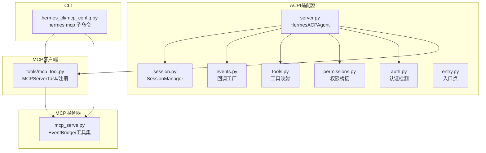
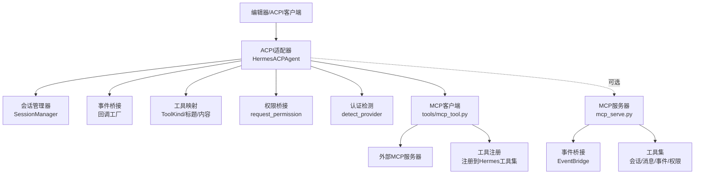
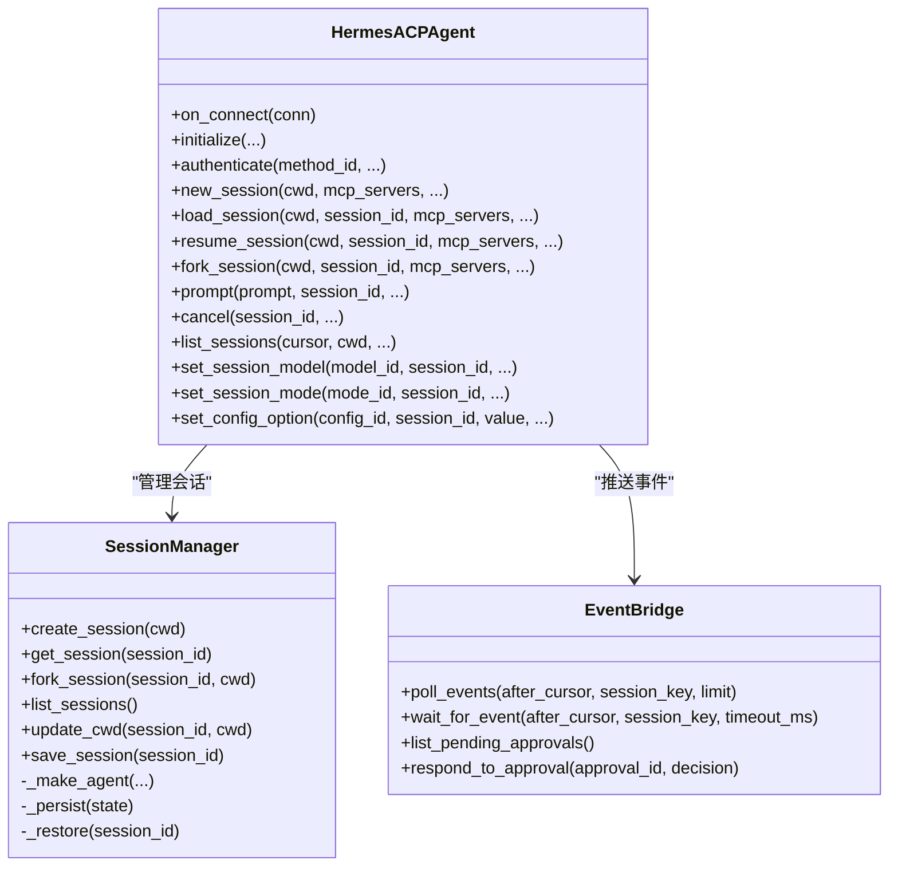
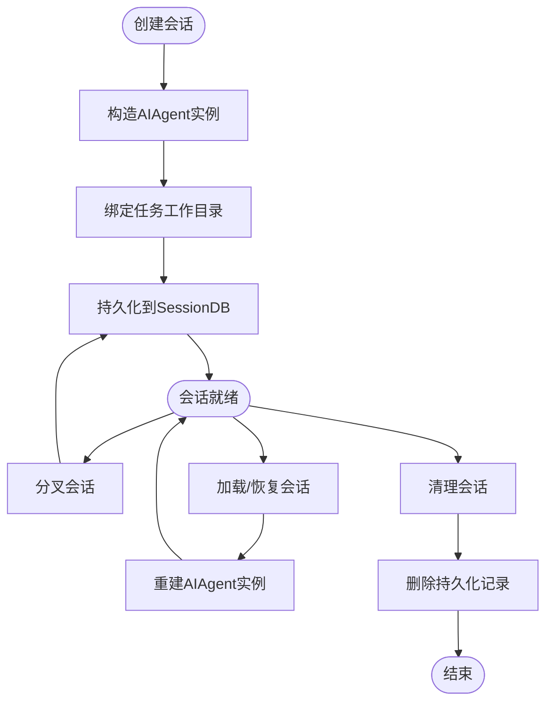
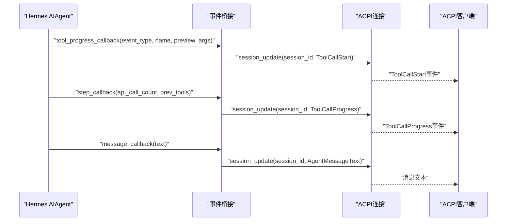
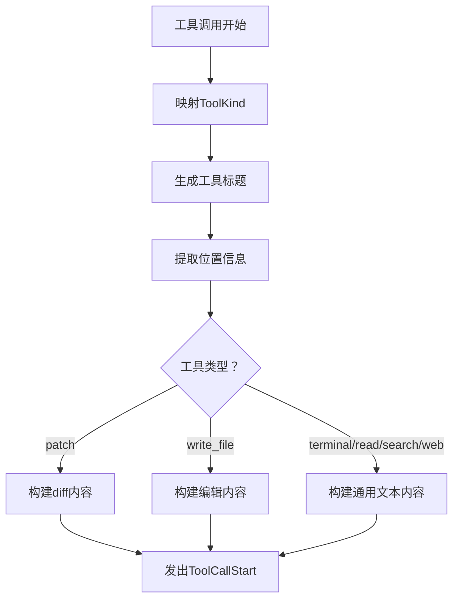
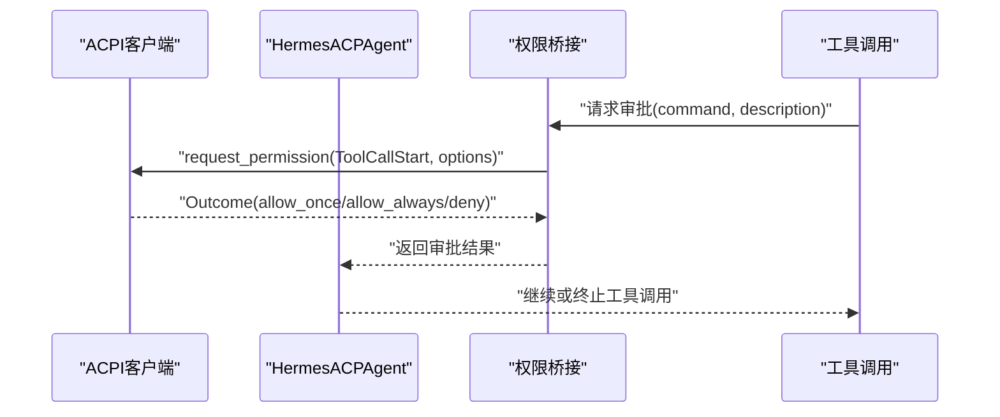
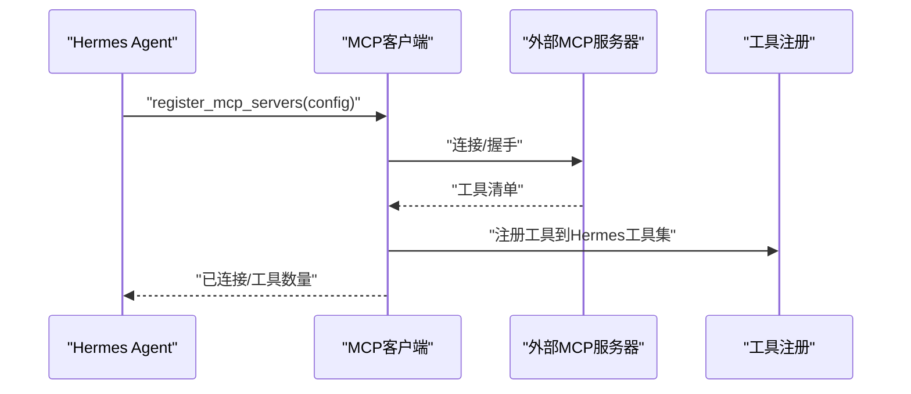
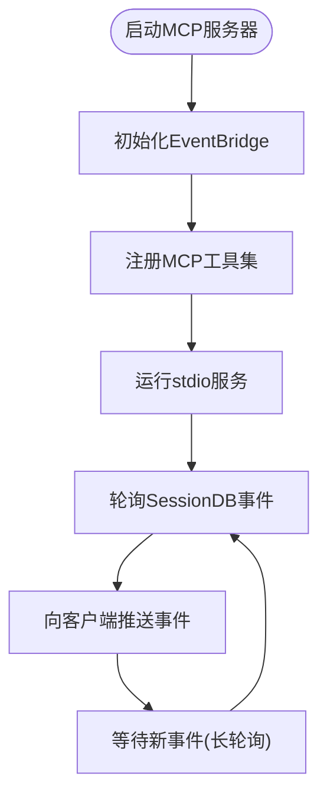
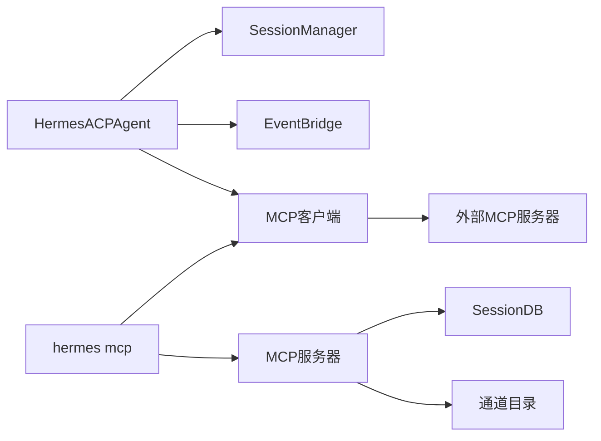

# ACPI/MCP集成

<cite>
**本文档引用的文件**
- [acp_adapter/__init__.py](file://acp_adapter/__init__.py)
- [acp_adapter/server.py](file://acp_adapter/server.py)
- [acp_adapter/auth.py](file://acp_adapter/auth.py)
- [acp_adapter/session.py](file://acp_adapter/session.py)
- [acp_adapter/events.py](file://acp_adapter/events.py)
- [acp_adapter/tools.py](file://acp_adapter/tools.py)
- [acp_adapter/permissions.py](file://acp_adapter/permissions.py)
- [acp_adapter/entry.py](file://acp_adapter/entry.py)
- [mcp_serve.py](file://mcp_serve.py)
- [tools/mcp_tool.py](file://tools/mcp_tool.py)
- [hermes_cli/mcp_config.py](file://hermes_cli/mcp_config.py)
- [tests/acp/test_server.py](file://tests/acp/test_server.py)
- [tests/acp/test_session.py](file://tests/acp/test_session.py)
- [tests/acp/test_auth.py](file://tests/acp/test_auth.py)
- [tests/acp/test_mcp_e2e.py](file://tests/acp/test_mcp_e2e.py)
- [tests/tools/test_mcp_tool.py](file://tests/tools/test_mcp_tool.py)
- [tests/test_mcp_serve.py](file://tests/test_mcp_serve.py)
</cite>

## 目录
1. [简介](#简介)
2. [项目结构](#项目结构)
3. [核心组件](#核心组件)
4. [架构总览](#架构总览)
5. [详细组件分析](#详细组件分析)
6. [依赖关系分析](#依赖关系分析)
7. [性能考虑](#性能考虑)
8. [故障排除指南](#故障排除指南)
9. [结论](#结论)
10. [附录](#附录)

## 简介
本文件面向Hermes Agent的ACPI与MCP集成功能，提供专业级技术文档。内容涵盖：
- ACPI协议规范：协议标准、消息格式、认证机制
- MCP集成架构：服务器配置、工具发现、连接管理
- ACPI适配器实现原理：协议转换、数据映射、错误处理
- MCP工具开发与部署指南
- 编辑器集成示例与故障排除方法

## 项目结构
围绕ACPI/MCP集成的相关模块主要分布在以下目录：
- acp_adapter：实现ACPI适配器，桥接Hermes Agent与ACPI客户端
- tools：MCP客户端支持，负责连接外部MCP服务器并注册工具
- mcp_serve：作为MCP服务器，暴露会话与事件能力供其他客户端使用
- hermes_cli：MCP服务器生命周期管理命令行接口
- tests：覆盖ACPI与MCP的关键测试用例

**图表来源**
- [acp_adapter/server.py:92-727](file://acp_adapter/server.py#L92-L727)
- [acp_adapter/session.py:70-476](file://acp_adapter/session.py#L70-L476)
- [acp_adapter/events.py:1-176](file://acp_adapter/events.py#L1-L176)
- [acp_adapter/tools.py:1-215](file://acp_adapter/tools.py#L1-L215)
- [acp_adapter/permissions.py:1-78](file://acp_adapter/permissions.py#L1-L78)
- [acp_adapter/auth.py:1-25](file://acp_adapter/auth.py#L1-L25)
- [acp_adapter/entry.py:1-86](file://acp_adapter/entry.py#L1-L86)
- [tools/mcp_tool.py:1-800](file://tools/mcp_tool.py#L1-L800)
- [mcp_serve.py:1-868](file://mcp_serve.py#L1-L868)
- [hermes_cli/mcp_config.py:1-646](file://hermes_cli/mcp_config.py#L1-L646)

**章节来源**
- [acp_adapter/__init__.py:1-2](file://acp_adapter/__init__.py#L1-L2)
- [acp_adapter/server.py:1-727](file://acp_adapter/server.py#L1-L727)
- [acp_adapter/session.py:1-476](file://acp_adapter/session.py#L1-L476)
- [acp_adapter/events.py:1-176](file://acp_adapter/events.py#L1-L176)
- [acp_adapter/tools.py:1-215](file://acp_adapter/tools.py#L1-L215)
- [acp_adapter/permissions.py:1-78](file://acp_adapter/permissions.py#L1-L78)
- [acp_adapter/auth.py:1-25](file://acp_adapter/auth.py#L1-L25)
- [acp_adapter/entry.py:1-86](file://acp_adapter/entry.py#L1-L86)
- [tools/mcp_tool.py:1-800](file://tools/mcp_tool.py#L1-L800)
- [mcp_serve.py:1-868](file://mcp_serve.py#L1-L868)
- [hermes_cli/mcp_config.py:1-646](file://hermes_cli/mcp_config.py#L1-L646)

## 核心组件
- ACPI适配器（HermesACPAgent）：实现ACPI协议端点，负责会话管理、提示处理、事件推送与权限请求
- 会话管理器（SessionManager）：在内存与持久化数据库之间维护会话状态，支持fork、恢复与历史持久化
- 事件桥接（events.py）：将Hermes Agent内部事件转换为ACPI会话更新，支持工具调用进度、思考过程与消息流
- 工具映射（tools.py）：将Hermes工具名称映射到ACPI ToolKind，并构建工具调用的标题与内容
- 权限桥接（permissions.py）：将ACPI权限请求映射到Hermes审批回调
- 认证辅助（auth.py）：检测运行时提供商，用于ACPI认证方法声明
- MCP客户端（tools/mcp_tool.py）：连接外部MCP服务器，动态发现工具并注册到Hermes工具集
- MCP服务器（mcp_serve.py）：以MCP服务器形式暴露会话列表、消息读取、事件轮询/等待、消息发送与权限管理
- CLI管理（hermes_cli/mcp_config.py）：提供hermes mcp add/remove/list/test/configure等子命令

**章节来源**
- [acp_adapter/server.py:92-727](file://acp_adapter/server.py#L92-L727)
- [acp_adapter/session.py:70-476](file://acp_adapter/session.py#L70-L476)
- [acp_adapter/events.py:1-176](file://acp_adapter/events.py#L1-L176)
- [acp_adapter/tools.py:1-215](file://acp_adapter/tools.py#L1-L215)
- [acp_adapter/permissions.py:1-78](file://acp_adapter/permissions.py#L1-L78)
- [acp_adapter/auth.py:1-25](file://acp_adapter/auth.py#L1-L25)
- [tools/mcp_tool.py:1-800](file://tools/mcp_tool.py#L1-L800)
- [mcp_serve.py:1-868](file://mcp_serve.py#L1-L868)
- [hermes_cli/mcp_config.py:1-646](file://hermes_cli/mcp_config.py#L1-L646)

## 架构总览
下图展示ACPI与MCP集成的整体架构：编辑器通过ACPI连接Hermes Agent；Agent内部通过SessionManager管理会话；事件桥接将内部事件转化为ACPI更新；同时Agent可连接外部MCP服务器并通过工具注册进入工具集；此外，Hermes还提供MCP服务器能力，供其他客户端消费会话与事件。

**图表来源**
- [acp_adapter/server.py:92-727](file://acp_adapter/server.py#L92-L727)
- [acp_adapter/session.py:70-476](file://acp_adapter/session.py#L70-L476)
- [acp_adapter/events.py:1-176](file://acp_adapter/events.py#L1-L176)
- [acp_adapter/tools.py:1-215](file://acp_adapter/tools.py#L1-L215)
- [acp_adapter/permissions.py:1-78](file://acp_adapter/permissions.py#L1-L78)
- [acp_adapter/auth.py:1-25](file://acp_adapter/auth.py#L1-L25)
- [tools/mcp_tool.py:1-800](file://tools/mcp_tool.py#L1-L800)
- [mcp_serve.py:1-868](file://mcp_serve.py#L1-L868)

## 详细组件分析

### ACPI适配器（HermesACPAgent）
- 协议实现：遵循ACPI协议版本，提供initialize、authenticate、new_session/load_session/resume_session/fork_session、prompt、set_session_model/set_session_mode/set_config_option等方法
- 会话管理：通过SessionManager创建/恢复/分叉会话，持久化对话历史至SessionDB
- 事件推送：通过事件桥接将工具调用开始/完成、思考文本、消息流等转换为ACPI会话更新
- 权限处理：将ACPI权限请求映射为Hermes审批回调，支持超时与拒绝策略
- 认证支持：基于运行时提供商检测，声明可用的认证方法

**图表来源**
- [acp_adapter/server.py:92-727](file://acp_adapter/server.py#L92-L727)
- [acp_adapter/session.py:70-476](file://acp_adapter/session.py#L70-L476)
- [mcp_serve.py:185-426](file://mcp_serve.py#L185-L426)

**章节来源**
- [acp_adapter/server.py:92-727](file://acp_adapter/server.py#L92-L727)
- [acp_adapter/session.py:70-476](file://acp_adapter/session.py#L70-L476)
- [acp_adapter/events.py:1-176](file://acp_adapter/events.py#L1-L176)
- [acp_adapter/permissions.py:1-78](file://acp_adapter/permissions.py#L1-L78)
- [acp_adapter/auth.py:1-25](file://acp_adapter/auth.py#L1-L25)

### 会话管理（SessionManager）
- 内存+持久化双层存储：在内存中快速访问，同时持久化到SessionDB，支持进程重启后恢复
- 工作目录绑定：为每个任务绑定工作目录，确保工具执行上下文一致
- 模型与提供商信息：在会话元数据中保存模型、提供商、基础URL与API模式
- 会话生命周期：创建、fork、加载、恢复、清理与删除

**图表来源**
- [acp_adapter/session.py:94-405](file://acp_adapter/session.py#L94-L405)

**章节来源**
- [acp_adapter/session.py:70-476](file://acp_adapter/session.py#L70-L476)

### 事件桥接（events.py）
- 工具进度回调：将工具started事件转换为ToolCallStart，跟踪同名工具的多个调用
- 思考回调：推送思考文本到编辑器
- 步骤回调：将已完成工具的输出转换为ToolCallProgress并完成对应调用
- 消息回调：流式推送助手消息文本

**图表来源**
- [acp_adapter/events.py:47-175](file://acp_adapter/events.py#L47-L175)

**章节来源**
- [acp_adapter/events.py:1-176](file://acp_adapter/events.py#L1-L176)

### 工具映射与内容构建（tools.py）
- 工具种类映射：将Hermes工具名称映射到ACPI ToolKind（read/edit/search/execute/fetch/think等）
- 工具标题生成：根据参数生成人类可读标题
- 工具调用内容：针对不同工具类型构建ToolCallStart与ToolCallProgress的内容块

**图表来源**
- [acp_adapter/tools.py:17-215](file://acp_adapter/tools.py#L17-L215)

**章节来源**
- [acp_adapter/tools.py:1-215](file://acp_adapter/tools.py#L1-L215)

### 权限桥接（permissions.py）
- 将ACPI request_permission请求映射为Hermes审批回调
- 支持允许一次、总是允许、拒绝一次、拒绝永久四种选项
- 超时自动拒绝，避免阻塞

**图表来源**
- [acp_adapter/permissions.py:26-77](file://acp_adapter/permissions.py#L26-L77)

**章节来源**
- [acp_adapter/permissions.py:1-78](file://acp_adapter/permissions.py#L1-L78)

### 认证检测（auth.py）
- 基于运行时提供商检测当前可用的认证源
- 若存在有效提供商与密钥，则声明相应的认证方法

**章节来源**
- [acp_adapter/auth.py:1-25](file://acp_adapter/auth.py#L1-L25)

### MCP客户端（tools/mcp_tool.py）
- 连接外部MCP服务器：支持stdio与HTTP/StreamableHTTP传输
- 动态工具发现：监听tools/list_changed通知，自动刷新工具集
- 安全与超时：过滤环境变量、工具调用超时、连接超时、指数退避重连
- 采样支持：允许MCP服务器发起LLM请求，经由集中路由调用

**图表来源**
- [tools/mcp_tool.py:1-800](file://tools/mcp_tool.py#L1-L800)
- [tools/mcp_tool.py:1870-1902](file://tools/mcp_tool.py#L1870-L1902)

**章节来源**
- [tools/mcp_tool.py:1-800](file://tools/mcp_tool.py#L1-L800)
- [tools/mcp_tool.py:1870-1902](file://tools/mcp_tool.py#L1870-L1902)

### MCP服务器（mcp_serve.py）
- 会话与消息：提供会话列表、会话详情、消息读取、附件提取
- 事件：轮询与等待新事件，支持游标增量拉取
- 发送消息：通过通道列表解析目标平台与标识符
- 权限：列出与响应待处理审批请求

**图表来源**
- [mcp_serve.py:431-868](file://mcp_serve.py#L431-L868)
- [mcp_serve.py:185-426](file://mcp_serve.py#L185-L426)

**章节来源**
- [mcp_serve.py:1-868](file://mcp_serve.py#L1-L868)

### CLI管理（hermes_cli/mcp_config.py）
- hermes mcp add：添加MCP服务器，支持OAuth与HTTP头认证，连接探测工具
- hermes mcp remove：移除服务器
- hermes mcp list/test/configure：列出、测试连接、配置启用的工具

**章节来源**
- [hermes_cli/mcp_config.py:1-646](file://hermes_cli/mcp_config.py#L1-L646)

## 依赖关系分析
- ACPI适配器依赖会话管理器与事件桥接，通过回调工厂将内部事件映射为ACPI更新
- MCP客户端依赖MCP SDK，动态连接外部服务器并将工具注册到Hermes工具集
- MCP服务器依赖SessionDB与通道目录，提供会话与事件的查询与推送
- CLI管理命令通过tools/mcp_tool.py与mcp_serve.py进行配置与运行控制

**图表来源**
- [acp_adapter/server.py:92-727](file://acp_adapter/server.py#L92-L727)
- [acp_adapter/session.py:70-476](file://acp_adapter/session.py#L70-L476)
- [mcp_serve.py:1-868](file://mcp_serve.py#L1-L868)
- [hermes_cli/mcp_config.py:1-646](file://hermes_cli/mcp_config.py#L1-L646)

**章节来源**
- [acp_adapter/server.py:1-727](file://acp_adapter/server.py#L1-L727)
- [acp_adapter/session.py:1-476](file://acp_adapter/session.py#L1-L476)
- [mcp_serve.py:1-868](file://mcp_serve.py#L1-L868)
- [hermes_cli/mcp_config.py:1-646](file://hermes_cli/mcp_config.py#L1-L646)

## 性能考虑
- 会话持久化：通过SessionDB减少重复计算与状态丢失风险，但需注意SQLite写入开销
- 事件轮询：EventBridge采用200ms轮询间隔与mtime缓存，降低I/O压力
- 线程池与异步：ACPI适配器使用线程池执行同步Agent逻辑，避免阻塞事件循环
- MCP连接：支持指数退避重连与超时控制，避免资源浪费与阻塞

[本节为通用指导，无需特定文件引用]

## 故障排除指南
- ACPI连接失败：检查日志输出（stderr），确认use_unstable_protocol已启用；验证环境变量与.env加载
- 会话恢复异常：确认SessionDB可用且sessions.json存在；检查会话元数据中的cwd/provider/base_url/api_mode
- MCP服务器不可用：确认安装了mcp包；检查服务器URL/命令与认证配置；查看工具发现与注册日志
- 权限请求超时：调整超时时间或在编辑器侧快速响应；检查代理网络与防火墙
- 事件未推送：确认EventBridge已启动且轮询正常；检查SessionDB变更与mtime缓存

**章节来源**
- [acp_adapter/entry.py:23-86](file://acp_adapter/entry.py#L23-L86)
- [acp_adapter/session.py:251-416](file://acp_adapter/session.py#L251-L416)
- [mcp_serve.py:836-868](file://mcp_serve.py#L836-L868)
- [hermes_cli/mcp_config.py:114-152](file://hermes_cli/mcp_config.py#L114-L152)
- [acp_adapter/permissions.py:26-77](file://acp_adapter/permissions.py#L26-L77)

## 结论
Hermes Agent的ACPI/MCP集成功能通过清晰的模块划分实现了编辑器与Agent之间的协议桥接、会话状态持久化、事件流式推送与工具生态扩展。ACPI适配器提供标准化的会话与提示处理能力，MCP客户端与服务器则打通了外部工具与会话事件的双向通道。配合CLI管理工具，用户可以便捷地配置与运维MCP服务器，满足多样化场景需求。

[本节为总结性内容，无需特定文件引用]

## 附录

### ACPI协议要点
- 协议版本：遵循ACPI协议版本，initialize返回协议版本与能力声明
- 认证方法：基于运行时提供商声明可用认证方式
- 会话管理：支持新建、加载、恢复、分叉与取消
- 提示处理：将用户输入转换为Agent对话，流式推送思考与消息

**章节来源**
- [acp_adapter/server.py:216-254](file://acp_adapter/server.py#L216-L254)
- [acp_adapter/server.py:263-333](file://acp_adapter/server.py#L263-L333)
- [acp_adapter/server.py:349-465](file://acp_adapter/server.py#L349-L465)
- [acp_adapter/auth.py:8-24](file://acp_adapter/auth.py#L8-L24)

### MCP工具开发与部署
- 配置文件：在~/.hermes/config.yaml下配置mcp_servers，支持stdio与HTTP传输、认证与超时
- 添加服务器：hermes mcp add <name> [--url <endpoint>|--command <cmd> --args ...]
- 测试连接：hermes mcp test <name>
- 工具选择：hermes mcp configure <name>交互式选择启用工具
- 启动服务器：hermes mcp serve

**章节来源**
- [hermes_cli/mcp_config.py:173-338](file://hermes_cli/mcp_config.py#L173-L338)
- [hermes_cli/mcp_config.py:441-501](file://hermes_cli/mcp_config.py#L441-L501)
- [hermes_cli/mcp_config.py:512-607](file://hermes_cli/mcp_config.py#L512-L607)
- [mcp_serve.py:836-868](file://mcp_serve.py#L836-L868)

### 编辑器集成示例
- ACP客户端：通过ACPI协议连接HermesACPAgent，支持会话管理与提示提交
- MCP客户端：在编辑器中配置MCP服务器，使用discover与工具调用
- MCP服务器：在编辑器中作为MCP服务器，提供会话与事件查询

**章节来源**
- [acp_adapter/server.py:144-147](file://acp_adapter/server.py#L144-L147)
- [tools/mcp_tool.py:1-800](file://tools/mcp_tool.py#L1-L800)
- [mcp_serve.py:1-868](file://mcp_serve.py#L1-L868)