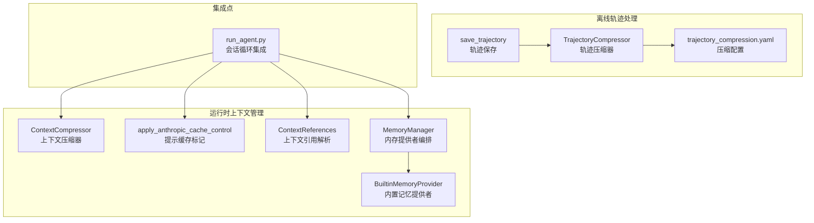
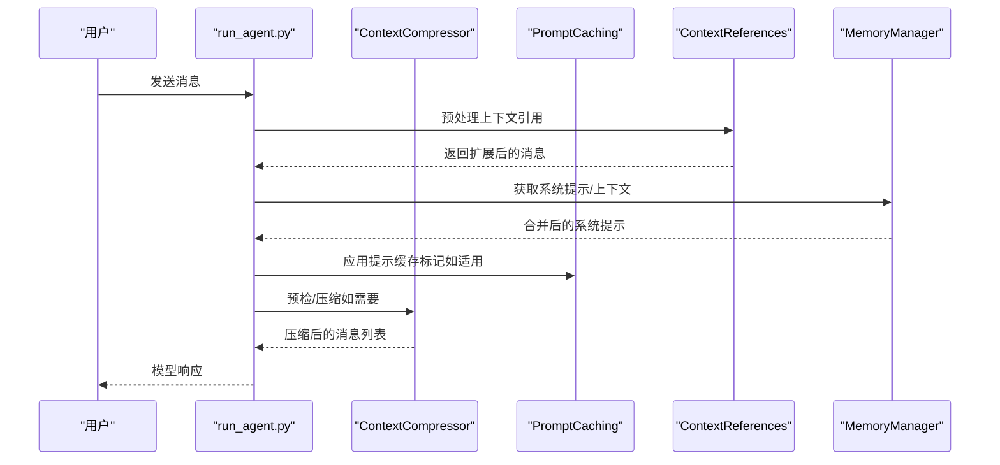
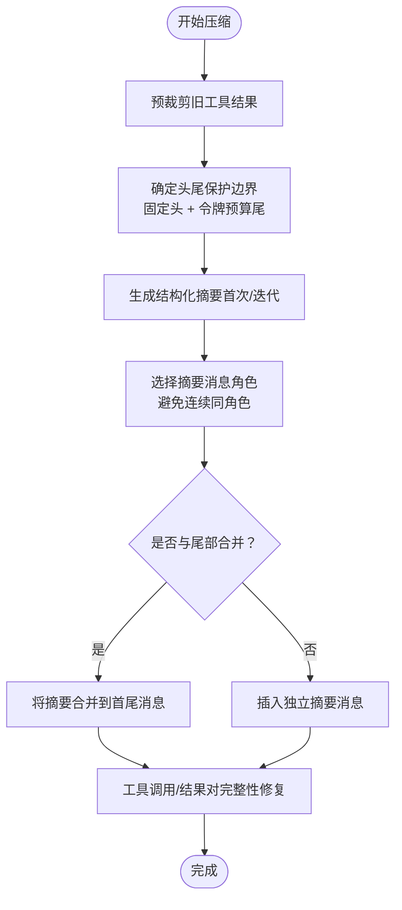
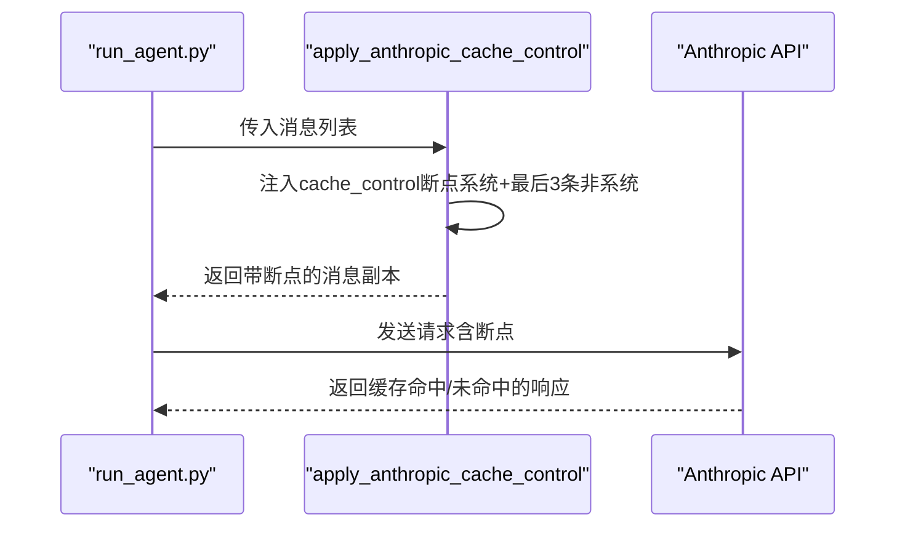
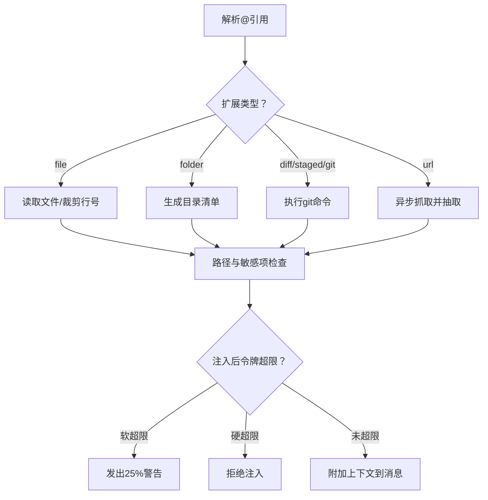
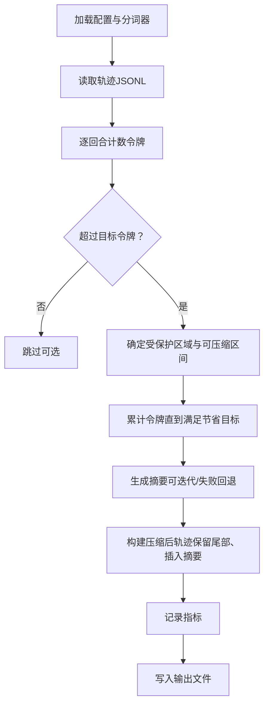
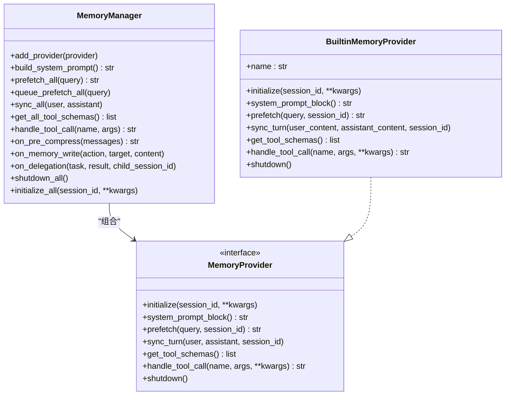
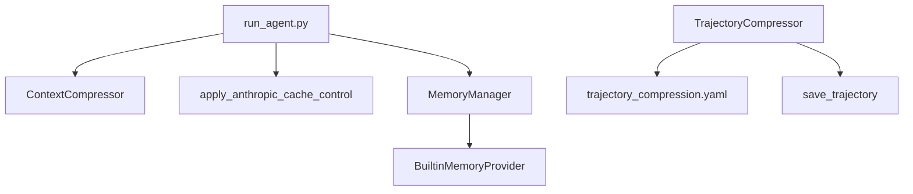

# 上下文管理

<cite>
**本文引用的文件**
- [agent/context_compressor.py](file://agent/context_compressor.py)
- [agent/prompt_caching.py](file://agent/prompt_caching.py)
- [agent/context_references.py](file://agent/context_references.py)
- [agent/trajectory.py](file://agent/trajectory.py)
- [trajectory_compressor.py](file://trajectory_compressor.py)
- [datagen-config-examples/trajectory_compression.yaml](file://datagen-config-examples/trajectory_compression.yaml)
- [agent/memory_manager.py](file://agent/memory_manager.py)
- [agent/builtin_memory_provider.py](file://agent/builtin_memory_provider.py)
- [run_agent.py](file://run_agent.py)
- [tests/agent/test_context_compressor.py](file://tests/agent/test_context_compressor.py)
- [tests/agent/test_prompt_caching.py](file://tests/agent/test_prompt_caching.py)
- [tests/agent/test_context_references.py](file://tests/agent/test_context_references.py)
- [website/docs/developer-guide/context-compression-and-caching.md](file://website/docs/developer-guide/context-compression-and-caching.md)
</cite>

## 目录
1. [简介](#简介)
2. [项目结构](#项目结构)
3. [核心组件](#核心组件)
4. [架构总览](#架构总览)
5. [详细组件分析](#详细组件分析)
6. [依赖分析](#依赖分析)
7. [性能考量](#性能考量)
8. [故障排除指南](#故障排除指南)
9. [结论](#结论)
10. [附录](#附录)

## 简介
本文件面向Hermes Agent的上下文管理能力，系统化阐述以下主题：
- 上下文压缩算法：文本压缩策略、重要性评估、信息保留机制、工具调用对齐与完整性修复。
- 提示缓存系统：缓存策略、命中率优化、存储管理（针对Anthropic）。
- 上下文引用机制：引用格式、链接管理、路径安全与版本控制思路。
- 轨迹压缩功能：使用方法、配置选项、批量处理与指标统计。
- 性能优化建议与常见问题排查。

## 项目结构
围绕上下文管理的关键模块分布如下：
- 运行期上下文压缩：agent/context_compressor.py
- 提示缓存（Anthropic）：agent/prompt_caching.py
- 上下文引用解析与注入：agent/context_references.py
- 轨迹压缩（离线后处理）：trajectory_compressor.py
- 轨迹保存辅助：agent/trajectory.py
- 内存与上下文整合：agent/memory_manager.py、agent/builtin_memory_provider.py
- 配置样例：datagen-config-examples/trajectory_compression.yaml
- 使用入口与集成点：run_agent.py
- 测试与文档：tests/* 与 website/docs/developer-guide/context-compression-and-caching.md

图示来源
- [agent/context_compressor.py](file://agent/context_compressor.py)
- [agent/prompt_caching.py](file://agent/prompt_caching.py)
- [agent/context_references.py](file://agent/context_references.py)
- [agent/memory_manager.py](file://agent/memory_manager.py)
- [agent/builtin_memory_provider.py](file://agent/builtin_memory_provider.py)
- [trajectory_compressor.py](file://trajectory_compressor.py)
- [agent/trajectory.py](file://agent/trajectory.py)
- [datagen-config-examples/trajectory_compression.yaml](file://datagen-config-examples/trajectory_compression.yaml)
- [run_agent.py](file://run_agent.py)

章节来源
- [agent/context_compressor.py](file://agent/context_compressor.py)
- [agent/prompt_caching.py](file://agent/prompt_caching.py)
- [agent/context_references.py](file://agent/context_references.py)
- [trajectory_compressor.py](file://trajectory_compressor.py)
- [agent/trajectory.py](file://agent/trajectory.py)
- [datagen-config-examples/trajectory_compression.yaml](file://datagen-config-examples/trajectory_compression.yaml)
- [agent/memory_manager.py](file://agent/memory_manager.py)
- [agent/builtin_memory_provider.py](file://agent/builtin_memory_provider.py)
- [run_agent.py](file://run_agent.py)

## 核心组件
- 上下文压缩器（ContextCompressor）
  - 基于阈值触发，采用“预裁剪旧工具结果 + 头尾保护 + 结构化摘要 + 可迭代更新”的四阶段流程。
  - 尾部采用按令牌预算保护，避免固定消息数导致的不灵活；摘要目标比例随内容规模动态缩放。
  - 对工具调用/结果对进行完整性修复，确保API一致性。
- 提示缓存（apply_anthropic_cache_control）
  - 在Anthropic模型上应用system_and_3策略，在系统提示与最后三条非系统消息处注入cache_control断点，最多4个断点。
  - 支持5分钟或1小时TTL，兼容原生与OpenRouter路径差异。
- 上下文引用（ContextReferences）
  - 解析并扩展@file、@folder、@diff、@staged、@git、@url等引用，支持行号范围、目录清单、Git日志/差异、URL抓取。
  - 引入软硬令牌上限，防止过度注入；严格限制敏感路径与工作区边界。
- 轨迹压缩（TrajectoryCompressor）
  - 针对已完成轨迹进行离线压缩，保留首尾关键回合，仅压缩中间部分，以单条人类总结替代被压缩内容。
  - 支持配置化目标令牌、摘要目标、保护回合、并发与重试策略，并输出详细指标。
- 内存与上下文整合（MemoryManager/BuiltinMemoryProvider）
  - 统一编排内置与外部记忆提供者，支持在压缩前注入上下文摘要提示，构建系统提示块，以及工具路由。

章节来源
- [agent/context_compressor.py](file://agent/context_compressor.py)
- [agent/prompt_caching.py](file://agent/prompt_caching.py)
- [agent/context_references.py](file://agent/context_references.py)
- [trajectory_compressor.py](file://trajectory_compressor.py)
- [agent/memory_manager.py](file://agent/memory_manager.py)
- [agent/builtin_memory_provider.py](file://agent/builtin_memory_provider.py)

## 架构总览
运行时与离线两条路径协同：
- 运行时：在对话过程中，根据令牌估算与阈值判断触发压缩；同时在Anthropic路径启用提示缓存以降低输入成本。
- 离线：对已完成的轨迹进行批量压缩，生成可复用的训练/评测数据集。

图示来源
- [run_agent.py](file://run_agent.py)
- [agent/context_compressor.py](file://agent/context_compressor.py)
- [agent/prompt_caching.py](file://agent/prompt_caching.py)
- [agent/context_references.py](file://agent/context_references.py)
- [agent/memory_manager.py](file://agent/memory_manager.py)

## 详细组件分析

### 上下文压缩器（ContextCompressor）
- 触发与阈值
  - 基于模型上下文窗口与阈值百分比计算触发阈值；提供预检估算与实际使用后统计。
- 四阶段压缩流程
  1) 预裁剪旧工具结果：对超出长度且非空的工具结果进行占位替换，减少冗余输出。
  2) 头尾保护：保留前N条与最近的尾部消息；尾部保护采用令牌预算而非固定数量。
  3) 结构化摘要：对中间区域生成结构化摘要（Goal/Progress/Decisions/Files/Next Steps），支持首次与迭代更新。
  4) 工具对齐与完整性修复：确保每个工具调用都有对应结果，移除孤儿结果或补全缺失结果。
- 重要性评估与信息保留
  - 通过“摘要模板”与“迭代更新”保留关键决策、文件变更与下一步行动；通过“摘要角色选择”避免连续相同角色消息破坏对话节奏。
- 关键参数
  - threshold_percent：压缩触发阈值（默认0.50）
  - summary_target_ratio：摘要预算占中间内容的比例（默认0.20，限制在0.10~0.80）
  - protect_first_n / protect_last_n：头尾保护数量
  - max_summary_tokens：摘要最大令牌数（随上下文窗口缩放，上限12K）

图示来源
- [agent/context_compressor.py](file://agent/context_compressor.py)

章节来源
- [agent/context_compressor.py](file://agent/context_compressor.py)
- [tests/agent/test_context_compressor.py](file://tests/agent/test_context_compressor.py)
- [website/docs/developer-guide/context-compression-and-caching.md](file://website/docs/developer-guide/context-compression-and-caching.md)

### 提示缓存系统（Anthropic）
- 缓存策略
  - system_and_3：在系统提示与最后三条非系统消息处放置断点，最多4个断点。
  - 支持5分钟与1小时TTL；原生与OpenRouter路径分别处理cache_control位置。
- 命中率优化
  - 通过断点数量与内容类型适配（字符串/列表/空内容/工具消息）提升缓存命中概率。
- 存储管理
  - 断点由API端维护，客户端仅负责注入标记；注意OpenRouter路径下工具消息不注入顶层cache_control。

图示来源
- [agent/prompt_caching.py](file://agent/prompt_caching.py)
- [run_agent.py](file://run_agent.py)
- [tests/agent/test_prompt_caching.py](file://tests/agent/test_prompt_caching.py)

章节来源
- [agent/prompt_caching.py](file://agent/prompt_caching.py)
- [tests/agent/test_prompt_caching.py](file://tests/agent/test_prompt_caching.py)
- [run_agent.py](file://run_agent.py)

### 上下文引用机制（ContextReferences）
- 引用格式
  - @file:path[:start-end]、@folder:path、@diff、@staged、@git:n、@url:https://...
- 链接管理
  - 文件：支持行号范围裁剪；二进制文件拒绝注入；目录：生成可见文件清单。
  - Git：支持diff、staged与指定次数的日志；超时与错误处理。
  - URL：异步抓取，Markdown抽取，支持自定义fetcher。
- 版本控制与安全
  - 通过allowed_root限制工作区；阻断敏感路径（如~/.ssh、~/.aws、~/.kube、.hermes内部）。
  - 令牌预算：软阈值25%警告、硬阈值50%拒绝注入。
- 版本控制思路
  - 当前实现主要基于文件系统快照与Git命令输出；若需更细粒度版本控制，可在上游引入VCS元数据或时间戳标注。

图示来源
- [agent/context_references.py](file://agent/context_references.py)
- [tests/agent/test_context_references.py](file://tests/agent/test_context_references.py)

章节来源
- [agent/context_references.py](file://agent/context_references.py)
- [tests/agent/test_context_references.py](file://tests/agent/test_context_references.py)

### 轨迹压缩功能（TrajectoryCompressor）
- 使用场景
  - 对已完成的Agent对话轨迹进行离线压缩，便于训练/评测数据集构建。
- 压缩策略
  - 保护首系统、首人类、首GPT、首工具与最后N回合；仅压缩中间必要部分。
  - 以单条人类总结替代被压缩区域，保留后续工具调用继续执行的能力。
- 配置选项
  - 分词器名称与信任远程代码
  - 目标最大令牌数与摘要目标令牌数
  - 保护回合开关与数量
  - 摘要模型、基础URL、温度、重试与延迟
  - 输出开关、摘要通知文本、输出后缀
  - 并行工作线程、并发请求上限、跳过/保存策略、超时
  - 指标统计开关与输出文件名
- 指标统计
  - 原始/压缩令牌数、节省令牌数、压缩比、回合数变化、摘要API调用与错误数等。

图示来源
- [trajectory_compressor.py](file://trajectory_compressor.py)
- [datagen-config-examples/trajectory_compression.yaml](file://datagen-config-examples/trajectory_compression.yaml)

章节来源
- [trajectory_compressor.py](file://trajectory_compressor.py)
- [datagen-config-examples/trajectory_compression.yaml](file://datagen-config-examples/trajectory_compression.yaml)

### 内存与上下文整合（MemoryManager/BuiltinMemoryProvider）
- 统一编排
  - 内置提供者始终注册；最多允许一个外部提供者；失败不影响其他提供者。
- 上下文注入
  - 在压缩前回调各提供者，收集可用于摘要提示的上下文片段。
  - 构建系统提示块，包裹为“记忆上下文”围栏，避免模型误判为用户输入。
- 工具路由
  - 将工具schema去重聚合，按名称路由至对应提供者，避免冲突。

图示来源
- [agent/memory_manager.py](file://agent/memory_manager.py)
- [agent/builtin_memory_provider.py](file://agent/builtin_memory_provider.py)

章节来源
- [agent/memory_manager.py](file://agent/memory_manager.py)
- [agent/builtin_memory_provider.py](file://agent/builtin_memory_provider.py)

## 依赖分析
- 运行时依赖
  - run_agent.py在会话循环中集成ContextCompressor与提示缓存；在Anthropic路径启用apply_anthropic_cache_control。
  - MemoryManager在预压缩阶段收集上下文摘要提示，保障摘要质量。
- 离线依赖
  - trajectory_compressor.py依赖外部分词器（transformers）与LLM路由（OpenRouter或其他），并输出指标文件。
- 测试覆盖
  - 对压缩器、提示缓存、上下文引用分别提供单元测试，验证边界条件、异常路径与行为一致性。

图示来源
- [run_agent.py](file://run_agent.py)
- [agent/context_compressor.py](file://agent/context_compressor.py)
- [agent/prompt_caching.py](file://agent/prompt_caching.py)
- [agent/memory_manager.py](file://agent/memory_manager.py)
- [agent/builtin_memory_provider.py](file://agent/builtin_memory_provider.py)
- [trajectory_compressor.py](file://trajectory_compressor.py)
- [agent/trajectory.py](file://agent/trajectory.py)
- [datagen-config-examples/trajectory_compression.yaml](file://datagen-config-examples/trajectory_compression.yaml)

章节来源
- [run_agent.py](file://run_agent.py)
- [agent/context_compressor.py](file://agent/context_compressor.py)
- [agent/prompt_caching.py](file://agent/prompt_caching.py)
- [agent/memory_manager.py](file://agent/memory_manager.py)
- [agent/builtin_memory_provider.py](file://agent/builtin_memory_provider.py)
- [trajectory_compressor.py](file://trajectory_compressor.py)
- [agent/trajectory.py](file://agent/trajectory.py)
- [datagen-config-examples/trajectory_compression.yaml](file://datagen-config-examples/trajectory_compression.yaml)

## 性能考量
- 压缩器
  - 预裁剪工具结果显著降低令牌占用；摘要预算与上下文窗口成比例，避免小模型被硬性上限限制。
  - 工具对齐与摘要角色选择减少API失败与重试成本。
- 提示缓存
  - system_and_3策略在多轮对话中稳定复用系统提示与近期上下文，显著降低输入令牌成本。
  - 注意OpenRouter路径下工具消息不注入顶层cache_control，避免静默挂起。
- 上下文引用
  - 严格的软/硬阈值与路径限制，避免大体量注入导致的令牌超限与安全风险。
- 轨迹压缩
  - 并发与重试策略平衡吞吐与稳定性；指标统计帮助评估压缩效果与成本。

## 故障排除指南
- 压缩器摘要失败
  - 现象：摘要生成异常，进入冷却期，中间段落直接丢弃。
  - 排查：确认摘要模型可用、网络连通、令牌预算充足；检查摘要模板与输入内容长度。
  - 参考
    - [agent/context_compressor.py](file://agent/context_compressor.py)
    - [tests/agent/test_context_compressor.py](file://tests/agent/test_context_compressor.py)
- 提示缓存无效或报错
  - 现象：缓存未命中或请求被拒绝。
  - 排查：确认平台为原生Anthropic或OpenRouter；工具消息在OpenRouter路径不应有顶层cache_control；检查断点数量不超过4。
  - 参考
    - [agent/prompt_caching.py](file://agent/prompt_caching.py)
    - [tests/agent/test_prompt_caching.py](file://tests/agent/test_prompt_caching.py)
- 上下文引用被拒绝
  - 现象：@file/@url等被拒绝注入。
  - 排查：检查令牌预算（25%警告、50%拒绝）、路径是否在allowed_root内、是否为敏感路径；二进制文件会被拒绝。
  - 参考
    - [agent/context_references.py](file://agent/context_references.py)
    - [tests/agent/test_context_references.py](file://tests/agent/test_context_references.py)
- 轨迹压缩未达标
  - 现象：压缩后仍超目标令牌。
  - 排查：调整summary_target_tokens、target_max_tokens、保护回合数量；检查并发与超时设置；查看指标文件定位瓶颈。
  - 参考
    - [trajectory_compressor.py](file://trajectory_compressor.py)
    - [datagen-config-examples/trajectory_compression.yaml](file://datagen-config-examples/trajectory_compression.yaml)

章节来源
- [agent/context_compressor.py](file://agent/context_compressor.py)
- [agent/prompt_caching.py](file://agent/prompt_caching.py)
- [agent/context_references.py](file://agent/context_references.py)
- [trajectory_compressor.py](file://trajectory_compressor.py)
- [datagen-config-examples/trajectory_compression.yaml](file://datagen-config-examples/trajectory_compression.yaml)
- [tests/agent/test_context_compressor.py](file://tests/agent/test_context_compressor.py)
- [tests/agent/test_prompt_caching.py](file://tests/agent/test_prompt_caching.py)
- [tests/agent/test_context_references.py](file://tests/agent/test_context_references.py)

## 结论
Hermes Agent的上下文管理通过“运行时压缩 + 离线轨迹压缩 + 提示缓存 + 上下文引用 + 内存整合”形成闭环：
- 运行时保证对话流畅与API一致性；
- 离线保证数据质量与可复用性；
- 提示缓存与引用注入在安全与成本之间取得平衡；
- 配置化与指标统计为持续优化提供依据。

## 附录
- 使用建议
  - 运行时：合理设置threshold_percent与summary_target_ratio；在Anthropic路径启用提示缓存；对工具输出进行预裁剪。
  - 离线：根据下游用途调整目标令牌与摘要目标；开启并发与重试；定期查看指标文件。
  - 安全：严格限制allowed_root与敏感路径；对URL抓取与Git操作设置超时。
- 相关文档
  - [website/docs/developer-guide/context-compression-and-caching.md](file://website/docs/developer-guide/context-compression-and-caching.md)