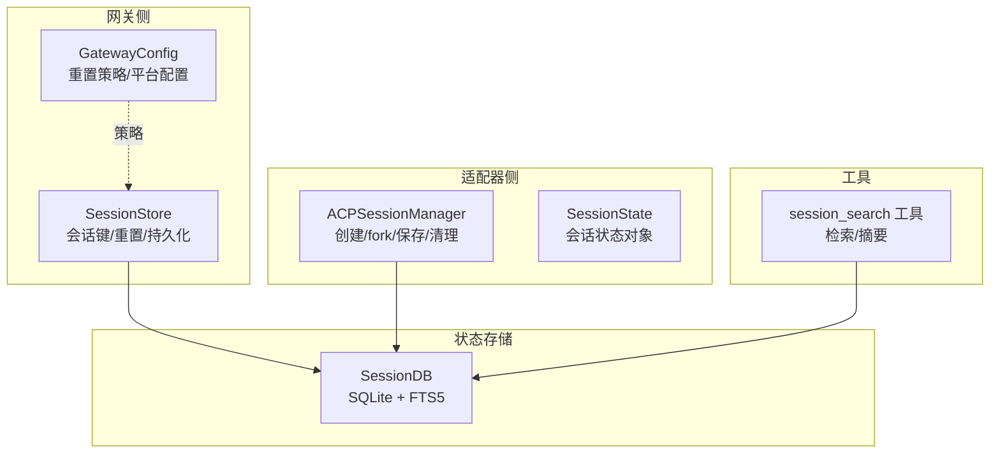
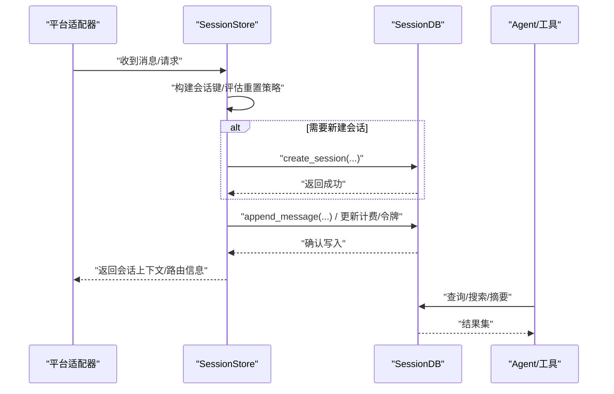
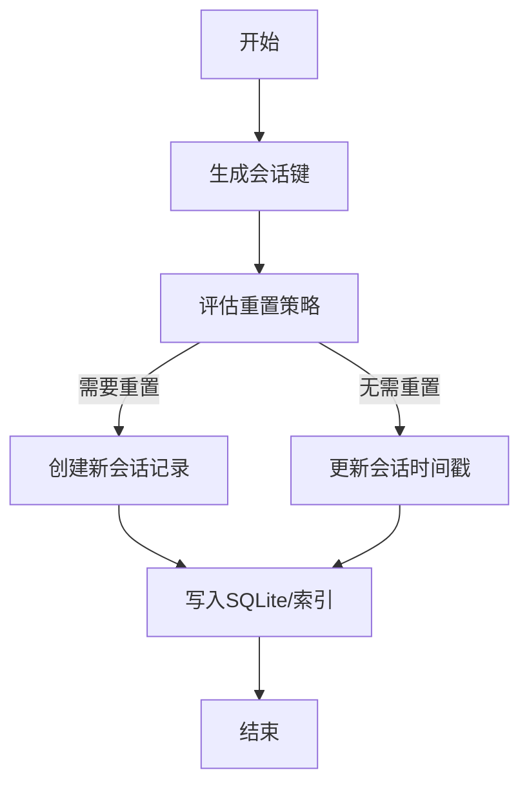
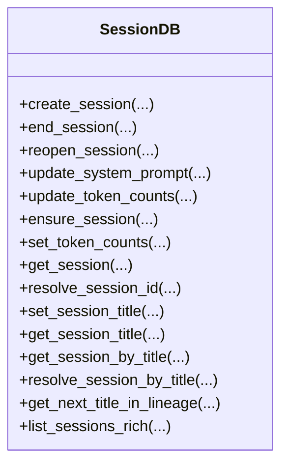
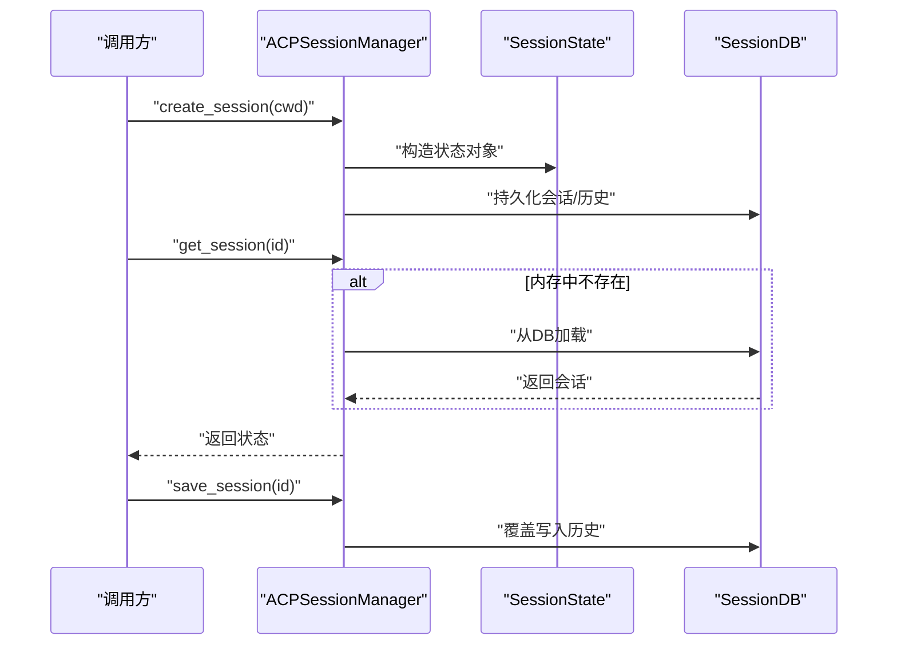
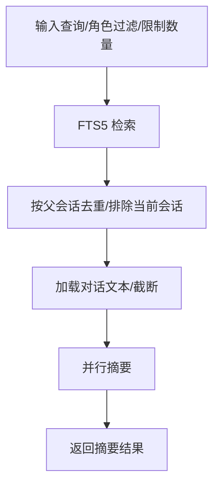
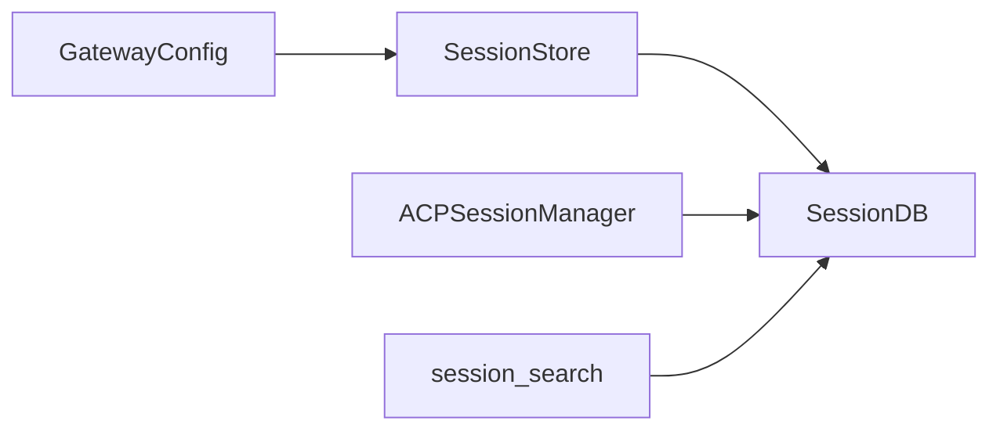

# 多会话管理

<cite>
**本文引用的文件**
- [gateway/session.py](file://gateway/session.py)
- [gateway/config.py](file://gateway/config.py)
- [hermes_state.py](file://hermes_state.py)
- [acp_adapter/session.py](file://acp_adapter/session.py)
- [acp_adapter/server.py](file://acp_adapter/server.py)
- [tools/session_search_tool.py](file://tools/session_search_tool.py)
- [hermes_cli/setup.py](file://hermes_cli/setup.py)
- [tests/acp/test_session.py](file://tests/acp/test_session.py)
- [tests/gateway/test_session_reset_notify.py](file://tests/gateway/test_session_reset_notify.py)
- [website/docs/developer-guide/session-storage.md](file://website/docs/developer-guide/session-storage.md)
</cite>

## 目录
1. [简介](#简介)
2. [项目结构](#项目结构)
3. [核心组件](#核心组件)
4. [架构总览](#架构总览)
5. [详细组件分析](#详细组件分析)
6. [依赖分析](#依赖分析)
7. [性能考量](#性能考量)
8. [故障排查指南](#故障排查指南)
9. [结论](#结论)
10. [附录](#附录)

## 简介
本指南围绕 Hermes Agent 的多会话管理能力，系统阐述会话状态管理（持久化、切换、数据隔离）、会话间数据同步与一致性保障、会话生命周期（创建、维护、清理）、会话配置与个性化设置，以及多用户场景下的会话管理与安全注意事项。内容基于仓库中的网关会话存储、SQLite 状态库、ACP 会话适配器、会话搜索工具与相关测试用例进行归纳总结。

## 项目结构
与多会话管理直接相关的模块与职责概览：
- 网关会话层：负责跨平台消息来源的会话键生成、会话重置策略评估、会话记录持久化与读取、动态系统提示注入等。
- SQLite 状态库：统一存储会话元数据、消息历史、标题、计费与令牌统计等，支持 FTS5 全文检索与并发写入优化。
- ACP 会话适配器：面向 ACP 场景的会话状态对象与管理器，提供创建、fork、列表、保存、清理等操作，并与共享 SessionDB 持久化集成。
- 会话搜索工具：基于 FTS5 的会话检索与摘要，用于跨会话召回与回顾。
- 配置与策略：通过配置文件与交互式 CLI 设置会话重置策略、线程隔离规则等。

**图表来源**
- [gateway/session.py](file://gateway/session.py)
- [gateway/config.py](file://gateway/config.py)
- [hermes_state.py](file://hermes_state.py)
- [acp_adapter/session.py](file://acp_adapter/session.py)
- [tools/session_search_tool.py](file://tools/session_search_tool.py)

**章节来源**
- [gateway/session.py](file://gateway/session.py)
- [gateway/config.py](file://gateway/config.py)
- [hermes_state.py](file://hermes_state.py)
- [acp_adapter/session.py](file://acp_adapter/session.py)
- [tools/session_search_tool.py](file://tools/session_search_tool.py)

## 核心组件
- 会话键与上下文
  - 会话键由平台、聊天类型、群组/频道/私聊标识、线程标识、参与者标识等组合生成，确保在多用户、多线程场景下实现正确的会话隔离与共享。
  - 动态系统提示注入包含来源平台、会话类型、Home 渠道、交付选项等，帮助代理在不同平台与会话上下文中正确响应。
- 会话存储与索引
  - 使用 SQLite + WAL 模式，配合 FTS5 虚拟表实现全文检索；内置写入竞争处理（短超时 + 应用层抖动重试 + PASSIVE checkpoint）以降低高并发写入的“车队效应”。
  - 支持会话标题、唯一性校验、父子会话链（压缩/委派后的新会话）等。
- 会话重置策略
  - 支持按空闲时长、每日边界或两者同时触发的自动重置；可配置是否通知用户、排除特定平台等。
- ACP 会话管理
  - 提供内存 + 数据库双层持久化，支持 fork 历史、工作目录绑定、模型与运行参数持久化、清理与列表合并等。
- 会话搜索与摘要
  - 基于 FTS5 的关键字/布尔查询，聚合去重后对前 N 个会话进行摘要，便于跨会话召回。

**章节来源**
- [gateway/session.py](file://gateway/session.py)
- [gateway/config.py](file://gateway/config.py)
- [hermes_state.py](file://hermes_state.py)
- [acp_adapter/session.py](file://acp_adapter/session.py)
- [tools/session_search_tool.py](file://tools/session_search_tool.py)

## 架构总览
下图展示从消息入口到会话持久化的整体流程，以及与 SQLite 状态库的交互。

**图表来源**
- [gateway/session.py](file://gateway/session.py)
- [hermes_state.py](file://hermes_state.py)
- [tools/session_search_tool.py](file://tools/session_search_tool.py)

## 详细组件分析

### 组件A：网关会话存储与重置策略
- 会话键生成规则
  - 私聊：优先使用 chat_id 区分；若存在 thread_id 则进一步区分；否则可能共享会话。
  - 群组/频道：以 chat_id 为主，thread_id 区分线程；默认线程内共享会话（可通过配置改为按用户隔离）。
  - 参与者隔离：当启用 per-user 隔离且具备 user_id 时，同一群组内的不同用户拥有独立会话。
- 重置策略评估
  - 支持“空闲超时”“每日边界”“两者皆有”“永不重置”四种模式；可配置通知行为与排除平台。
  - 重置触发后，新会话记录被创建，旧会话标记结束并记录原因；必要时向会话上下文注入“自动重置”提示。
- 动态系统提示
  - 将来源平台、会话类型、Home 渠道、交付选项等注入系统提示，使代理在不同上下文中保持一致行为。
- PII 处理
  - 在支持的平台上对用户/聊天 ID 进行确定性哈希，避免敏感信息泄露。

**图表来源**
- [gateway/session.py](file://gateway/session.py)
- [gateway/config.py](file://gateway/config.py)

**章节来源**
- [gateway/session.py](file://gateway/session.py)
- [gateway/config.py](file://gateway/config.py)
- [tests/gateway/test_session_reset_notify.py](file://tests/gateway/test_session_reset_notify.py)

### 组件B：SQLite 状态库（SessionDB）
- 设计要点
  - WAL 模式 + 短超时 + 抖动重试 + PASSIVE checkpoint，缓解多进程并发写入争用。
  - FTS5 虚拟表支持全文检索；消息表与会话表关联，支持父子会话链（压缩/委派后的新会话）。
  - 会话标题唯一性约束（非空唯一），支持标题清洗与变体解析（如“标题 #2”）。
- 关键能力
  - 会话生命周期：创建、结束、重新打开、更新令牌与计费信息、设置/获取标题。
  - 查询与检索：按来源过滤、按父会话解析、按时间排序、全文检索。
  - 解析与恢复：支持会话 ID 前缀解析、标题解析、父子链回溯。

**图表来源**
- [hermes_state.py](file://hermes_state.py)

**章节来源**
- [hermes_state.py](file://hermes_state.py)
- [website/docs/developer-guide/session-storage.md](file://website/docs/developer-guide/session-storage.md)

### 组件C：ACP 会话管理器
- 角色与职责
  - 管理 ACP 场景下的会话状态对象（含历史、工作目录、模型等），提供创建、fork、获取、删除、清理、保存等接口。
  - 与 SessionDB 集成：会话创建/更新时写入数据库；重启后可从数据库恢复。
- 并发与持久化
  - 使用锁保护内存字典；持久化采用原子写入（临时文件 + 原子替换）。
  - 支持任务级工作目录绑定，确保工具执行上下文一致。
- 列表与合并
  - 合并内存与数据库中的会话信息，避免仅显示内存中已丢失的会话。

**图表来源**
- [acp_adapter/session.py](file://acp_adapter/session.py)
- [acp_adapter/server.py](file://acp_adapter/server.py)

**章节来源**
- [acp_adapter/session.py](file://acp_adapter/session.py)
- [acp_adapter/server.py](file://acp_adapter/server.py)
- [tests/acp/test_session.py](file://tests/acp/test_session.py)

### 组件D：会话搜索与摘要（session_search）
- 功能概述
  - 无查询时列出最近会话（零 LLM 成本）；有查询时基于 FTS5 检索匹配，按父会话去重，截断并摘要，返回聚焦的回顾。
- 关键流程
  - FTS5 搜索 → 去重（解析父会话）→ 排除当前会话/委派会话 → 并行摘要 → 返回结果。
- 安全与可见性
  - 默认排除特定来源（如第三方工具）以减少噪音。

**图表来源**
- [tools/session_search_tool.py](file://tools/session_search_tool.py)
- [hermes_state.py](file://hermes_state.py)

**章节来源**
- [tools/session_search_tool.py](file://tools/session_search_tool.py)
- [hermes_state.py](file://hermes_state.py)

## 依赖分析
- 组件耦合
  - 网关会话存储依赖配置模块以获取重置策略；与 SQLite 状态库通过会话 ID 关联。
  - ACP 会话管理器依赖 SessionDB 实现持久化；与运行时提供者配置联动以恢复代理实例。
  - 会话搜索工具依赖 SessionDB 的检索与摘要能力。
- 外部依赖
  - SQLite（WAL/FTS5）、异步 LLM 客户端（用于摘要）、环境变量与配置文件（会话重置策略、平台配置）。

**图表来源**
- [gateway/config.py](file://gateway/config.py)
- [gateway/session.py](file://gateway/session.py)
- [hermes_state.py](file://hermes_state.py)
- [acp_adapter/session.py](file://acp_adapter/session.py)
- [tools/session_search_tool.py](file://tools/session_search_tool.py)

**章节来源**
- [gateway/config.py](file://gateway/config.py)
- [gateway/session.py](file://gateway/session.py)
- [hermes_state.py](file://hermes_state.py)
- [acp_adapter/session.py](file://acp_adapter/session.py)
- [tools/session_search_tool.py](file://tools/session_search_tool.py)

## 性能考量
- 写入竞争与吞吐
  - 短超时 + 抖动重试 + PASSIVE checkpoint 有效降低高并发写入的“车队效应”，提升整体吞吐。
- 检索效率
  - FTS5 虚拟表提供快速全文检索；建议合理使用布尔/短语查询，避免过宽泛导致过多候选。
- 会话摘要成本控制
  - 限制摘要会话数量（默认 3，上限 5），并截断对话文本，避免大模型调用开销过高。

**章节来源**
- [website/docs/developer-guide/session-storage.md](file://website/docs/developer-guide/session-storage.md)
- [tools/session_search_tool.py](file://tools/session_search_tool.py)

## 故障排查指南
- 会话未持久化或重复
  - 确认 SessionDB 是否可用；检查写入重试与 WAL checkpoint 日志；核对原子写入流程。
- 会话重置异常
  - 检查重置策略配置（空闲分钟数、每日小时、通知开关）；确认是否处于活跃后台进程导致不重置。
- 会话搜索无结果
  - 确认查询语法（布尔/短语/前缀）；检查排除来源设置；确认数据库存在且已初始化。
- ACP 会话恢复失败
  - 检查 SessionDB 中是否存在对应会话记录；确认模型配置与运行时提供者参数是否一致。

**章节来源**
- [tests/acp/test_session.py](file://tests/acp/test_session.py)
- [tests/gateway/test_session_reset_notify.py](file://tests/gateway/test_session_reset_notify.py)
- [hermes_state.py](file://hermes_state.py)

## 结论
Hermes Agent 的多会话管理通过“网关会话存储 + SQLite 状态库 + ACP 适配器”的协同，实现了跨平台、可配置、可扩展的会话生命周期管理。其关键优势在于：
- 明确的会话键规则与动态系统提示，确保上下文一致与平台适配；
- 基于 WAL/FTS5 的高性能持久化与检索；
- 灵活的重置策略与自动通知，平衡成本与体验；
- ACP 会话的 fork 与持久化，满足编辑器/IDE 等场景的连续性需求；
- 会话搜索与摘要工具，提供低成本的跨会话召回能力。

## 附录

### 会话状态管理机制（持久化、切换、数据隔离）
- 持久化
  - 网关侧：SessionStore 将会话元数据与消息写入 SessionDB；使用原子写入与 WAL 模式保证一致性。
  - ACP 侧：ACPSessionManager 将会话状态与历史写入 SessionDB，并持久化工作目录与模型配置。
- 会话切换
  - 通过会话键映射到 SessionEntry 或 SessionState；重置策略触发时自动创建新会话并结束旧会话。
- 数据隔离
  - 私聊按 chat_id/thread_id 隔离；群组/频道按 chat_id/thread_id 隔离；线程默认共享，可通过配置改为 per-user 隔离；支持 PII 哈希以降低风险。

**章节来源**
- [gateway/session.py](file://gateway/session.py)
- [acp_adapter/session.py](file://acp_adapter/session.py)
- [hermes_state.py](file://hermes_state.py)

### 会话间数据同步与一致性
- 同步方式
  - 通过 SessionDB 的 FTS5 检索与摘要工具实现跨会话召回；通过父子会话链解析避免委派/压缩产生的碎片化。
- 冲突解决
  - 标题唯一性约束与清洗；会话 ID 前缀解析与去重；摘要失败时回退为原始预览。
- 一致性保证
  - 写入采用 BEGIN IMMEDIATE + 抖动重试；WAL PASSIVE checkpoint 控制日志膨胀；FTS5 触发器自动维护索引。

**章节来源**
- [hermes_state.py](file://hermes_state.py)
- [tools/session_search_tool.py](file://tools/session_search_tool.py)

### 会话生命周期管理（创建、维护、清理）
- 创建
  - 生成会话键 → 评估重置策略 → 创建会话记录 → 写入消息与元数据。
- 维护
  - 更新时间戳、令牌与计费信息；必要时注入自动重置提示；定期 WAL checkpoint。
- 清理
  - 删除内存与数据库中的会话记录；清理任务级工作目录绑定；批量清理 DB-only 会话。

**章节来源**
- [gateway/session.py](file://gateway/session.py)
- [acp_adapter/session.py](file://acp_adapter/session.py)

### 会话配置与个性化设置
- 重置策略
  - 通过配置文件与交互式 CLI 设置模式（空闲/每日/两者/永不）、空闲分钟数、每日小时、通知开关与排除平台。
- 线程与群组隔离
  - 控制 group_sessions_per_user 与 thread_sessions_per_user，决定群组/线程内的会话隔离粒度。
- ACP 个性化
  - 通过会话配置选项（如工作目录、模型参数）持久化，支持运行时更新与保存。

**章节来源**
- [gateway/config.py](file://gateway/config.py)
- [hermes_cli/setup.py](file://hermes_cli/setup.py)
- [acp_adapter/server.py](file://acp_adapter/server.py)

### 多用户场景与安全考虑
- 多用户隔离
  - 群组/频道按用户隔离需显式开启；线程默认共享，避免过度碎片化。
- PII 处理
  - 在支持的平台上对用户/聊天 ID 进行确定性哈希；提及系统依赖真实 ID 的平台（如 Discord）不进行哈希。
- 权限与来源
  - 会话搜索默认排除特定来源（如第三方工具）；ACL 与权限由各平台适配器与配置控制。

**章节来源**
- [gateway/session.py](file://gateway/session.py)
- [tools/session_search_tool.py](file://tools/session_search_tool.py)