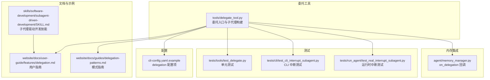
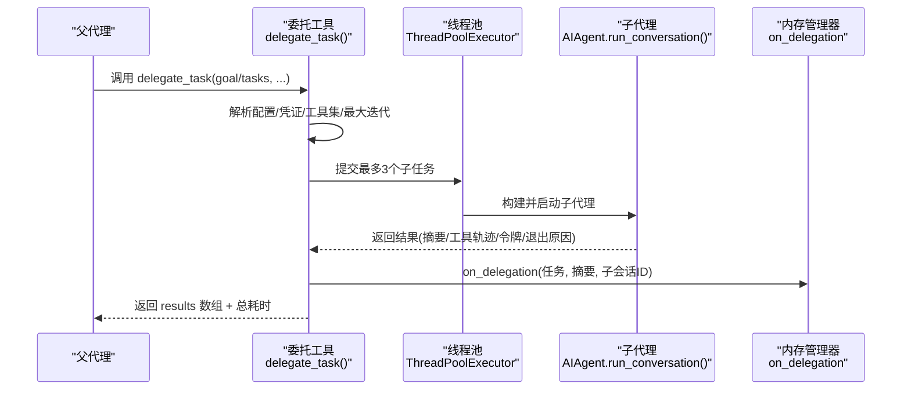
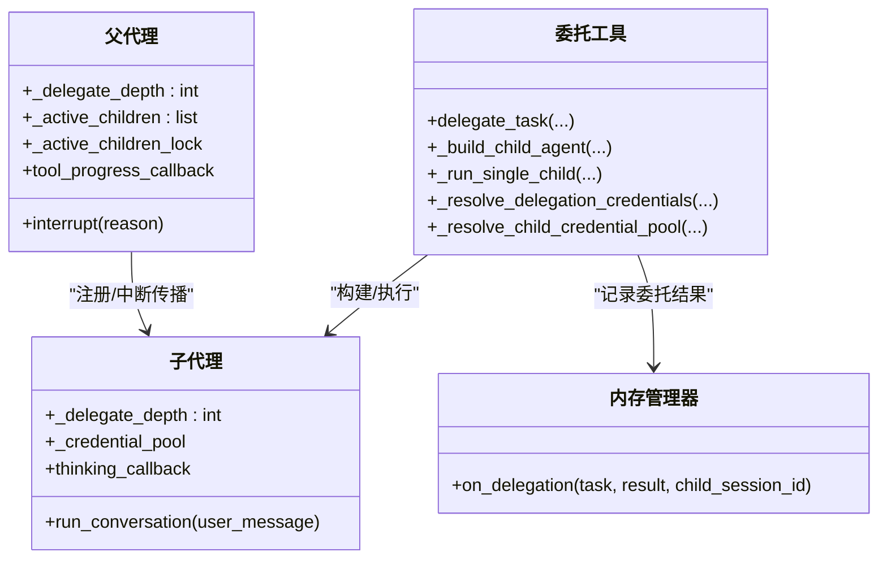
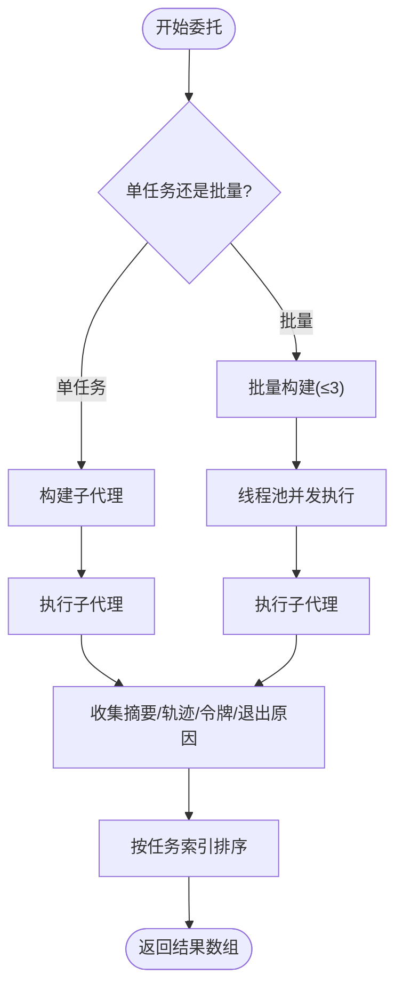
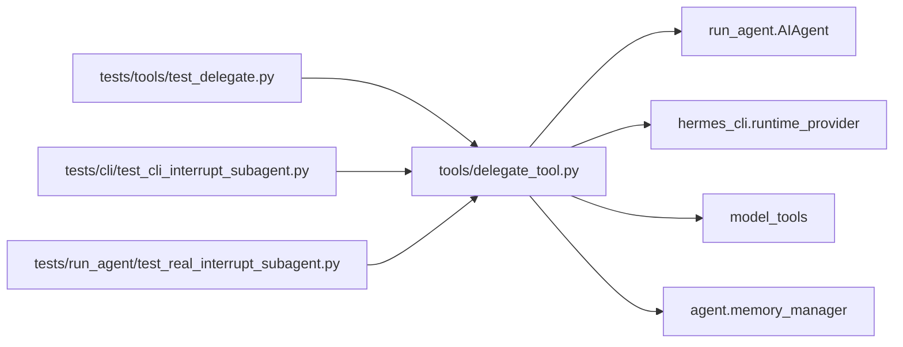

# 委托并行化

<cite>
**本文引用的文件**
- [tools/delegate_tool.py](file://tools/delegate_tool.py)
- [website/docs/user-guide/features/delegation.md](file://website/docs/user-guide/features/delegation.md)
- [website/docs/guides/delegation-patterns.md](file://website/docs/guides/delegation-patterns.md)
- [cli-config.yaml.example](file://cli-config.yaml.example)
- [tests/tools/test_delegate.py](file://tests/tools/test_delegate.py)
- [tests/cli/test_cli_interrupt_subagent.py](file://tests/cli/test_cli_interrupt_subagent.py)
- [tests/run_agent/test_real_interrupt_subagent.py](file://tests/run_agent/test_real_interrupt_subagent.py)
- [agent/memory_manager.py](file://agent/memory_manager.py)
- [skills/software-development/subagent-driven-development/SKILL.md](file://skills/software-development/subagent-driven-development/SKILL.md)
</cite>

## 目录
1. [简介](#简介)
2. [项目结构](#项目结构)
3. [核心组件](#核心组件)
4. [架构总览](#架构总览)
5. [详细组件分析](#详细组件分析)
6. [依赖分析](#依赖分析)
7. [性能考虑](#性能考虑)
8. [故障排查指南](#故障排查指南)
9. [结论](#结论)
10. [附录](#附录)

## 简介
本指南聚焦于 Hermes Agent 的“委托并行化”能力，围绕子代理创建与生命周期管理、资源分配与状态隔离、任务委托流程（分解、优先级、执行监控）、结果聚合与合并策略、以及委托工具的使用与配置进行系统讲解。文档同时提供可直接落地的使用案例与最佳实践，帮助你在复杂任务中高效拆分、并行执行、统一收口。

## 项目结构
委托并行化的核心实现位于工具模块，配套文档与测试覆盖了使用方式、行为边界与中断传播等关键点；技能层提供了面向软件开发的端到端工作流参考。

图表来源
- [tools/delegate_tool.py:510-691](file://tools/delegate_tool.py#L510-L691)
- [website/docs/user-guide/features/delegation.md:1-223](file://website/docs/user-guide/features/delegation.md#L1-L223)
- [website/docs/guides/delegation-patterns.md:233-240](file://website/docs/guides/delegation-patterns.md#L233-L240)
- [cli-config.yaml.example:686-711](file://cli-config.yaml.example#L686-L711)
- [tests/tools/test_delegate.py:1-1057](file://tests/tools/test_delegate.py#L1-L1057)
- [tests/cli/test_cli_interrupt_subagent.py:130-164](file://tests/cli/test_cli_interrupt_subagent.py#L130-L164)
- [tests/run_agent/test_real_interrupt_subagent.py:123-186](file://tests/run_agent/test_real_interrupt_subagent.py#L123-L186)
- [agent/memory_manager.py:325-337](file://agent/memory_manager.py#L325-L337)
- [skills/software-development/subagent-driven-development/SKILL.md:1-343](file://skills/software-development/subagent-driven-development/SKILL.md#L1-L343)

章节来源
- [tools/delegate_tool.py:1-979](file://tools/delegate_tool.py#L1-L979)
- [website/docs/user-guide/features/delegation.md:1-223](file://website/docs/user-guide/features/delegation.md#L1-L223)
- [cli-config.yaml.example:686-711](file://cli-config.yaml.example#L686-L711)

## 核心组件
- 委托工具入口：提供单任务与批量（最多 3 并发）两种模式，支持模型/提供商覆盖、工具集限制、最大迭代次数、ACPC 传输覆盖等参数。
- 子代理构建器：为每个任务构造独立的 AIAgent 实例，注入隔离系统提示词、受限工具集、会话与记忆开关、进度回调、深度限制、凭证池共享等。
- 执行与观察：线程池并发执行子代理，收集每个子代理的摘要、工具调用轨迹、令牌用量、退出原因等可观测信息；支持中断传播。
- 结果聚合：按输入顺序返回结果数组，汇总总耗时；通过内存管理器回调记录委托结果，便于外部持久化或追踪。

章节来源
- [tools/delegate_tool.py:510-691](file://tools/delegate_tool.py#L510-L691)
- [tools/delegate_tool.py:196-336](file://tools/delegate_tool.py#L196-L336)
- [tools/delegate_tool.py:338-497](file://tools/delegate_tool.py#L338-L497)
- [agent/memory_manager.py:325-337](file://agent/memory_manager.py#L325-L337)

## 架构总览
下图展示了从父代理发起委托到子代理执行与结果回传的整体流程，包括并发控制、中断传播与可观测性字段。

图表来源
- [tools/delegate_tool.py:510-691](file://tools/delegate_tool.py#L510-L691)
- [tools/delegate_tool.py:338-497](file://tools/delegate_tool.py#L338-L497)
- [agent/memory_manager.py:325-337](file://agent/memory_manager.py#L325-L337)

## 详细组件分析

### 子代理创建与生命周期管理
- 隔离上下文：子代理拥有全新对话历史、独立终端会话、禁用共享内存写入与用户交互工具，确保状态隔离。
- 工具集限制：自动剔除被禁止的工具集（如 delegation、clarify、memory、send_message、execute_code），并根据父代理启用状态推导有效工具集。
- 凭证与路由：支持继承父代理的 API 密钥/提供商配置，或基于 delegation 配置解析不同提供商/直连端点；在同提供商场景下共享凭证池以支持轮换。
- 深度限制：防止递归委托（最大深度 2），子代理无法再派生孙代理。
- 进度与思考回调：当父代理提供进度回调时，子代理的思考过程会被转发，避免子代理自建 Spinner。
- 注册与中断传播：子代理加入父代理的活动子代理列表，父中断请求会传播至所有活跃子代理，实现统一中断。

图表来源
- [tools/delegate_tool.py:196-336](file://tools/delegate_tool.py#L196-L336)
- [tools/delegate_tool.py:338-497](file://tools/delegate_tool.py#L338-L497)
- [agent/memory_manager.py:325-337](file://agent/memory_manager.py#L325-L337)

章节来源
- [tools/delegate_tool.py:196-336](file://tools/delegate_tool.py#L196-L336)
- [tools/delegate_tool.py:338-497](file://tools/delegate_tool.py#L338-L497)
- [tests/tools/test_delegate.py:204-231](file://tests/tools/test_delegate.py#L204-L231)
- [tests/run_agent/test_real_interrupt_subagent.py:150-182](file://tests/run_agent/test_real_interrupt_subagent.py#L150-L182)

### 任务委托流程：分解、优先级、执行监控
- 任务分解：支持单任务与批量（tasks 数组）两种模式；批量模式最多 3 个并发，超过部分会被截断；单任务直接执行，避免线程池开销。
- 优先级设置：当前实现未内置显式优先级队列；可通过任务粒度与工具集选择间接影响吞吐与成本。
- 执行监控：
  - CLI 模式：树形视图实时展示各子代理的工具调用；每任务完成行会在进度条上方显示。
  - 网关模式：批量汇总工具名并通过父代理进度回调上报。
  - 可观测性字段：每个子代理返回摘要、工具调用轨迹（含 args/result 字节量与错误标记）、令牌用量、模型与退出原因（completed/interrupted/max_iterations）。
  - 中断传播：父代理中断会快速终止活跃子代理，缩短等待时间。

图表来源
- [tools/delegate_tool.py:510-691](file://tools/delegate_tool.py#L510-L691)
- [tools/delegate_tool.py:338-497](file://tools/delegate_tool.py#L338-L497)

章节来源
- [website/docs/user-guide/features/delegation.md:120-130](file://website/docs/user-guide/features/delegation.md#L120-L130)
- [tests/tools/test_delegate.py:145-174](file://tests/tools/test_delegate.py#L145-L174)
- [tests/tools/test_delegate.py:395-556](file://tests/tools/test_delegate.py#L395-L556)

### 结果聚合与合并策略
- 数据整合：每个子代理返回摘要与工具轨迹；父代理将多个结果按输入顺序拼接为数组，附加总耗时。
- 冲突解决：当前未内置跨子代理冲突检测；建议通过任务粒度划分与明确上下文减少冲突概率。
- 最终输出生成：父代理仅保留子代理摘要进入其上下文窗口，避免中间结果污染；如需完整产物，可在子代理内部产出文件并通过父代理读取。

章节来源
- [tools/delegate_tool.py:673-691](file://tools/delegate_tool.py#L673-L691)
- [website/docs/user-guide/features/delegation.md:180-187](file://website/docs/user-guide/features/delegation.md#L180-L187)

### 委托工具使用方法与配置选项
- 基本参数
  - goal：子代理需要完成的任务描述（必须清晰、自包含）
  - context：任务所需背景信息（文件路径、错误消息、约束条件等）
  - toolsets：允许的工具集（默认继承父代理启用状态，自动剔除被禁止项）
  - tasks：批量任务数组（最多 3 项，逐项独立执行）
  - max_iterations：每个子代理的最大推理轮次（默认 50）
  - acp_command/acp_args：为子代理覆盖 ACP 命令与参数（例如 Claude Code）
- 配置文件
  - delegation.max_iterations：全局默认最大迭代
  - delegation.default_toolsets：默认工具集
  - delegation.model/delegation.provider：为子代理指定不同模型/提供商
  - delegation.base_url/delegation.api_key：直连端点与密钥（当 provider 为空时生效）

章节来源
- [tools/delegate_tool.py:842-978](file://tools/delegate_tool.py#L842-L978)
- [cli-config.yaml.example:686-711](file://cli-config.yaml.example#L686-L711)
- [website/docs/user-guide/features/delegation.md:132-144](file://website/docs/user-guide/features/delegation.md#L132-L144)

### 实际使用案例与最佳实践
- 并行研究：同时对多个主题进行网络检索，收集摘要后统一评估。
- 代码审查与修复：先委派审查子代理定位问题，再委派修复子代理实施修复，最后统一回归验证。
- 大型重构：将多文件替换任务拆分为若干小任务，避免父代理上下文溢出。
- 子代理驱动开发：按计划逐项委派实现、规范符合性审查与代码质量审查，形成闭环。

章节来源
- [website/docs/user-guide/features/delegation.md:58-118](file://website/docs/user-guide/features/delegation.md#L58-L118)
- [skills/software-development/subagent-driven-development/SKILL.md:35-187](file://skills/software-development/subagent-driven-development/SKILL.md#L35-L187)

## 依赖分析
- 委托工具依赖
  - run_agent.AIAgent：用于构建与运行子代理
  - hermes_cli.runtime_provider：解析提供商路由
  - model_tools：解析工具集与工具名称
  - agent.memory_manager：记录委托结果
  - 测试覆盖：覆盖参数校验、并发上限、工具名恢复、可观测性字段、凭证解析等
- 中断传播依赖
  - 父代理维护 _active_children 列表并在中断时设置 _interrupt_requested
  - 子代理在运行循环中检测中断并尽快退出

图表来源
- [tools/delegate_tool.py:196-336](file://tools/delegate_tool.py#L196-L336)
- [tests/tools/test_delegate.py:1-1057](file://tests/tools/test_delegate.py#L1-L1057)
- [tests/cli/test_cli_interrupt_subagent.py:130-164](file://tests/cli/test_cli_interrupt_subagent.py#L130-L164)
- [tests/run_agent/test_real_interrupt_subagent.py:123-186](file://tests/run_agent/test_real_interrupt_subagent.py#L123-L186)

章节来源
- [tests/tools/test_delegate.py:1-1057](file://tests/tools/test_delegate.py#L1-L1057)
- [tests/cli/test_cli_interrupt_subagent.py:130-164](file://tests/cli/test_cli_interrupt_subagent.py#L130-L164)
- [tests/run_agent/test_real_interrupt_subagent.py:123-186](file://tests/run_agent/test_real_interrupt_subagent.py#L123-L186)

## 性能考虑
- 并发度：批量模式最大并发 3，避免过度竞争资源；单任务直接执行，降低线程池调度开销。
- 上下文与令牌：子代理仅返回摘要，显著降低父代理上下文压力；可观测性字段可用于成本与效率分析。
- 凭证轮换：同提供商场景下共享凭证池，有助于在限速时自动切换密钥，提升吞吐稳定性。
- 中断响应：父中断快速传播至子代理，缩短无效等待时间，提高交互体验。

## 故障排查指南
- 无父代理上下文：委托工具要求提供 parent_agent，否则返回错误。
- 深度超限：超过最大深度（2）会拒绝进一步委托。
- 缺少目标：未提供 goal 或 tasks 时返回错误。
- 工具集缺失：若提供的工具集为空或仅包含被禁止项，将被剔除或报错。
- 观测性字段异常：检查子代理是否正确返回 messages，工具调用与结果匹配依赖 tool_call_id。
- 中断未生效：确认父代理已正确设置 _interrupt_requested，且子代理在运行循环中检测该标志。

章节来源
- [tools/delegate_tool.py:510-567](file://tools/delegate_tool.py#L510-L567)
- [tests/tools/test_delegate.py:104-130](file://tests/tools/test_delegate.py#L104-L130)
- [tests/tools/test_delegate.py:395-556](file://tests/tools/test_delegate.py#L395-L556)
- [tests/cli/test_cli_interrupt_subagent.py:145-164](file://tests/cli/test_cli_interrupt_subagent.py#L145-L164)
- [tests/run_agent/test_real_interrupt_subagent.py:150-182](file://tests/run_agent/test_real_interrupt_subagent.py#L150-L182)

## 结论
委托并行化通过“隔离上下文 + 受限工具 + 并发执行 + 统一聚合”的设计，在复杂任务中实现了高吞吐、低污染、可观察与可中断的子代理工作流。结合配置项与最佳实践，你可以按需选择模型/提供商、工具集与迭代上限，从而在成本与效果之间取得平衡。

## 附录
- 相关文档
  - 用户指南：[子代理委托:1-223](file://website/docs/user-guide/features/delegation.md#L1-L223)
  - 模式指南：[委托模式要点:233-240](file://website/docs/guides/delegation-patterns.md#L233-L240)
  - 子代理驱动开发技能：[工作流与范式:1-343](file://skills/software-development/subagent-driven-development/SKILL.md#L1-L343)
- 配置参考
  - [delegation 配置项:686-711](file://cli-config.yaml.example#L686-L711)
- 行为验证
  - [委托工具测试:1-1057](file://tests/tools/test_delegate.py#L1-L1057)
  - [CLI 中断传播测试:130-164](file://tests/cli/test_cli_interrupt_subagent.py#L130-L164)
  - [运行时中断传播测试:123-186](file://tests/run_agent/test_real_interrupt_subagent.py#L123-L186)