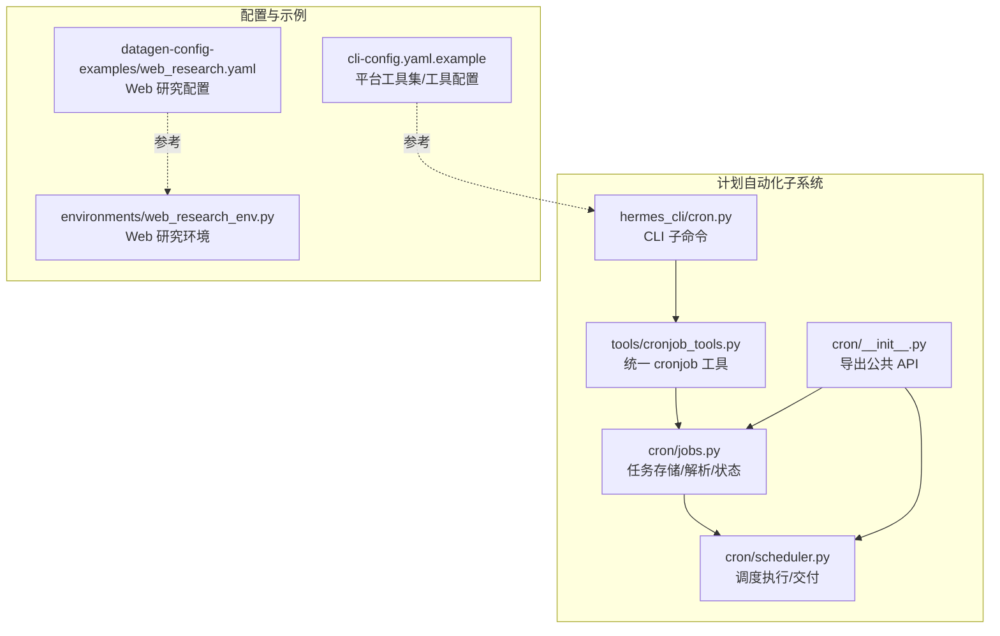
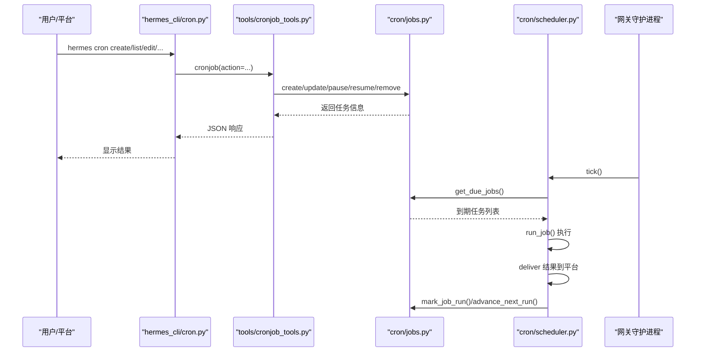
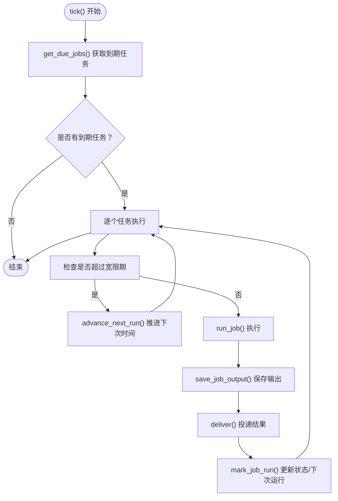
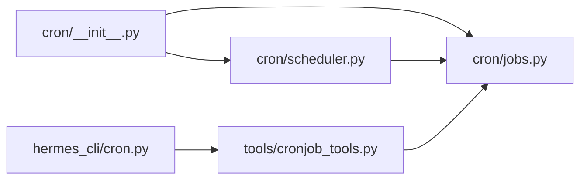

# 计划自动化

<cite>
**本文引用的文件**
- [cron/__init__.py](file://cron/__init__.py)
- [cron/jobs.py](file://cron/jobs.py)
- [cron/scheduler.py](file://cron/scheduler.py)
- [hermes_cli/cron.py](file://hermes_cli/cron.py)
- [tools/cronjob_tools.py](file://tools/cronjob_tools.py)
- [README.md](file://README.md)
- [cli-config.yaml.example](file://cli-config.yaml.example)
- [datagen-config-examples/web_research.yaml](file://datagen-config-examples/web_research.yaml)
- [environments/web_research_env.py](file://environments/web_research_env.py)
</cite>

## 目录
1. [简介](#简介)
2. [项目结构](#项目结构)
3. [核心组件](#核心组件)
4. [架构总览](#架构总览)
5. [详细组件分析](#详细组件分析)
6. [依赖分析](#依赖分析)
7. [性能考虑](#性能考虑)
8. [故障排查指南](#故障排查指南)
9. [结论](#结论)
10. [附录](#附录)

## 简介
本指南面向希望使用 Hermes Agent 的“计划自动化（Cron）”能力的用户与平台集成者。内容覆盖：
- 如何创建与管理定时任务（cron 任务）
- 任务配置语法、执行频率设置、一次性与周期性调度
- 自然语言任务描述的解析、参数提取与执行计划生成
- 任务调度机制：队列管理、并发控制、资源限制与超时策略
- 任务监控与日志记录
- 实际应用场景：Web 研究、数据生成等的配置示例

Hermes 的计划自动化基于内部文件系统驱动的调度器，由网关守护进程每分钟轮询一次，确保在多实例或系统重启场景下避免重复执行。

## 项目结构
与计划自动化直接相关的模块与文件如下：
- cron 模块：任务存储、解析与调度
- hermes_cli 子命令：CLI 对 cron 的管理入口
- 工具层：统一的 cronjob 管理工具接口
- 示例与环境：Web 研究与数据生成的配置样例

图示来源
- [cron/__init__.py:1-43](file://cron/__init__.py#L1-L43)
- [cron/jobs.py:1-120](file://cron/jobs.py#L1-L120)
- [cron/scheduler.py:1-120](file://cron/scheduler.py#L1-L120)
- [hermes_cli/cron.py:1-120](file://hermes_cli/cron.py#L1-L120)
- [tools/cronjob_tools.py:1-120](file://tools/cronjob_tools.py#L1-L120)
- [cli-config.yaml.example:520-590](file://cli-config.yaml.example#L520-L590)
- [datagen-config-examples/web_research.yaml:1-47](file://datagen-config-examples/web_research.yaml#L1-L47)
- [environments/web_research_env.py:1-120](file://environments/web_research_env.py#L1-L120)

章节来源
- [README.md:100-106](file://README.md#L100-L106)
- [cron/__init__.py:1-43](file://cron/__init__.py#L1-L43)

## 核心组件
- 任务存储与解析：负责任务的创建、更新、暂停/恢复、删除、到期检测与输出落盘
- 调度器：每分钟轮询到期任务，执行并按目标平台自动投递结果
- CLI 管理：提供 list/create/edit/pause/resume/run/remove/status/tick 等命令
- 统一工具接口：封装安全校验、脚本路径验证、提示词扫描与模型/路由解析

章节来源
- [cron/jobs.py:320-754](file://cron/jobs.py#L320-L754)
- [cron/scheduler.py:1-200](file://cron/scheduler.py#L1-L200)
- [hermes_cli/cron.py:1-276](file://hermes_cli/cron.py#L1-L276)
- [tools/cronjob_tools.py:208-532](file://tools/cronjob_tools.py#L208-L532)

## 架构总览
Hermes 计划自动化采用“文件系统 + 网关守护”的轻量架构：
- 任务定义与状态持久化于 ~/.hermes/cron/jobs.json
- 输出落盘于 ~/.hermes/cron/output/{job_id}/ 时间戳.md
- 网关后台线程每 60 秒调用 tick() 执行到期任务
- 文件锁防止多实例重入导致的重复执行
- 支持多种交付目标（Telegram、Discord、Slack、Email 等）

图示来源
- [hermes_cli/cron.py:145-276](file://hermes_cli/cron.py#L145-L276)
- [tools/cronjob_tools.py:208-372](file://tools/cronjob_tools.py#L208-L372)
- [cron/jobs.py:649-754](file://cron/jobs.py#L649-L754)
- [cron/scheduler.py:10-120](file://cron/scheduler.py#L10-L120)

## 详细组件分析

### 任务创建与配置语法
- 任务创建支持以下关键字段：
  - prompt：任务提示词（必须自包含；若提供技能，则作为任务指令）
  - schedule：调度表达式，支持“持续时间”“间隔”“Cron 表达式”“指定时间”
  - name/deliver/repeat/skill(s)/model/provider/base_url/script
- 调度表达式解析规则：
  - “30m”“2h”“1d” → 一次性延时运行
  - “every 30m/every 2h” → 周期性间隔
  - “0 9 * * *” → Cron 表达式（需安装 croniter）
  - “2026-02-03T14:00:00” → 指定时间一次性运行
- 交付目标：
  - origin/local/平台名（如 telegram/discord/slack 等）
  - 支持平台:chat_id 或 平台:chat_id:thread_id 的形式
- 数据采集脚本：
  - script：相对路径位于 ~/.hermes/scripts/ 下，每次运行前注入其 stdout 作为上下文

章节来源
- [tools/cronjob_tools.py:208-372](file://tools/cronjob_tools.py#L208-L372)
- [cron/jobs.py:117-204](file://cron/jobs.py#L117-L204)
- [hermes_cli/cron.py:145-170](file://hermes_cli/cron.py#L145-L170)

### 任务调度机制与执行流程
- 到期检测：
  - compute_next_run() 基于 schedule(kind=once/interval/cron) 推算下次运行时间
  - get_due_jobs() 在每次 tick 中筛选到期任务；对周期性任务采用“宽限期追赶”策略，避免重启后爆发执行
- 执行与交付：
  - run_job() 构建提示词（含技能加载、脚本输出注入、交付说明），运行 AIAgent，捕获最终响应
  - deliver() 将结果按目标平台投递；支持本地保存与静默抑制
- 资源与并发控制：
  - 单次 tick 内串行处理到期任务
  - 通过文件锁避免多实例同时执行
  - 通过 HERMES_CRON_TIMEOUT 控制空闲超时（秒），默认 600

图示来源
- [cron/scheduler.py:10-120](file://cron/scheduler.py#L10-L120)
- [cron/jobs.py:649-754](file://cron/jobs.py#L649-L754)

章节来源
- [cron/scheduler.py:500-800](file://cron/scheduler.py#L500-L800)
- [cron/jobs.py:284-314](file://cron/jobs.py#L284-L314)

### 自然语言任务描述与参数提取
- 提示词扫描：
  - 对 cron 提示词进行威胁模式匹配与不可见字符过滤，阻断高危注入
- 技能加载：
  - 支持顺序加载多个技能，技能内容注入到系统提示中，随后追加用户 prompt 作为任务指令
- 数据脚本注入：
  - 运行前执行 script，将 stdout 注入到提示词开头，作为上下文供模型参考
- 交付提示：
  - 固定注入“交付说明”，指导模型不要自行发送消息，而是产出最终报告，由系统自动投递

章节来源
- [tools/cronjob_tools.py:55-64](file://tools/cronjob_tools.py#L55-L64)
- [cron/scheduler.py:422-510](file://cron/scheduler.py#L422-L510)

### 队列管理、并发控制与资源限制
- 队列管理：
  - 任务按 next_run_at 排序，tick() 时一次性取出到期集合，串行执行
- 并发控制：
  - 文件锁保证同一时刻仅有一个 tick 进程执行
  - 任务执行池为单线程，避免竞争
- 资源限制：
  - HERMES_CRON_TIMEOUT 控制空闲超时（秒），0 表示不限
  - 脚本执行超时固定为 120 秒
  - 输出落盘采用临时文件 + 原子替换，保障一致性

章节来源
- [cron/scheduler.py:341-420](file://cron/scheduler.py#L341-L420)
- [cron/scheduler.py:674-738](file://cron/scheduler.py#L674-L738)

### 任务监控与日志记录
- 本地输出：
  - 每次执行生成 Markdown 文件，包含任务名、运行时间、调度显示、提示词与最终响应/错误
- 状态追踪：
  - jobs.json 记录任务状态、最近运行时间、重复次数、下次运行时间等
- 日志：
  - 调度器与任务执行过程均有日志输出，便于定位问题

章节来源
- [cron/jobs.py:728-754](file://cron/jobs.py#L728-L754)
- [cron/jobs.py:577-619](file://cron/jobs.py#L577-L619)
- [cron/scheduler.py:512-800](file://cron/scheduler.py#L512-L800)

### CLI 使用与常见操作
- 查看状态与活动任务
  - hermes cron status
  - hermes cron list [--all]
- 创建任务
  - hermes cron create --schedule "every 2h" --prompt "..." --deliver telegram
- 编辑任务
  - hermes cron edit <job_id> --schedule "0 9 * * *" --deliver origin
- 控制任务
  - hermes cron pause/resume/run/remove <job_id>
- 强制执行一次
  - hermes cron tick

章节来源
- [hermes_cli/cron.py:41-143](file://hermes_cli/cron.py#L41-L143)
- [hermes_cli/cron.py:145-276](file://hermes_cli/cron.py#L145-L276)

### 实际应用场景示例

#### Web 研究与数据生成
- 使用 datagen 配置批量生成轨迹数据，结合 WebResearchEnv 环境训练研究型代理
- 关键点：
  - toolsets: web + file
  - num_workers/batch_size/max_items 控制并行与规模
  - model 指定推理模型
  - output_dir 指定输出目录
  - compression 控制轨迹压缩

章节来源
- [datagen-config-examples/web_research.yaml:1-47](file://datagen-config-examples/web_research.yaml#L1-L47)
- [environments/web_research_env.py:1-120](file://environments/web_research_env.py#L1-L120)

#### 定时报告与备份
- 使用 hermes cron create 创建周期性任务，例如：
  - 每日 9:00 发送健康检查报告到 Telegram
  - 每周日凌晨 2:00 备份会话日志
- 交付目标可设为 origin（回送到原聊天）或平台直发

章节来源
- [hermes_cli/cron.py:145-170](file://hermes_cli/cron.py#L145-L170)
- [tools/cronjob_tools.py:411-486](file://tools/cronjob_tools.py#L411-L486)

## 依赖分析
- cron/__init__.py 导出公共 API（任务 CRUD、tick 等）
- cron/jobs.py 提供任务存储、解析、到期计算与输出落盘
- cron/scheduler.py 提供调度执行、交付与安全校验
- hermes_cli/cron.py 提供 CLI 入口
- tools/cronjob_tools.py 提供统一工具接口与安全策略

图示来源
- [cron/__init__.py:18-42](file://cron/__init__.py#L18-L42)
- [cron/jobs.py:1-120](file://cron/jobs.py#L1-L120)
- [cron/scheduler.py:1-120](file://cron/scheduler.py#L1-L120)
- [hermes_cli/cron.py:1-120](file://hermes_cli/cron.py#L1-L120)
- [tools/cronjob_tools.py:1-120](file://tools/cronjob_tools.py#L1-L120)

章节来源
- [cron/__init__.py:18-42](file://cron/__init__.py#L18-L42)

## 性能考虑
- 调度轮询周期为 60 秒，适合大多数自动化场景
- 周期性任务的“宽限期追赶”避免重启后的突发执行，降低资源峰值
- 输出落盘采用原子写入，减少磁盘争用
- 空闲超时可按任务复杂度调整（HERMES_CRON_TIMEOUT），平衡资源占用与响应速度

## 故障排查指南
- 无法创建 Cron 任务
  - 检查提示词是否通过安全扫描（威胁模式/不可见字符）
  - 确认脚本路径是否位于 ~/.hermes/scripts/ 下且为相对路径
- 任务未执行
  - 使用 hermes cron status 检查网关是否运行
  - 使用 hermes cron tick 强制执行一次
  - 查看 ~/.hermes/cron/output/{job_id}/ 下最新输出文件
- 交付失败
  - 确认平台配置已启用且 HOME_CHANNEL 环境变量已设置
  - 检查 deliver 参数格式（platform:chat_id 或 platform:chat_id:thread_id）
- 超时或卡住
  - 设置 HERMES_CRON_TIMEOUT 为更宽松值，或优化提示词/脚本
  - 检查脚本执行超时（120 秒）

章节来源
- [tools/cronjob_tools.py:55-64](file://tools/cronjob_tools.py#L55-L64)
- [tools/cronjob_tools.py:141-178](file://tools/cronjob_tools.py#L141-L178)
- [cron/scheduler.py:235-339](file://cron/scheduler.py#L235-L339)
- [hermes_cli/cron.py:106-143](file://hermes_cli/cron.py#L106-L143)

## 结论
Hermes 的计划自动化以简洁稳定的文件系统 + 网关守护架构实现了可靠的定时任务执行，具备：
- 灵活的调度表达式与交付目标
- 安全的提示词扫描与脚本执行策略
- 清晰的任务状态与输出追踪
- 易于扩展的 CLI 与工具接口

建议在生产环境中：
- 合理设置 HERMES_CRON_TIMEOUT 与脚本超时
- 使用 origin 或明确的平台直发，确保交付稳定
- 通过 CLI 的 status/tick 辅助排障与验证

## 附录

### 调度表达式速查
- 持续时间：30m、2h、1d（一次性延时）
- 间隔：every 30m、every 2h（周期性）
- Cron：0 9 * * *（需 croniter）
- 指定时间：2026-02-03T14:00:00（一次性）

章节来源
- [cron/jobs.py:117-204](file://cron/jobs.py#L117-L204)

### 平台交付目标速查
- deliver: origin（回送至原聊天）
- deliver: local（仅本地保存）
- deliver: telegram/discord/slack/...（需对应 HOME_CHANNEL 环境变量）
- deliver: platform:chat_id 或 platform:chat_id:thread_id

章节来源
- [tools/cronjob_tools.py:455-458](file://tools/cronjob_tools.py#L455-L458)
- [cron/scheduler.py:235-258](file://cron/scheduler.py#L235-L258)