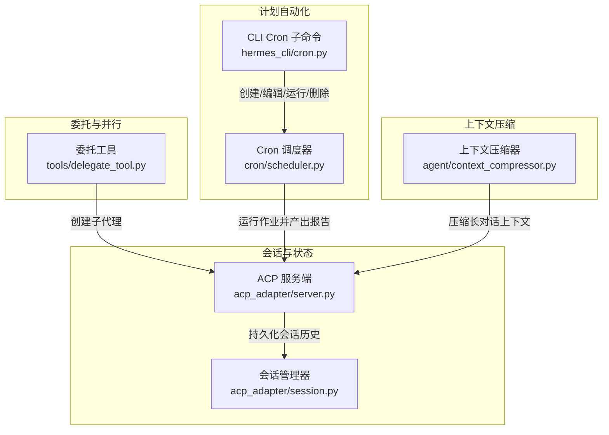
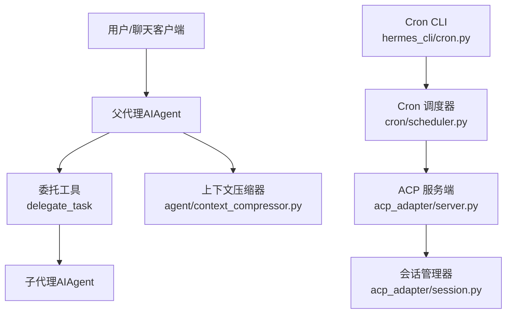
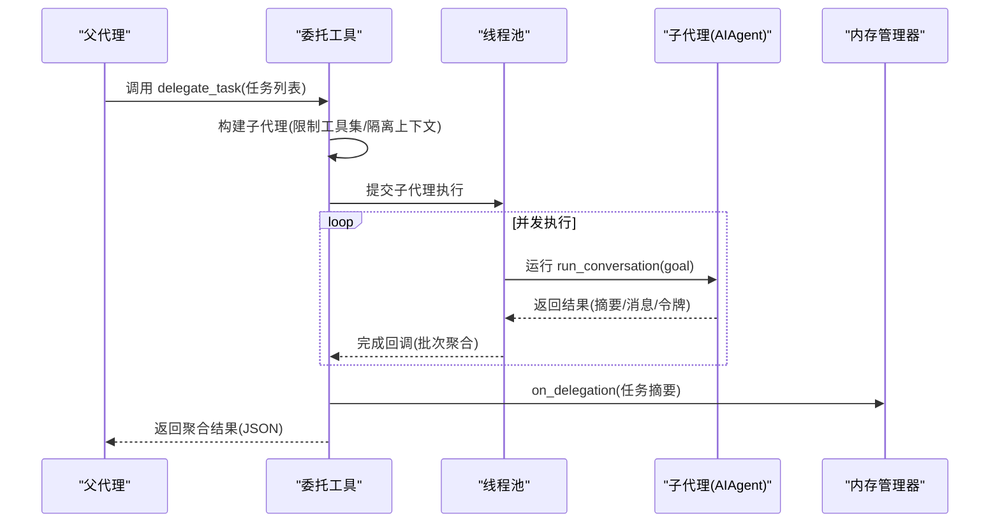
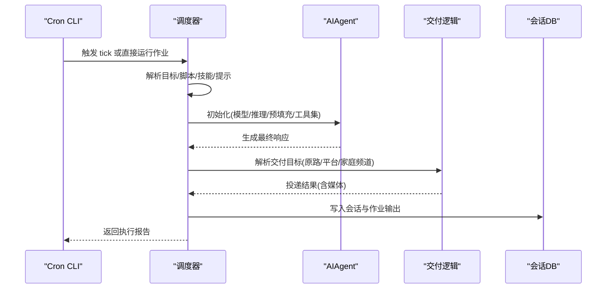
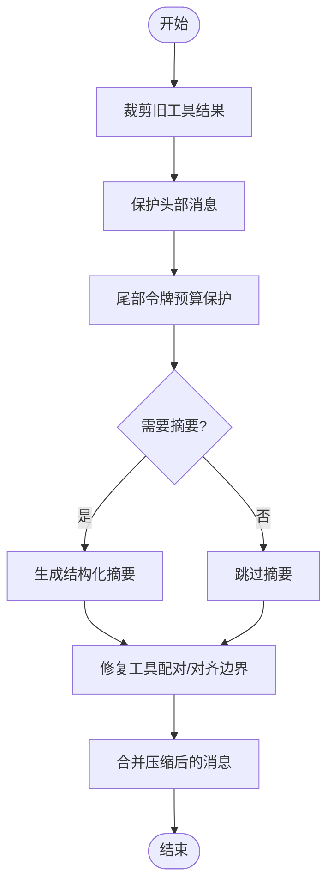
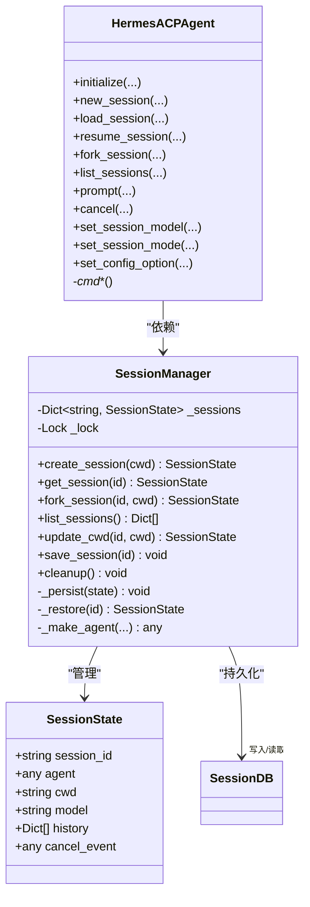
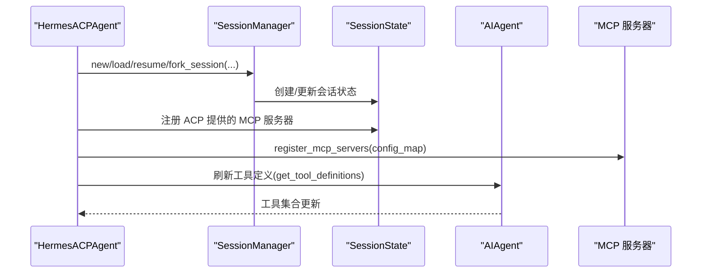

# 高级功能

<cite>
**本文引用的文件**
- [agent/context_compressor.py](file://agent/context_compressor.py)
- [agent/memory_manager.py](file://agent/memory_manager.py)
- [agent/builtin_memory_provider.py](file://agent/builtin_memory_provider.py)
- [tools/delegate_tool.py](file://tools/delegate_tool.py)
- [tools/mixture_of_agents_tool.py](file://tools/mixture_of_agents_tool.py)
- [cron/scheduler.py](file://cron/scheduler.py)
- [hermes_cli/cron.py](file://hermes_cli/cron.py)
- [acp_adapter/server.py](file://acp_adapter/server.py)
- [acp_adapter/session.py](file://acp_adapter/session.py)
</cite>

## 目录
1. [简介](#简介)
2. [项目结构](#项目结构)
3. [核心组件](#核心组件)
4. [架构总览](#架构总览)
5. [详细组件分析](#详细组件分析)
6. [依赖分析](#依赖分析)
7. [性能考虑](#性能考虑)
8. [故障排查指南](#故障排查指南)
9. [结论](#结论)
10. [附录](#附录)

## 简介
本指南面向希望深入使用 Hermes Agent 的高级用户，系统讲解以下高级能力与实践方法：
- 委托并行化：子代理创建、任务分配、结果聚合与上下文隔离
- 计划自动化：基于 Cron 的定时任务创建、技能注入、交付与监控
- 上下文压缩与缓存：长对话压缩、工具输出裁剪、尾部保护与令牌预算
- 多会话管理与状态同步：ACP 会话生命周期、持久化与跨进程恢复
- ACPI 协议与 MCP 集成：通过 ACP 暴露工具面、动态注册 MCP 服务器
- 高级配置与性能调优：模型路由、并发控制、令牌预算与错误冷却

## 项目结构
围绕“高级功能”的关键模块分布如下：
- 委托并行化：tools/delegate_tool.py 提供子代理编排；run_agent 中的 AIAgent 负责执行
- 计划自动化：cron/scheduler.py 执行作业；hermes_cli/cron.py 提供 CLI 管理命令
- 上下文压缩与缓存：agent/context_compressor.py 实现结构化摘要与令牌预算保护
- 多会话管理与状态同步：acp_adapter/server.py 与 acp_adapter/session.py 管理会话与持久化
- ACPI 协议与 MCP 集成：acp_adapter/server.py 暴露 ACP 能力；注册 MCP 服务器后刷新工具面

图示来源
- [tools/delegate_tool.py:510-691](file://tools/delegate_tool.py#L510-L691)
- [hermes_cli/cron.py:145-275](file://hermes_cli/cron.py#L145-L275)
- [cron/scheduler.py:512-800](file://cron/scheduler.py#L512-L800)
- [acp_adapter/server.py:92-727](file://acp_adapter/server.py#L92-L727)
- [acp_adapter/session.py:70-476](file://acp_adapter/session.py#L70-L476)
- [agent/context_compressor.py:53-697](file://agent/context_compressor.py#L53-L697)

章节来源
- [tools/delegate_tool.py:1-979](file://tools/delegate_tool.py#L1-L979)
- [hermes_cli/cron.py:1-276](file://hermes_cli/cron.py#L1-L276)
- [cron/scheduler.py:1-898](file://cron/scheduler.py#L1-L898)
- [acp_adapter/server.py:1-727](file://acp_adapter/server.py#L1-L727)
- [acp_adapter/session.py:1-476](file://acp_adapter/session.py#L1-L476)
- [agent/context_compressor.py:1-697](file://agent/context_compressor.py#L1-L697)

## 核心组件
- 委托并行化（子代理）：支持单任务与批量并行模式，自动屏蔽敏感工具、限制工具集、隔离上下文与会话，汇总子代理结果返回父代理
- 计划自动化（Cron）：CLI 创建/编辑/暂停/恢复/触发/删除任务；调度器按时间片执行、自动交付到平台或本地
- 上下文压缩与缓存：基于令牌预算的尾部保护、工具输出裁剪、结构化摘要模板、迭代更新摘要、失败冷却
- 多会话管理与状态同步：ACP 会话创建/加载/恢复/分叉、持久化到 SessionDB、工作目录绑定、取消事件
- ACPI 协议与 MCP 集成：ACP 代理能力暴露、命令广告、模型切换、会话模式设置、动态注册 MCP 服务器并刷新工具面

章节来源
- [tools/delegate_tool.py:510-691](file://tools/delegate_tool.py#L510-L691)
- [cron/scheduler.py:512-800](file://cron/scheduler.py#L512-L800)
- [agent/context_compressor.py:53-697](file://agent/context_compressor.py#L53-L697)
- [acp_adapter/server.py:92-727](file://acp_adapter/server.py#L92-L727)
- [acp_adapter/session.py:70-476](file://acp_adapter/session.py#L70-L476)

## 架构总览
下图展示“委托并行化”“计划自动化”“上下文压缩”“会话管理”“ACP/MCP 集成”的交互关系。

图示来源
- [tools/delegate_tool.py:510-691](file://tools/delegate_tool.py#L510-L691)
- [hermes_cli/cron.py:145-275](file://hermes_cli/cron.py#L145-L275)
- [cron/scheduler.py:512-800](file://cron/scheduler.py#L512-L800)
- [acp_adapter/server.py:92-727](file://acp_adapter/server.py#L92-L727)
- [acp_adapter/session.py:70-476](file://acp_adapter/session.py#L70-L476)
- [agent/context_compressor.py:53-697](file://agent/context_compressor.py#L53-L697)

## 详细组件分析

### 委托并行化（子代理）
- 功能要点
  - 单任务与批量并行：批量模式使用线程池并发执行，支持进度回调与子代理思考事件转发
  - 工具集限制：自动屏蔽 delegation、clarify、memory、send_message、execute_code 等受限工具
  - 上下文隔离：子代理拥有独立会话 ID、终端会话、文件缓存，且不共享父代理的历史
  - 结果聚合：返回每个子代理的状态、摘要、耗时、令牌用量与工具追踪，父代理仅记录委托调用与最终摘要
  - 凭据继承/覆盖：可从父代理继承或按配置覆盖 provider/model/base_url/api_key/api_mode
- 关键流程（批量并行）

图示来源
- [tools/delegate_tool.py:510-691](file://tools/delegate_tool.py#L510-L691)
- [agent/memory_manager.py:325-337](file://agent/memory_manager.py#L325-L337)

章节来源
- [tools/delegate_tool.py:1-979](file://tools/delegate_tool.py#L1-L979)
- [agent/memory_manager.py:1-368](file://agent/memory_manager.py#L1-L368)

### 计划自动化（Cron）
- 功能要点
  - CLI 管理：创建/编辑/暂停/恢复/触发/删除任务，查看状态与下次运行时间
  - 作业执行：调度器按时间片扫描到期任务，构建提示（可注入技能内容与脚本输出），以专用会话运行 AIAgent，支持超时与静默标记
  - 自动交付：根据 deliver 配置将结果投递到原渠道、特定平台或家庭频道，支持媒体附件直传
  - 会话持久化：作业运行时写入 SQLite 会话库，便于检索与审计
- 关键流程（作业执行）

图示来源
- [hermes_cli/cron.py:145-275](file://hermes_cli/cron.py#L145-L275)
- [cron/scheduler.py:512-800](file://cron/scheduler.py#L512-L800)

章节来源
- [hermes_cli/cron.py:1-276](file://hermes_cli/cron.py#L1-L276)
- [cron/scheduler.py:1-898](file://cron/scheduler.py#L1-L898)

### 上下文压缩与缓存
- 功能要点
  - 工具输出裁剪：对旧工具结果进行占位符替换，降低令牌占用
  - 尾部保护：基于令牌预算保护最近消息，避免截断关键上下文
  - 结构化摘要：采用“目标/进展/决策/文件/下一步/关键上下文”模板，支持首次摘要与迭代更新
  - 对齐与修复：确保摘要前后不会产生孤儿工具调用/结果配对问题
  - 失败冷却：摘要生成失败进入冷却期，避免反复重试造成噪音
- 压缩流程（简化）

图示来源
- [agent/context_compressor.py:565-697](file://agent/context_compressor.py#L565-L697)

章节来源
- [agent/context_compressor.py:1-697](file://agent/context_compressor.py#L1-L697)

### 多会话管理与状态同步（ACP）
- 功能要点
  - 会话生命周期：创建、加载、恢复、分叉、列出、清理
  - 持久化：会话元数据与消息历史写入 SessionDB，支持跨进程重启恢复
  - 工作目录绑定：为任务/工具注册 cwd 覆盖，保证子进程工作路径一致
  - 取消与中断：每个会话维护取消事件，支持主动中断
  - ACP 命令广告：向客户端通告可用斜杠命令（如模型切换、工具列表、上下文统计、压缩、版本）
- 会话管理类图

图示来源
- [acp_adapter/session.py:58-476](file://acp_adapter/session.py#L58-L476)
- [acp_adapter/server.py:92-727](file://acp_adapter/server.py#L92-L727)

章节来源
- [acp_adapter/session.py:1-476](file://acp_adapter/session.py#L1-L476)
- [acp_adapter/server.py:1-727](file://acp_adapter/server.py#L1-L727)

### ACPI 协议与 MCP 集成
- 功能要点
  - ACP 代理能力：会话分叉/列表、模型切换、会话模式设置、配置项更新
  - 命令广告：向客户端通告可用斜杠命令，支持帮助、模型查询/切换、工具列表、上下文统计、压缩、版本
  - MCP 注册：在会话中动态注册 ACP 提供的 MCP 服务器，刷新工具表面，使子工具可用
- 序列图（MCP 注册与工具刷新）

图示来源
- [acp_adapter/server.py:149-213](file://acp_adapter/server.py#L149-L213)

章节来源
- [acp_adapter/server.py:1-727](file://acp_adapter/server.py#L1-L727)

## 依赖分析
- 委托并行化依赖
  - tools/delegate_tool.py 依赖 run_agent 的 AIAgent 构造与执行
  - 通过 agent/memory_manager.py 的 on_delegation 回调通知外部记忆提供者
- 计划自动化依赖
  - hermes_cli/cron.py 通过 tools/cronjob_tools 调用 cron/scheduler.py
  - 调度器在作业执行前解析环境变量、配置与运行时提供者
- 上下文压缩依赖
  - 使用 agent/model_metadata 的令牌估算接口，结合辅助模型进行摘要
- 会话管理依赖
  - acp_adapter/server.py 与 acp_adapter/session.py 共同实现 ACP 生命周期与持久化
- ACPI/MCP 集成依赖
  - ACP 服务端通过 tools.mcp_tool 注册 MCP 服务器，并刷新工具面

章节来源
- [tools/delegate_tool.py:1-979](file://tools/delegate_tool.py#L1-L979)
- [hermes_cli/cron.py:1-276](file://hermes_cli/cron.py#L1-L276)
- [cron/scheduler.py:1-898](file://cron/scheduler.py#L1-L898)
- [agent/context_compressor.py:1-697](file://agent/context_compressor.py#L1-L697)
- [acp_adapter/server.py:1-727](file://acp_adapter/server.py#L1-L727)
- [acp_adapter/session.py:1-476](file://acp_adapter/session.py#L1-L476)

## 性能考虑
- 委托并行化
  - 并发上限：默认最大并发子代理数受控，避免资源争用
  - 工具集裁剪：仅向子代理开放必要工具集，减少无效 API 调用
  - 凭据轮换：子代理可共享父代理的凭据池，提高配额利用率
- 计划自动化
  - 超时策略：基于活动度的空闲超时，防止卡死任务占用资源
  - 交付路径：优先使用运行时适配器直连，支持端到端加密与媒体直传
- 上下文压缩
  - 令牌预算：尾部保护按模型上下文窗口比例动态调整，兼顾近期信息完整性
  - 失败冷却：摘要失败进入冷却期，避免重复失败带来的日志与资源浪费
- 会话管理
  - 持久化：SessionDB 持久化会话历史，支持跨进程恢复与搜索
  - 取消事件：快速中断长任务，释放资源

章节来源
- [tools/delegate_tool.py:37-38](file://tools/delegate_tool.py#L37-L38)
- [cron/scheduler.py:674-737](file://cron/scheduler.py#L674-L737)
- [agent/context_compressor.py:96-101](file://agent/context_compressor.py#L96-L101)
- [acp_adapter/server.py:307-332](file://acp_adapter/server.py#L307-L332)

## 故障排查指南
- 委托并行化
  - 子代理未产生摘要：检查工具集是否被正确裁剪、是否被阻断工具影响
  - 凭据问题：确认 delegation.provider/base_url/api_key 配置正确，或从父代理继承
  - 深度限制：委托深度超过阈值会被拒绝，避免无限嵌套
- 计划自动化
  - 作业未触发：检查 gateway 是否运行、cron 状态与下次运行时间
  - 交付失败：核对 deliver 配置与平台 HOME_CHANNEL 环境变量
  - 超时中断：关注空闲超时日志，适当调整 HERMES_CRON_TIMEOUT
- 上下文压缩
  - 摘要失败冷却：等待冷却期结束，或调整摘要模型与预算
  - 工具配对异常：检查摘要前后消息是否保留正确的工具调用/结果配对
- 会话管理
  - 会话丢失：确认 SessionDB 可用，检查持久化写入与恢复逻辑
  - ACP 命令不可见：确认已发送 AvailableCommandsUpdate，或客户端支持命令广告

章节来源
- [tools/delegate_tool.py:532-540](file://tools/delegate_tool.py#L532-L540)
- [hermes_cli/cron.py:106-143](file://hermes_cli/cron.py#L106-L143)
- [cron/scheduler.py:710-737](file://cron/scheduler.py#L710-L737)
- [agent/context_compressor.py:264-389](file://agent/context_compressor.py#L264-L389)
- [acp_adapter/server.py:485-512](file://acp_adapter/server.py#L485-L512)
- [acp_adapter/session.py:273-331](file://acp_adapter/session.py#L273-L331)

## 结论
Hermes Agent 在高级功能上提供了完整的“委托并行化、计划自动化、上下文压缩、多会话管理、ACP/MCP 集成”体系。通过严格的工具集限制、令牌预算与失败冷却策略，既保障了复杂任务的稳定性，也提升了长对话与定时任务的可维护性。配合 ACP 的会话持久化与 MCP 的动态工具扩展，用户可在多种客户端与平台上获得一致、可控的智能体体验。

## 附录
- 高级配置建议
  - 委托并行化：合理设置 delegation.max_iterations 与并发上限；必要时为子代理指定更便宜的摘要模型
  - 计划自动化：为高负载任务设置较长的 HERMES_CRON_TIMEOUT；启用 cron.wrap_response 控制交付格式
  - 上下文压缩：根据模型上下文长度调整 threshold_percent 与 summary_target_ratio；开启摘要模型以减少失败冷却
  - 会话管理：在 ACP stdio 场景下使用 stderr 输出人类可读信息；为工具注册 cwd 覆盖以确保路径一致性
  - ACPI/MCP：在会话中动态注册 MCP 服务器后及时刷新工具面，确保新工具立即可用