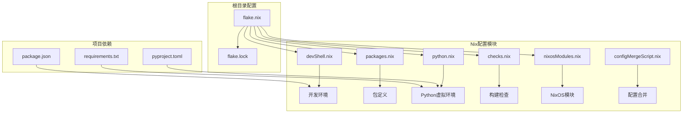
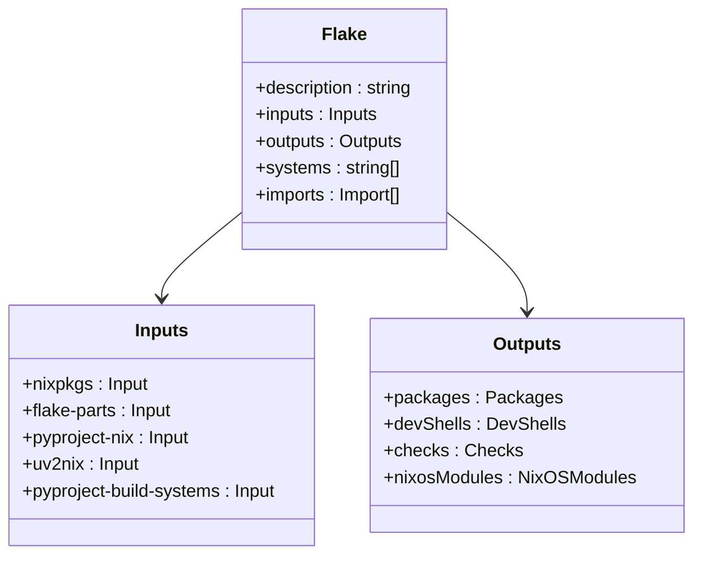
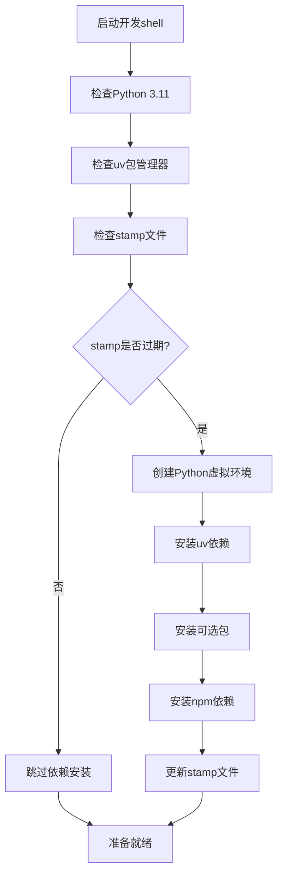
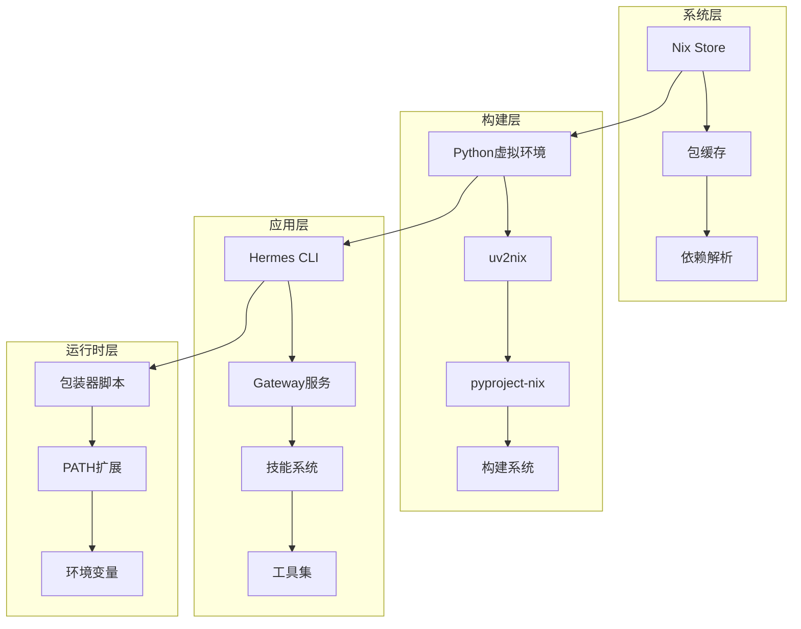
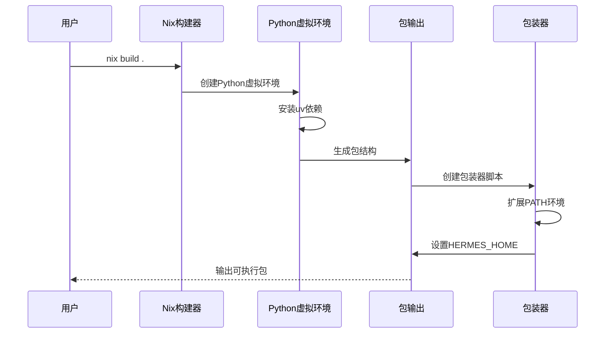
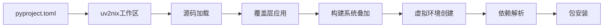
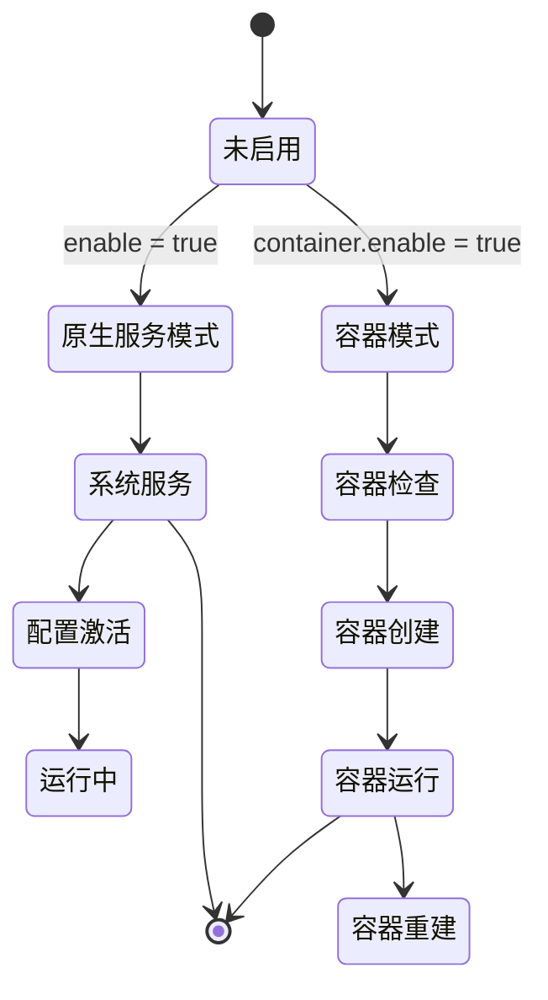
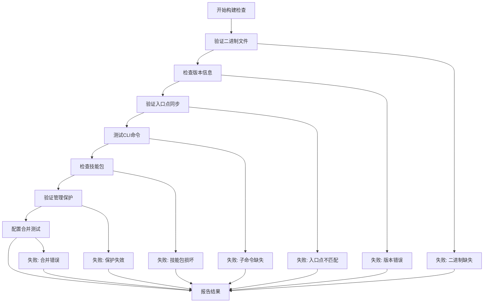
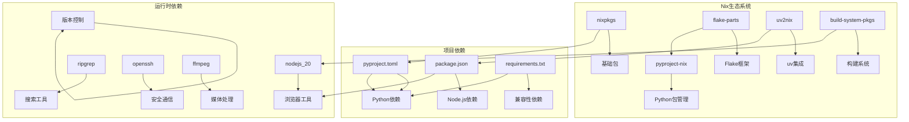
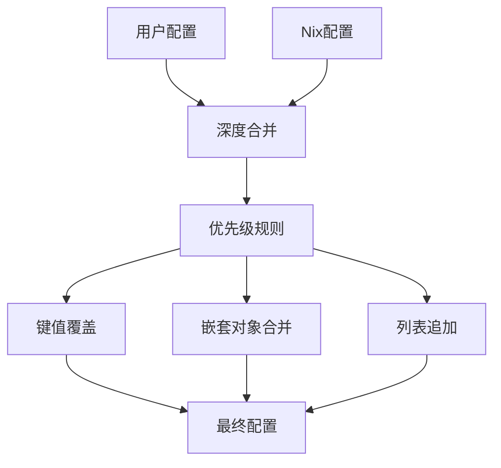

# Nix包管理系统

<cite>
**本文档引用的文件**
- [flake.nix](file://flake.nix)
- [flake.lock](file://flake.lock)
- [devShell.nix](file://nix/devShell.nix)
- [packages.nix](file://nix/packages.nix)
- [python.nix](file://nix/python.nix)
- [checks.nix](file://nix/checks.nix)
- [nixosModules.nix](file://nix/nixosModules.nix)
- [configMergeScript.nix](file://nix/configMergeScript.nix)
- [pyproject.toml](file://pyproject.toml)
- [package.json](file://package.json)
- [requirements.txt](file://requirements.txt)
- [cli-config.yaml.example](file://cli-config.yaml.example)
</cite>

## 目录
1. [简介](#简介)
2. [项目结构](#项目结构)
3. [核心组件](#核心组件)
4. [架构概览](#架构概览)
5. [详细组件分析](#详细组件分析)
6. [依赖关系分析](#依赖关系分析)
7. [性能考虑](#性能考虑)
8. [故障排除指南](#故障排除指南)
9. [结论](#结论)
10. [附录](#附录)

## 简介

Hermes Agent的Nix包管理系统是一个现代化的软件构建和分发基础设施，基于Nix包管理器的强大功能，为AI代理框架提供了确定性构建、可重现性和依赖隔离的完整解决方案。

### Nix包管理器的核心优势

**确定性构建（Deterministic Builds）**
- 每次构建都产生完全相同的结果，消除"在我的机器上能运行"的问题
- 通过哈希值确保依赖项的精确版本控制
- 支持跨平台的一致性体验

**可重现性（Reproducibility）**
- 开发、测试和生产环境使用完全相同的依赖树
- 配置即代码，版本控制所有环境变更
- 支持时间旅行调试和环境回滚

**依赖隔离（Dependency Isolation）**
- 每个包在独立的沙盒环境中构建和运行
- 避免全局状态污染和版本冲突
- 支持多版本共存和灵活的依赖管理

## 项目结构

Hermes Agent的Nix配置采用模块化设计，将不同功能分离到独立的配置文件中：



**图表来源**
- [flake.nix:1-36](file://flake.nix#L1-L36)
- [devShell.nix:1-52](file://nix/devShell.nix#L1-L52)
- [packages.nix:1-55](file://nix/packages.nix#L1-L55)
- [python.nix:1-29](file://nix/python.nix#L1-L29)

**章节来源**
- [flake.nix:1-36](file://flake.nix#L1-L36)
- [flake.lock:1-182](file://flake.lock#L1-L182)

## 核心组件

### Flake配置系统

Flake是Nix 2.0引入的现代化包管理概念，将输入、输出和系统配置统一管理：



**图表来源**
- [flake.nix:4-34](file://flake.nix#L4-L34)

### 开发环境配置

开发shell集成了Python 3.11、uv包管理器、Node.js 20和常用工具：



**图表来源**
- [devShell.nix:7-49](file://nix/devShell.nix#L7-L49)

**章节来源**
- [devShell.nix:1-52](file://nix/devShell.nix#L1-L52)
- [pyproject.toml:13-97](file://pyproject.toml#L13-L97)

## 架构概览

Hermes Agent的Nix架构采用分层设计，从底层包管理到高层应用服务：



**图表来源**
- [packages.nix:22-52](file://nix/packages.nix#L22-L52)
- [python.nix:10-28](file://nix/python.nix#L10-L28)

## 详细组件分析

### 包定义系统

包定义系统负责创建可执行的Hermes Agent包，包含Python虚拟环境和系统工具：



**图表来源**
- [packages.nix:22-43](file://nix/packages.nix#L22-L43)
- [python.nix:26-28](file://nix/python.nix#L26-L28)

### Python虚拟环境管理

使用uv2nix和pyproject-nix实现现代Python包管理：



**图表来源**
- [python.nix:10-24](file://nix/python.nix#L10-L24)

### NixOS模块系统

提供完整的系统级部署能力，支持容器模式和原生服务模式：



**图表来源**
- [nixosModules.nix:626-751](file://nixosModules.nix#L626-L751)

**章节来源**
- [packages.nix:1-55](file://nix/packages.nix#L1-L55)
- [python.nix:1-29](file://nix/python.nix#L1-L29)
- [nixosModules.nix:1-755](file://nixosModules.nix#L1-L755)

### 构建检查系统

全面的构建验证确保包的质量和一致性：



**图表来源**
- [checks.nix:40-341](file://nix/checks.nix#L40-L341)

**章节来源**
- [checks.nix:1-344](file://nix/checks.nix#L1-L344)

## 依赖关系分析

### 外部依赖管理

Hermes Agent使用多种包管理器协同工作：



**图表来源**
- [flake.nix:4-22](file://flake.nix#L4-L22)
- [packages.nix:16-18](file://nix/packages.nix#L16-L18)

### 依赖解析流程


**图表来源**
- [flake.lock:23-177](file://flake.lock#L23-L177)

**章节来源**
- [flake.lock:1-182](file://flake.lock#L1-L182)
- [pyproject.toml:1-116](file://pyproject.toml#L1-L116)

## 性能考虑

### 构建优化策略

**增量构建**
- 使用stamp文件避免不必要的依赖重新安装
- 缓存Python虚拟环境以减少重复构建
- 利用Nix的构建去重机制

**并行化**
- 多系统支持（x86_64-linux, aarch64-linux, aarch64-darwin）
- 并行构建多个包变体
- 分布式构建缓存

**内存管理**
- 虚拟环境隔离避免内存泄漏
- 容器模式下的资源限制
- 进程间通信优化

### 运行时性能

**启动时间优化**
- 预编译的Python虚拟环境
- 延迟加载非必要模块
- 缓存策略优化

**资源使用**
- 容器模式下的磁盘和内存限制
- 进程池管理
- I/O操作优化

## 故障排除指南

### 常见问题诊断

**开发环境问题**
- 检查Python版本兼容性
- 验证uv安装状态
- 确认网络连接和镜像源

**构建失败排查**
- 查看构建日志中的具体错误
- 检查依赖版本冲突
- 验证Nix表达式语法

**运行时问题**
- 检查环境变量设置
- 验证权限配置
- 确认服务依赖

### 配置合并问题

NixOS模块提供了强大的配置合并功能：



**图表来源**
- [configMergeScript.nix:21-32](file://nix/configMergeScript.nix#L21-L32)

**章节来源**
- [configMergeScript.nix:1-34](file://nix/configMergeScript.nix#L1-L34)

## 结论

Hermes Agent的Nix包管理系统展现了现代软件工程的最佳实践，通过确定性构建、可重现性和依赖隔离提供了可靠的开发和部署体验。该系统不仅简化了复杂的多语言项目管理，还为团队协作和持续集成提供了坚实的基础。

关键优势包括：
- **一致性**：开发、测试、生产环境完全一致
- **可靠性**：可重现的构建过程和部署流程
- **可维护性**：模块化的配置结构和清晰的依赖关系
- **可扩展性**：支持多种部署模式和平台

## 附录

### 使用指南

**开发环境**
```bash
# 进入开发shell
nix develop

# 安装开发依赖
uv pip install -e ".[all,dev]"
```

**构建包**
```bash
# 构建默认包
nix build

# 构建特定系统包
nix build .#packages.x86_64-linux.default

# 运行包
nix run
```

**NixOS部署**
```nix
# 在NixOS配置中启用
services.hermes-agent = {
  enable = true;
  settings.model = "anthropic/claude-sonnet-4";
};
```

### 配置参考

**环境变量**
- `HERMES_HOME`：Hermes配置和数据目录
- `HERMES_MANAGED`：标记受管理的环境
- `MESSAGING_CWD`：消息平台的工作目录

**配置文件**
- `cli-config.yaml`：CLI配置文件
- `.env`：环境变量文件
- `config.yaml`：Hermes主配置文件