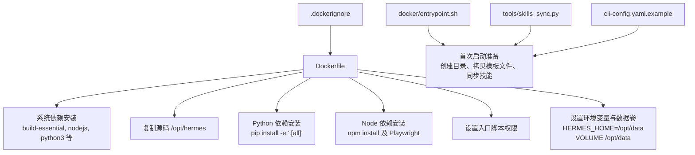
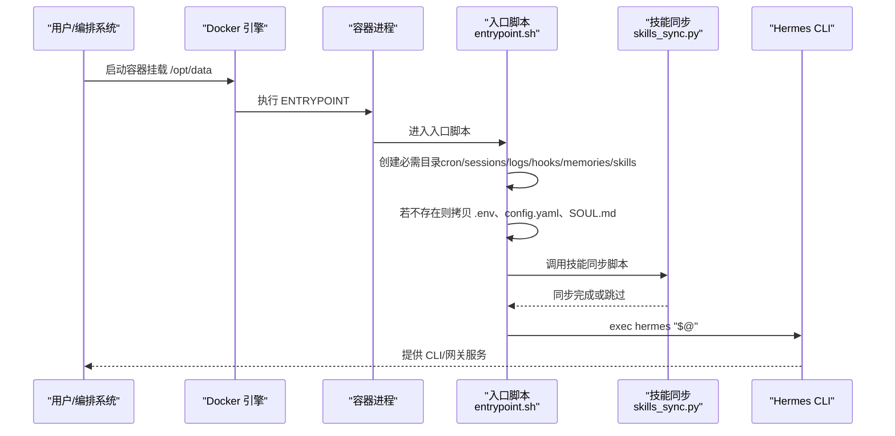
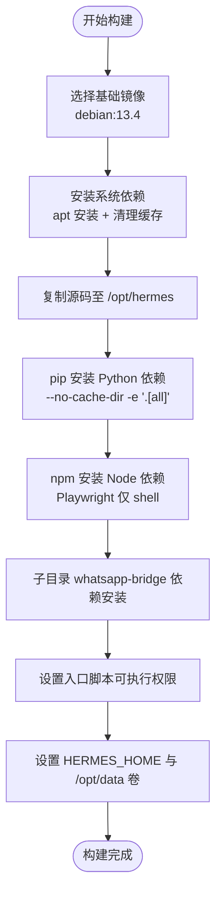
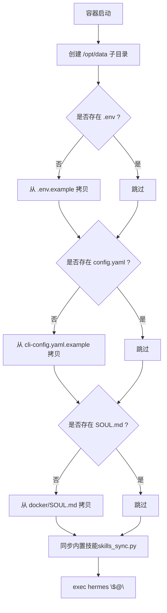
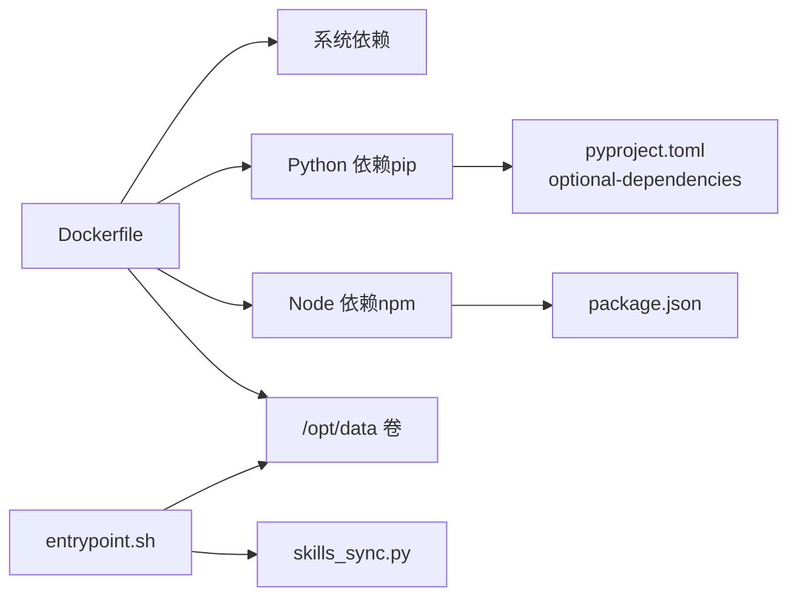

# 容器化部署

<cite>
**本文引用的文件**
- [Dockerfile](file://Dockerfile)
- [.dockerignore](file://.dockerignore)
- [docker/entrypoint.sh](file://docker/entrypoint.sh)
- [docker/SOUL.md](file://docker/SOUL.md)
- [pyproject.toml](file://pyproject.toml)
- [requirements.txt](file://requirements.txt)
- [package.json](file://package.json)
- [tools/skills_sync.py](file://tools/skills_sync.py)
- [cli-config.yaml.example](file://cli-config.yaml.example)
- [website/docs/reference/environment-variables.md](file://website/docs/reference/environment-variables.md)
- [tools/environments/docker.py](file://tools/environments/docker.py)
- [setup-hermes.sh](file://setup-hermes.sh)
</cite>

## 目录
1. [简介](#简介)
2. [项目结构](#项目结构)
3. [核心组件](#核心组件)
4. [架构总览](#架构总览)
5. [详细组件分析](#详细组件分析)
6. [依赖关系分析](#依赖关系分析)
7. [性能考虑](#性能考虑)
8. [故障排查指南](#故障排查指南)
9. [结论](#结论)
10. [附录](#附录)

## 简介
本文件面向希望以容器方式部署 Hermes Agent 的用户与运维人员，提供从镜像构建到运行时配置、从单容器到多容器编排、从健康检查到日志与监控的完整指南。内容基于仓库中现有的 Dockerfile、入口脚本、依赖清单与示例配置，确保可操作性与可追溯性。

## 项目结构
与容器化部署直接相关的关键文件与目录如下：
- 镜像构建：Dockerfile、.dockerignore
- 运行入口：docker/entrypoint.sh、docker/SOUL.md
- 依赖定义：pyproject.toml、requirements.txt、package.json
- 配置示例：cli-config.yaml.example
- 环境变量参考：website/docs/reference/environment-variables.md
- Docker 环境工具：tools/environments/docker.py
- 开发者快速安装脚本：setup-hermes.sh（用于理解依赖与初始化流程）

图表来源
- [Dockerfile:1-26](file://Dockerfile#L1-L26)
- [docker/entrypoint.sh:1-35](file://docker/entrypoint.sh#L1-L35)
- [tools/skills_sync.py:1-296](file://tools/skills_sync.py#L1-L296)
- [.dockerignore:1-16](file://.dockerignore#L1-L16)

章节来源
- [Dockerfile:1-26](file://Dockerfile#L1-L26)
- [.dockerignore:1-16](file://.dockerignore#L1-L16)
- [docker/entrypoint.sh:1-35](file://docker/entrypoint.sh#L1-L35)
- [tools/skills_sync.py:1-296](file://tools/skills_sync.py#L1-L296)
- [cli-config.yaml.example:1-831](file://cli-config.yaml.example#L1-L831)

## 核心组件
- 基础镜像与系统依赖
  - 使用 Debian 13.4 作为基础镜像，安装构建工具链、Node.js、Python 3、pip、ripgrep、FFmpeg、GCC、Python 开发头文件等。
  - 通过一次性 RUN 层安装并清理 APT 缓存，减少镜像体积与安全风险。
- Python 与 Node 依赖
  - 使用 pip 在无缓存模式下安装项目可编辑安装包（含 all 可选依赖），确保一致性与可复现性。
  - 使用 npm 安装前端依赖，并预装 Playwright Chromium 二进制（仅 shell，不下载完整浏览器）。
  - 子目录 scripts/whatsapp-bridge 下单独执行 npm 安装，保证桥接能力。
- 入口与数据卷
  - 设置 HERMES_HOME=/opt/data 并声明 /opt/data 卷，便于持久化配置、会话、日志、技能等。
  - 入口脚本负责首次启动时在数据卷中生成 .env、config.yaml、SOUL.md，并同步内置技能。
- 构建优化
  - 多阶段构建未在当前 Dockerfile 中使用；可通过后续迭代引入以进一步减小最终镜像体积。
  - 缓存层管理：apt 安装与依赖安装分层，避免无关变更导致重建整层。

章节来源
- [Dockerfile:1-26](file://Dockerfile#L1-L26)
- [requirements.txt:1-37](file://requirements.txt#L1-L37)
- [pyproject.toml:39-97](file://pyproject.toml#L39-L97)
- [package.json:1-26](file://package.json#L1-L26)
- [docker/entrypoint.sh:1-35](file://docker/entrypoint.sh#L1-L35)
- [docker/SOUL.md:1-15](file://docker/SOUL.md#L1-L15)

## 架构总览
下图展示容器启动时的初始化流程与关键交互：

图表来源
- [docker/entrypoint.sh:1-35](file://docker/entrypoint.sh#L1-L35)
- [tools/skills_sync.py:1-296](file://tools/skills_sync.py#L1-L296)

## 详细组件分析

### 组件一：Dockerfile 解析
- 基础镜像与系统依赖
  - 选择 Debian 13.4，兼顾稳定性与软件生态。
  - 一次性安装构建与运行所需系统库，随后清理 APT 缓存，降低镜像体积。
- 源码与工作目录
  - 将项目复制至 /opt/hermes，切换工作目录，便于后续安装与运行。
- Python 依赖安装
  - 使用 pip 无缓存模式安装可编辑包（含 all 可选依赖），确保与 pyproject.toml 一致。
- Node.js 与 Playwright
  - 安装 npm 与 Playwright，仅下载 Chromium shell，避免完整浏览器体积。
  - 子目录 whatsapp-bridge 单独安装依赖，保证桥接功能可用。
- 入口与数据卷
  - 设置 HERMES_HOME=/opt/data，声明 /opt/data 卷，便于持久化。
  - 为入口脚本赋予可执行权限，设置容器启动入口。

图表来源
- [Dockerfile:1-26](file://Dockerfile#L1-L26)

章节来源
- [Dockerfile:1-26](file://Dockerfile#L1-L26)

### 组件二：入口脚本与初始化流程
- 目录与文件准备
  - 在 /opt/data 下创建 cron、sessions、logs、hooks、memories、skills 等目录。
  - 若不存在 .env、config.yaml、SOUL.md，则从模板复制。
- 技能同步
  - 调用 skills_sync.py 将内置技能同步到用户目录，保留用户自定义修改。
- 启动主程序
  - exec hermes "$@" 将容器生命周期交由主程序接管。

图表来源
- [docker/entrypoint.sh:1-35](file://docker/entrypoint.sh#L1-L35)
- [tools/skills_sync.py:1-296](file://tools/skills_sync.py#L1-L296)
- [docker/SOUL.md:1-15](file://docker/SOUL.md#L1-L15)
- [cli-config.yaml.example:1-831](file://cli-config.yaml.example#L1-L831)

章节来源
- [docker/entrypoint.sh:1-35](file://docker/entrypoint.sh#L1-L35)
- [tools/skills_sync.py:1-296](file://tools/skills_sync.py#L1-L296)
- [docker/SOUL.md:1-15](file://docker/SOUL.md#L1-L15)
- [cli-config.yaml.example:1-831](file://cli-config.yaml.example#L1-L831)

### 组件三：依赖与可选功能
- Python 依赖
  - 核心依赖与可选功能集中在 pyproject.toml 的 optional-dependencies 中，例如 messaging、voice、mcp、acp 等。
  - requirements.txt 为便捷维护文件，实际以 pyproject.toml 为准。
- Node.js 依赖
  - package.json 指定浏览器相关依赖与 Node 版本要求。
- Playwright
  - Dockerfile 中通过 npx playwright install 仅安装 Chromium shell，满足浏览器自动化需求。

章节来源
- [pyproject.toml:39-97](file://pyproject.toml#L39-L97)
- [requirements.txt:1-37](file://requirements.txt#L1-L37)
- [package.json:1-26](file://package.json#L1-L26)
- [Dockerfile:12-18](file://Dockerfile#L12-L18)

### 组件四：容器运行时配置
- 环境变量
  - 支持通过 .env 文件注入，覆盖默认行为。常见变量涵盖各平台网关（Telegram、Discord、Slack、WhatsApp、Signal、SMS、Email、DingTalk、Feishu、WeCom、Matrix、Mattermost、Home Assistant、Webhook、API Server 等）。
- 卷挂载
  - /opt/data 为可写卷，持久化存储配置、会话、日志、钩子、记忆体与技能。
- 端口映射
  - API Server 默认监听本地回环地址，生产部署时建议通过反向代理暴露并启用鉴权密钥。
- 资源限制
  - 可通过编排平台（如 Docker Compose、Kubernetes）设置 CPU/内存/磁盘配额，结合容器内工具的超时与生命周期参数使用。

章节来源
- [Dockerfile:23-24](file://Dockerfile#L23-L24)
- [docker/entrypoint.sh:12-12](file://docker/entrypoint.sh#L12-L12)
- [website/docs/reference/environment-variables.md:156-259](file://website/docs/reference/environment-variables.md#L156-L259)
- [cli-config.yaml.example:195-202](file://cli-config.yaml.example#L195-L202)

### 组件五：Docker 环境工具与容器后端
- 工具模块
  - tools/environments/docker.py 提供 Docker 后端的环境封装，支持镜像、CPU/内存/磁盘、持久化文件系统、网络、卷挂载、环境变量转发等配置。
- 适用场景
  - 当需要在容器中执行命令或进行代码执行沙箱时，可利用该模块统一管理容器生命周期与资源约束。

章节来源
- [tools/environments/docker.py:41-261](file://tools/environments/docker.py#L41-L261)

## 依赖关系分析
- 构建期依赖
  - 系统层：APT 包与编译工具链。
  - Python 层：pip 安装可编辑包（含 all 可选依赖）。
  - Node 层：npm 安装前端依赖与 Playwright。
- 运行期依赖
  - Python 运行时与第三方库（见 pyproject.toml）。
  - Node.js 运行时与 Playwright Chromium shell。
  - 内置技能与用户技能目录（/opt/data/skills）。

图表来源
- [Dockerfile:1-26](file://Dockerfile#L1-L26)
- [pyproject.toml:39-97](file://pyproject.toml#L39-L97)
- [package.json:1-26](file://package.json#L1-L26)
- [docker/entrypoint.sh:1-35](file://docker/entrypoint.sh#L1-L35)
- [tools/skills_sync.py:1-296](file://tools/skills_sync.py#L1-L296)

章节来源
- [Dockerfile:1-26](file://Dockerfile#L1-L26)
- [pyproject.toml:39-97](file://pyproject.toml#L39-L97)
- [package.json:1-26](file://package.json#L1-L26)
- [docker/entrypoint.sh:1-35](file://docker/entrypoint.sh#L1-L35)
- [tools/skills_sync.py:1-296](file://tools/skills_sync.py#L1-L296)

## 性能考虑
- 镜像体积与安全
  - 使用 apt 清理缓存，避免遗留包与缓存文件。
  - 一次性安装系统依赖与应用依赖，减少层数与冗余。
- 依赖安装效率
  - pip 与 npm 分别在独立层安装，避免小变更导致全量重装。
  - Playwright 仅安装 shell，按需再拉取完整浏览器（可在宿主机或共享卷中缓存）。
- 运行时资源
  - 通过编排平台设置 CPU/内存/磁盘配额，结合工具后端的超时与生命周期参数，避免资源滥用。
- I/O 与持久化
  - 将 /opt/data 挂载到持久化存储，减少重复安装与缓存重建成本。

## 故障排查指南
- 启动后无配置文件
  - 确认 /opt/data 卷已正确挂载，入口脚本会在首次启动时复制 .env、config.yaml、SOUL.md。
- 技能未出现或被覆盖
  - skills_sync.py 会根据用户修改与内置版本差异决定是否更新；若用户自定义，将保留用户修改。
- Playwright 浏览器不可用
  - 确认容器内已安装 Chromium shell；如需完整浏览器，请在宿主机或共享卷中缓存并挂载。
- 网关平台无法接收消息
  - 检查对应平台的环境变量是否正确设置（如 TELEGRAM_BOT_TOKEN、WEBHOOK_PORT 等）。
- API Server 无法访问
  - 确认已设置鉴权密钥并在编排中正确映射端口；生产环境建议通过反向代理暴露并启用 TLS。

章节来源
- [docker/entrypoint.sh:14-27](file://docker/entrypoint.sh#L14-L27)
- [tools/skills_sync.py:155-280](file://tools/skills_sync.py#L155-L280)
- [website/docs/reference/environment-variables.md:156-259](file://website/docs/reference/environment-variables.md#L156-L259)

## 结论
本文基于仓库现有文件，提供了从镜像构建到运行时配置的完整容器化部署指南。通过合理的系统依赖安装、Python 与 Node 依赖管理、入口脚本初始化与数据卷持久化，Hermes Agent 可在单容器与多容器环境中稳定运行。建议在生产环境中结合编排平台完善资源限制、健康检查与监控告警，并通过 .env 与 config.yaml 实现灵活配置。

## 附录

### A. 单容器部署示例（Docker）
- 构建镜像
  - 使用仓库根目录的 Dockerfile 构建镜像。
- 启动容器
  - 挂载 /opt/data，设置 HERMES_HOME=/opt/data。
  - 如需网关服务，映射 API Server 端口并设置鉴权密钥。
- 初次运行
  - 容器启动后，入口脚本会自动在 /opt/data 生成 .env、config.yaml、SOUL.md，并同步内置技能。

章节来源
- [Dockerfile:1-26](file://Dockerfile#L1-L26)
- [docker/entrypoint.sh:1-35](file://docker/entrypoint.sh#L1-L35)
- [cli-config.yaml.example:1-831](file://cli-config.yaml.example#L1-L831)

### B. 多容器编排（Compose）
- 建议拆分
  - 应用容器：运行 Hermes CLI/网关。
  - 数据容器：提供 /opt/data 的持久化卷。
  - 反向代理：统一暴露 API Server 与 Webhook 端口，启用 TLS 与鉴权。
- 关键点
  - 明确环境变量注入（通过 .env 或 Compose 的 secrets/volume）。
  - 为 /opt/data 设置只读或受限权限，避免意外覆盖。
  - 为容器设置资源限制与健康检查。

[本节为概念性说明，无需“章节来源”]

### C. 健康检查与监控
- 健康检查
  - 可在编排中添加对 API Server 端口的探测，或通过自定义命令检测进程状态。
- 日志
  - 日志输出到标准输出/错误，结合编排平台的日志收集系统集中管理。
- 监控
  - 结合平台指标采集（CPU/内存/磁盘/网络）与业务指标（请求量、响应时间、错误率）。

[本节为通用实践说明，无需“章节来源”]

### D. 依赖安装顺序与优化建议
- 安装顺序
  - 系统依赖 → Python 依赖 → Node 依赖 → Playwright shell → 子目录依赖。
- 优化建议
  - 引入多阶段构建，分离构建与运行镜像。
  - 使用缓存友好的依赖清单与安装命令，避免不必要的重建。
  - 对于大型二进制（如 Playwright 完整浏览器），优先考虑宿主机缓存与共享卷。

章节来源
- [Dockerfile:12-18](file://Dockerfile#L12-L18)
- [pyproject.toml:39-97](file://pyproject.toml#L39-L97)
- [package.json:1-26](file://package.json#L1-L26)