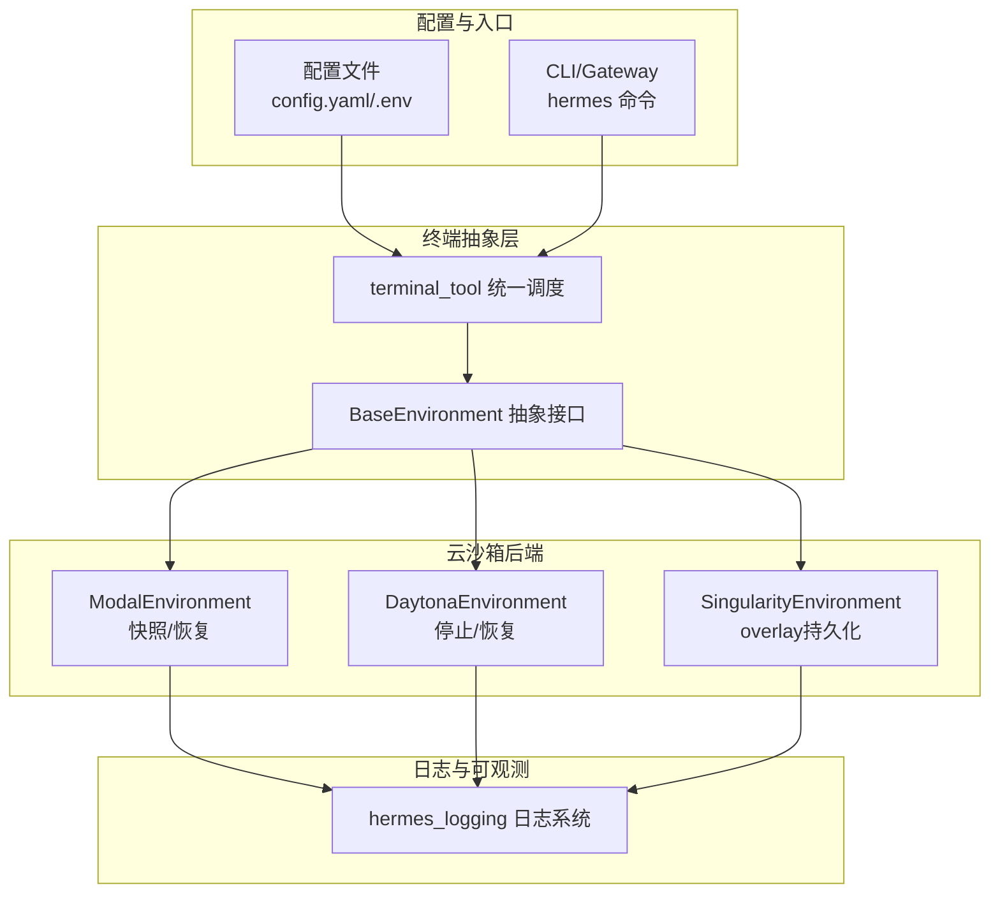
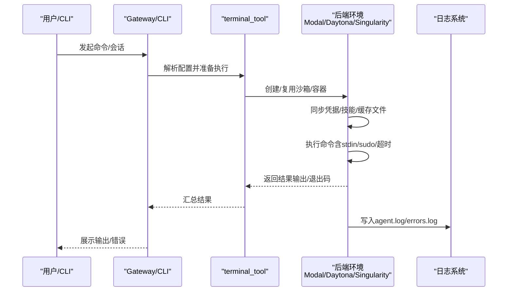
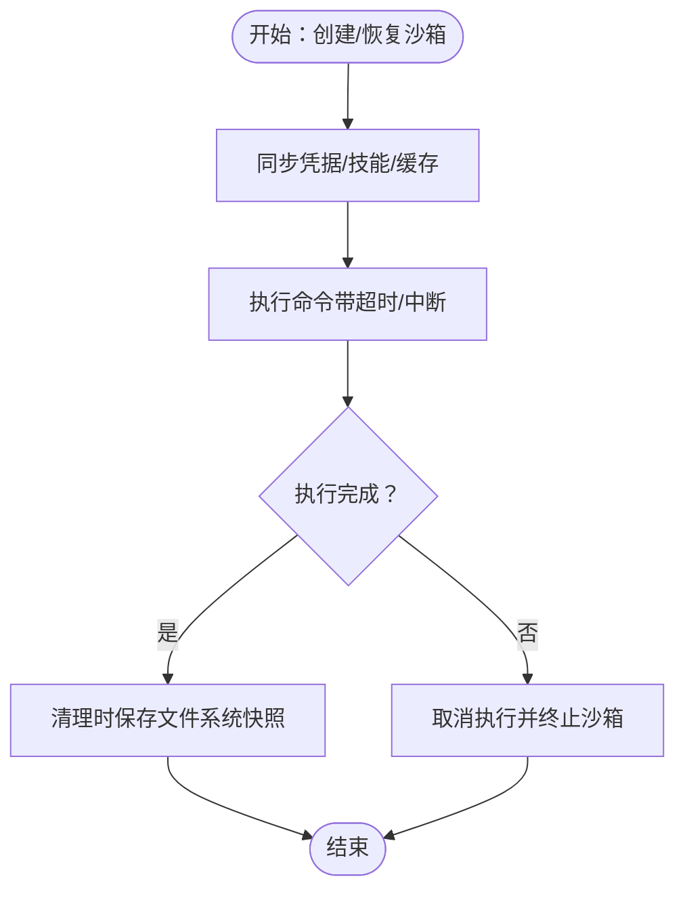
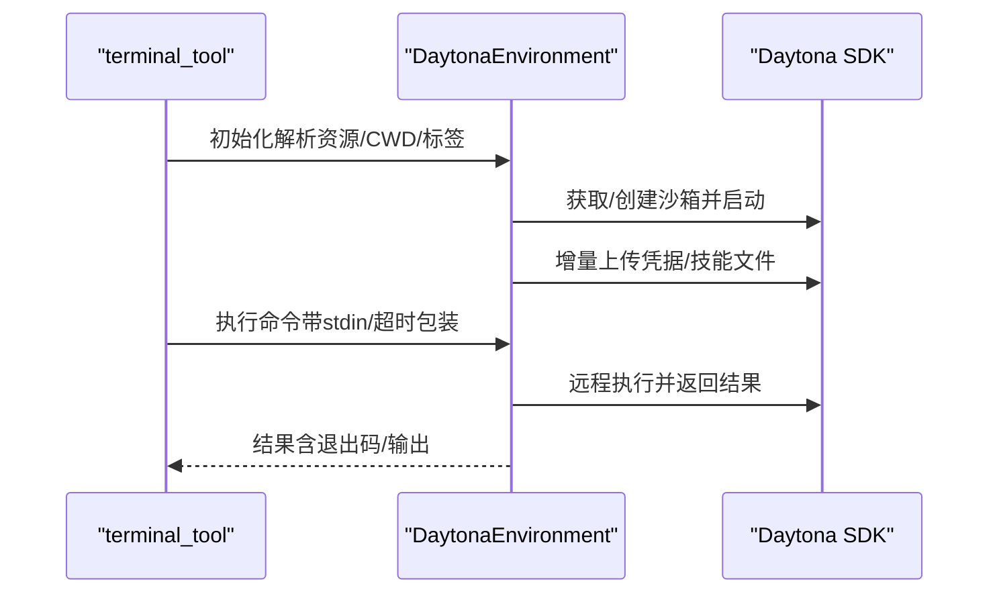
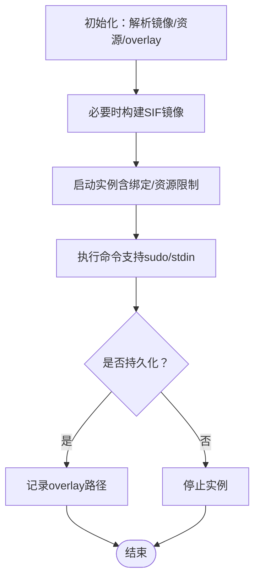
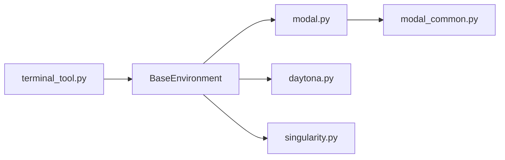

# 服务器less部署

<cite>
**本文引用的文件**
- [README.md](file://README.md)
- [website/docs/user-guide/configuration.md](file://website/docs/user-guide/configuration.md)
- [website/docs/reference/environment-variables.md](file://website/docs/reference/environment-variables.md)
- [tools/environments/base.py](file://tools/environments/base.py)
- [tools/environments/modal.py](file://tools/environments/modal.py)
- [tools/environments/modal_common.py](file://tools/environments/modal_common.py)
- [tools/environments/daytona.py](file://tools/environments/daytona.py)
- [tools/environments/singularity.py](file://tools/environments/singularity.py)
- [tools/terminal_tool.py](file://tools/terminal_tool.py)
- [scripts/kill_modal.sh](file://scripts/kill_modal.sh)
- [hermes_logging.py](file://hermes_logging.py)
- [cli-config.yaml.example](file://cli-config.yaml.example)
</cite>

## 目录
1. [简介](#简介)
2. [项目结构](#项目结构)
3. [核心组件](#核心组件)
4. [架构总览](#架构总览)
5. [详细组件分析](#详细组件分析)
6. [依赖分析](#依赖分析)
7. [性能考虑](#性能考虑)
8. [故障排查指南](#故障排查指南)
9. [结论](#结论)
10. [附录](#附录)

## 简介
本指南面向在Hermes Agent上落地“服务器less”（无服务器）运行模式的工程团队与个人开发者，围绕以下目标展开：
- 在Modal平台实现函数式部署、自动扩缩容与成本优化
- 配置并使用Daytona终端环境：远程开发环境、容器化部署与协作能力
- 使用Singularity/Apptainer进行容器化部署：镜像管理、运行时配置与资源限制
- 对比不同服务器less平台的成本效益、性能表现与易用性
- 编写适合服务器less环境的代码：无状态设计、冷启动优化与资源管理
- 建立监控与调试策略：日志采集、性能分析与故障排查
- 提供最佳实践与常见陷阱规避建议

## 项目结构
Hermes Agent通过统一的“终端后端”抽象，支持本地、Docker、SSH、Modal、Daytona、Singularity等执行环境。核心入口位于工具层，终端工具负责解析配置、选择后端并执行命令；Modal/Daytona/Singularity各自实现持久化与资源控制；日志系统集中输出到~/.hermes/logs。

图示来源
- [tools/environments/base.py:26-113](file://tools/environments/base.py#L26-L113)
- [tools/terminal_tool.py:578-1559](file://tools/terminal_tool.py#L578-L1559)
- [tools/environments/modal.py:147-446](file://tools/environments/modal.py#L147-L446)
- [tools/environments/daytona.py:24-301](file://tools/environments/daytona.py#L24-L301)
- [tools/environments/singularity.py:200-395](file://tools/environments/singularity.py#L200-L395)
- [hermes_logging.py:50-142](file://hermes_logging.py#L50-L142)

章节来源
- [README.md:24](file://README.md#L24)
- [website/docs/user-guide/configuration.md:76-103](file://website/docs/user-guide/configuration.md#L76-L103)

## 核心组件
- 终端后端抽象：统一的BaseEnvironment定义execute与cleanup接口，屏蔽不同后端差异。
- Modal后端：基于Modal Sandboxes的直接调用，支持快照/恢复与凭据挂载。
- Daytona后端：基于Daytona SDK的工作区沙箱，支持停止/恢复持久化。
- Singularity后端：基于Apptainer/Singularity的容器实例，支持overlay持久化与资源限制。
- 终端工具：根据配置选择后端，处理stdin、sudo、超时与中断，提供统一执行体验。
- 日志系统：集中输出agent.log与errors.log，支持轮转与敏感信息脱敏。

章节来源
- [tools/environments/base.py:26-113](file://tools/environments/base.py#L26-L113)
- [tools/environments/modal.py:147-446](file://tools/environments/modal.py#L147-L446)
- [tools/environments/daytona.py:24-301](file://tools/environments/daytona.py#L24-L301)
- [tools/environments/singularity.py:200-395](file://tools/environments/singularity.py#L200-L395)
- [tools/terminal_tool.py:578-1559](file://tools/terminal_tool.py#L578-L1559)
- [hermes_logging.py:50-142](file://hermes_logging.py#L50-L142)

## 架构总览
下图展示Hermes在服务器less场景下的典型交互：CLI/Gateway通过terminal_tool选择Modal/Daytona/Singularity后端，后端在云端或容器中执行命令，并通过快照/停止恢复实现“无服务器”的持久化与按需唤醒。

图示来源
- [tools/terminal_tool.py:578-1559](file://tools/terminal_tool.py#L578-L1559)
- [tools/environments/modal.py:238-446](file://tools/environments/modal.py#L238-L446)
- [tools/environments/daytona.py:156-301](file://tools/environments/daytona.py#L156-L301)
- [tools/environments/singularity.py:258-395](file://tools/environments/singularity.py#L258-L395)
- [hermes_logging.py:112-142](file://hermes_logging.py#L112-L142)

## 详细组件分析

### Modal平台部署（函数式、快照与成本优化）
- 快照与恢复：后端在清理时对文件系统进行快照，下次会话优先从快照恢复，减少冷启动时间与构建开销。
- 凭据与技能同步：每次执行前将凭据文件、技能文件与缓存文件增量同步至沙箱，确保运行态一致性。
- 资源与镜像：可通过配置指定CPU/内存/磁盘与容器镜像；镜像可来自注册表或快照ID。
- 中断与取消：通过异步工作线程与事件循环安全地取消执行，避免僵尸进程。
- 成本优化建议：
  - 合理设置container_persistent与快照策略，降低重复构建成本
  - 控制container_cpu/container_memory，避免过度配额
  - 使用脚本批量停止/清理Modal应用，避免闲置计费

图示来源
- [tools/environments/modal.py:238-446](file://tools/environments/modal.py#L238-L446)
- [tools/environments/modal_common.py:58-179](file://tools/environments/modal_common.py#L58-L179)
- [scripts/kill_modal.sh:1-35](file://scripts/kill_modal.sh#L1-L35)

章节来源
- [website/docs/user-guide/configuration.md:178-196](file://website/docs/user-guide/configuration.md#L178-L196)
- [website/docs/reference/environment-variables.md:119](file://website/docs/reference/environment-variables.md#L119)
- [cli-config.yaml.example:169-179](file://cli-config.yaml.example#L169-L179)

### Daytona终端环境（远程开发、容器化与协作）
- 工作区生命周期：默认停止而非删除沙箱，下次会话直接恢复，提升协作效率。
- 资源限制：CPU/内存/磁盘按GiB传入，超过平台上限会自动截断并告警。
- 文件同步：每次执行前增量上传变更的凭据与技能文件，保证运行态一致。
- 中断与超时：通过shell timeout可靠强制终止，避免SDK侧超时不生效问题。
- 协作能力：通过标签与命名空间识别任务，便于多用户共享与追踪。

图示来源
- [tools/environments/daytona.py:31-301](file://tools/environments/daytona.py#L31-L301)

章节来源
- [website/docs/user-guide/configuration.md:197-215](file://website/docs/user-guide/configuration.md#L197-L215)
- [website/docs/reference/environment-variables.md:107](file://website/docs/reference/environment-variables.md#L107)

### Singularity容器部署（HPC/共享环境）
- 安全隔离：使用--containall与--no-home，最小化宿主机可见面。
- 镜像管理：支持docker://URL自动转换为SIF并缓存；也可直接使用.sif路径。
- 持久化overlay：启用container_persistent时，overlay目录跨会话保留，安装的包与文件得以延续。
- 资源限制：通过cgroup参数限制CPU与内存，需要相应权限或配置。
- Scratch目录：支持自定义缓存目录与HPC约定路径，便于高性能存储利用。

图示来源
- [tools/environments/singularity.py:211-395](file://tools/environments/singularity.py#L211-L395)

章节来源
- [website/docs/user-guide/configuration.md:216-236](file://website/docs/user-guide/configuration.md#L216-L236)
- [website/docs/reference/environment-variables.md:118](file://website/docs/reference/environment-variables.md#L118)
- [cli-config.yaml.example:158-167](file://cli-config.yaml.example#L158-L167)

### 终端工具与统一调度
- 后端选择：依据TERMINAL_ENV与配置决定后端类型，校验必要凭据与SDK可用性。
- 执行流程：准备命令（含sudo/stdin）、设置超时、轮询执行结果、处理中断与超时。
- 默认行为：提供默认镜像、工作目录、超时与生命周期参数，便于快速上手。
- 兼容性：支持本地回退、SSH持久会话、Docker卷挂载与凭据转发等特性。

章节来源
- [tools/terminal_tool.py:578-1559](file://tools/terminal_tool.py#L578-L1559)
- [website/docs/reference/environment-variables.md:113-125](file://website/docs/reference/environment-variables.md#L113-L125)
- [cli-config.yaml.example:158-189](file://cli-config.yaml.example#L158-L189)

## 依赖分析
- 组件耦合：各后端均继承BaseEnvironment，保持execute/cleanup契约一致，降低上层调用复杂度。
- 外部依赖：Modal/Daytona/Singularity分别依赖对应SDK或CLI；凭据与技能文件通过工具模块统一挂载。
- 可能的循环：后端模块之间无直接导入，通过terminal_tool间接组合，避免循环依赖。

图示来源
- [tools/terminal_tool.py:578-1559](file://tools/terminal_tool.py#L578-L1559)
- [tools/environments/base.py:26-113](file://tools/environments/base.py#L26-L113)
- [tools/environments/modal.py:147-446](file://tools/environments/modal.py#L147-L446)
- [tools/environments/daytona.py:24-301](file://tools/environments/daytona.py#L24-L301)
- [tools/environments/singularity.py:200-395](file://tools/environments/singularity.py#L200-L395)
- [tools/environments/modal_common.py:58-179](file://tools/environments/modal_common.py#L58-L179)

## 性能考虑
- 冷启动优化
  - Modal：启用container_persistent并依赖快照恢复，显著缩短首次启动时间
  - Daytona：停止即恢复，避免重建过程
  - Singularity：overlay持久化减少重复安装与下载
- 资源配额
  - 合理设置container_cpu/container_memory/container_disk，避免过度分配导致等待或被限流
  - Modal/Daytona支持按任务动态调整资源，建议结合负载曲线做弹性配置
- I/O与网络
  - 将频繁访问的数据预热到沙箱内或使用持久化卷，减少外部依赖
  - 控制凭据/技能同步频率，采用增量同步策略
- 并发与中断
  - 使用异步工作线程与事件循环，确保中断与取消及时响应
  - 为长任务设置合理超时，避免长时间占用资源

## 故障排查指南
- 常见问题定位
  - 日志查看：优先检查~/.hermes/logs/agent.log与errors.log，关注ERROR/WARNING级别
  - 后端可用性：确认SDK/CLI是否安装且可执行（如apptainer/singularity、daytona、modal）
  - 凭据与镜像：核对环境变量与镜像名称，确保凭据文件已挂载
- Modal专项
  - 使用脚本批量停止/清理应用，避免闲置计费
  - 若快照恢复失败，后端会自动回退到基础镜像，检查快照有效性
- Daytona专项
  - 注意磁盘上限（10GiB），超过将被截断并告警
  - 若执行超时，检查shell timeout包装与SDK状态
- Singularity专项
  - 确认apptainer/singularity二进制存在且版本兼容
  - overlay目录权限与磁盘空间不足会导致启动失败

章节来源
- [hermes_logging.py:50-142](file://hermes_logging.py#L50-L142)
- [website/docs/user-guide/configuration.md:237-248](file://website/docs/user-guide/configuration.md#L237-L248)
- [scripts/kill_modal.sh:1-35](file://scripts/kill_modal.sh#L1-L35)

## 结论
Hermes Agent通过统一的终端抽象与多后端实现，为服务器less部署提供了灵活、可扩展的解决方案。在Modal上可实现按需冷启动与快照恢复，在Daytona上可获得稳定的停止/恢复持久化体验，在Singularity上可满足HPC与共享环境的安全隔离需求。结合合理的资源配置、增量同步与日志监控，可在成本、性能与易用性之间取得良好平衡。

## 附录

### 不同服务器less平台对比（成本/性能/易用性）
- Modal
  - 成本：按秒计费，空闲时停止；快照可显著降低重复构建成本
  - 性能：快照恢复与云原生资源弹性，适合高并发与突发负载
  - 易用性：SDK成熟，配置项清晰，适合快速集成
- Daytona
  - 成本：停止即恢复，避免重建成本；磁盘上限10GiB
  - 性能：恢复速度快，适合协作型开发环境
  - 易用性：标签与命名空间便于任务识别与管理
- Singularity
  - 成本：本地/共享集群资源，适合已有HPC基础设施
  - 性能：overlay持久化减少重复安装，SIF缓存加速镜像加载
  - 易用性：CLI与容器生态完善，但需管理员权限与正确配置

章节来源
- [website/docs/user-guide/configuration.md:178-236](file://website/docs/user-guide/configuration.md#L178-L236)

### 适合服务器less的代码编写要点
- 无状态设计
  - 依赖外部状态（如快照/overlay）而非进程内状态
  - 通过环境变量与配置文件注入依赖，避免硬编码
- 冷启动优化
  - 将大体积依赖预热到镜像或持久化卷
  - 使用增量同步策略，减少每次执行的I/O
- 资源管理
  - 明确声明CPU/内存/磁盘需求，避免被限流
  - 设置合理超时与重试策略，提升鲁棒性
- 中断与取消
  - 支持SIGINT/SIGTERM等信号，及时释放资源
  - 使用异步/事件循环确保取消操作可靠

### 监控与调试策略
- 日志采集
  - 使用集中式日志系统收集agent.log与errors.log
  - 对敏感信息进行脱敏处理，避免泄露
- 性能分析
  - 关注后端执行耗时、快照/恢复耗时与I/O瓶颈
  - 利用平台提供的指标面板（如Modal/Daytona）观察资源使用
- 故障排查
  - 通过日志与错误摘要快速定位问题根因
  - 使用脚本批量清理/回收资源，避免资源泄漏

章节来源
- [hermes_logging.py:50-142](file://hermes_logging.py#L50-L142)
- [website/docs/reference/environment-variables.md:107-125](file://website/docs/reference/environment-variables.md#L107-L125)