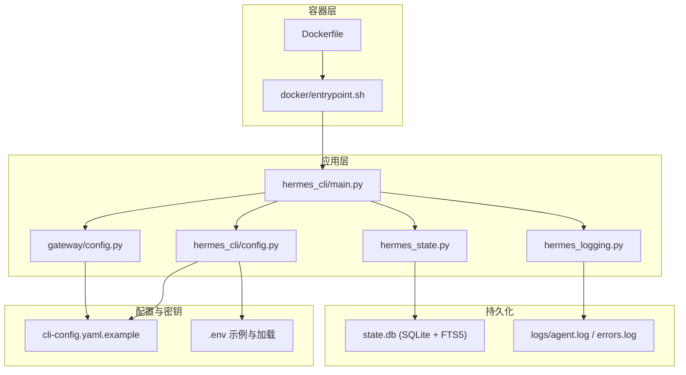
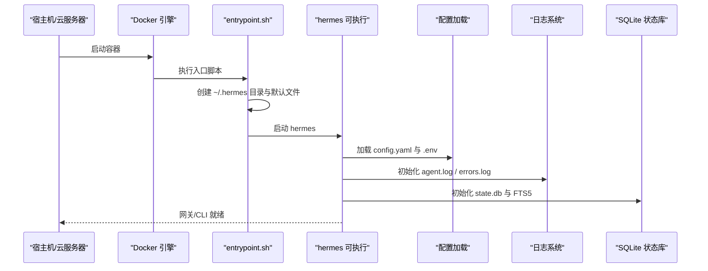
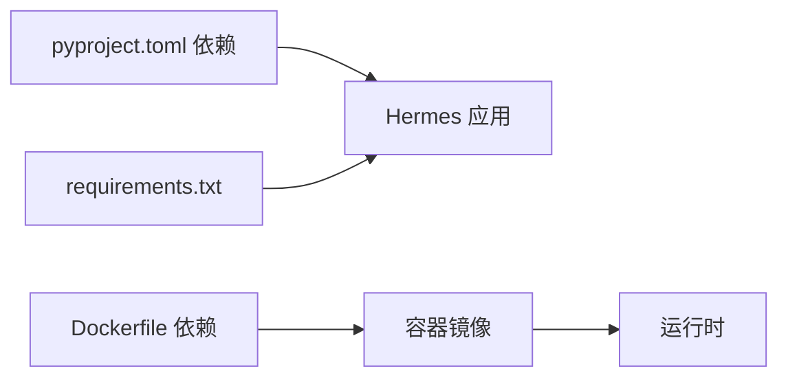

# 生产环境部署

<cite>
**本文档引用的文件**
- [README.md](file://README.md)
- [Dockerfile](file://Dockerfile)
- [docker/entrypoint.sh](file://docker/entrypoint.sh)
- [requirements.txt](file://requirements.txt)
- [pyproject.toml](file://pyproject.toml)
- [cli-config.yaml.example](file://cli-config.yaml.example)
- [hermes_cli/config.py](file://hermes_cli/config.py)
- [hermes_constants.py](file://hermes_constants.py)
- [gateway/config.py](file://gateway/config.py)
- [hermes_cli/main.py](file://hermes_cli/main.py)
- [hermes_logging.py](file://hermes_logging.py)
- [hermes_state.py](file://hermes_state.py)
- [setup-hermes.sh](file://setup-hermes.sh)
</cite>

## 目录
1. [简介](#简介)
2. [项目结构](#项目结构)
3. [核心组件](#核心组件)
4. [架构总览](#架构总览)
5. [详细组件分析](#详细组件分析)
6. [依赖关系分析](#依赖关系分析)
7. [性能考虑](#性能考虑)
8. [故障排查指南](#故障排查指南)
9. [结论](#结论)
10. [附录](#附录)

## 简介
本指南面向在生产环境中部署 Hermes Agent 的工程团队与运维人员，覆盖系统要求、硬件配置、网络设置、环境变量与配置管理、密钥与安全策略、性能调优、监控与日志、备份与灾备、以及高可用与故障转移等关键主题。文档基于仓库中的安装脚本、Docker 配置、配置示例与核心模块进行梳理，确保部署过程可追溯、可审计、可维护。

## 项目结构
Hermes Agent 提供多种部署形态与配置入口：
- 容器化部署：通过 Dockerfile 构建镜像，entrypoint 负责初始化用户目录与配置文件。
- 命令行工具：hermes 可执行命令提供 CLI 与网关（gateway）子命令，支持服务化运行与管理。
- 配置体系：通过 ~/.hermes/config.yaml 与 ~/.hermes/.env 组合管理模型、工具集、平台与密钥等。
- 状态存储：SQLite + FTS5 持久化会话与消息，支持全文检索与成本统计字段。
- 日志系统：集中式 RotatingFileHandler，按级别输出到 agent.log 与 errors.log，并对敏感信息脱敏。

图表来源
- [Dockerfile:1-26](file://Dockerfile#L1-L26)
- [docker/entrypoint.sh:1-35](file://docker/entrypoint.sh#L1-L35)
- [hermes_cli/main.py:1-120](file://hermes_cli/main.py#L1-L120)
- [hermes_cli/config.py:1-120](file://hermes_cli/config.py#L1-L120)
- [gateway/config.py:1-120](file://gateway/config.py#L1-L120)
- [hermes_logging.py:1-120](file://hermes_logging.py#L1-L120)
- [hermes_state.py:1-120](file://hermes_state.py#L1-L120)

章节来源
- [README.md:30-61](file://README.md#L30-L61)
- [Dockerfile:1-26](file://Dockerfile#L1-L26)
- [docker/entrypoint.sh:1-35](file://docker/entrypoint.sh#L1-L35)
- [hermes_cli/main.py:1-120](file://hermes_cli/main.py#L1-L120)
- [hermes_cli/config.py:1-120](file://hermes_cli/config.py#L1-L120)
- [gateway/config.py:1-120](file://gateway/config.py#L1-L120)
- [hermes_logging.py:1-120](file://hermes_logging.py#L1-L120)
- [hermes_state.py:1-120](file://hermes_state.py#L1-L120)

## 核心组件
- 配置管理：统一读取 ~/.hermes/config.yaml 与 ~/.hermes/.env，支持环境变量覆盖与默认值迁移。
- 网关配置：集中管理各平台（Telegram、Discord、WhatsApp 等）连接参数、会话重置策略、投递偏好等。
- 日志系统：RotatingFileHandler + RedactingFormatter，分别输出 INFO+ 与 WARNING+ 日志，避免敏感信息落盘。
- 状态存储：SQLite + FTS5，支持会话元数据、消息历史、全文检索与计费统计字段。
- 运行入口：hermes 命令提供 CLI 与 gateway 子命令，支持服务化安装与状态查询。

章节来源
- [hermes_cli/config.py:1-200](file://hermes_cli/config.py#L1-L200)
- [gateway/config.py:1-200](file://gateway/config.py#L1-L200)
- [hermes_logging.py:1-120](file://hermes_logging.py#L1-L120)
- [hermes_state.py:1-120](file://hermes_state.py#L1-L120)
- [hermes_cli/main.py:1-120](file://hermes_cli/main.py#L1-L120)

## 架构总览
下图展示生产部署的关键交互路径：容器启动后初始化配置，CLI/gateway 启动时加载配置与密钥，写入日志与状态库，平台适配器负责消息收发与会话管理。

图表来源
- [docker/entrypoint.sh:1-35](file://docker/entrypoint.sh#L1-L35)
- [hermes_cli/main.py:139-152](file://hermes_cli/main.py#L139-L152)
- [hermes_logging.py:50-142](file://hermes_logging.py#L50-L142)
- [hermes_state.py:120-161](file://hermes_state.py#L120-L161)

## 详细组件分析

### 系统要求与硬件配置
- 操作系统：Linux/macOS（Windows 不原生支持，需通过 WSL2）。脚本与依赖在 Linux/macOS 上经过验证。
- Python 版本：>= 3.11（推荐 3.11），项目构建与运行均以此为准。
- 容器镜像：基于 Debian 13.4，预装 Node.js/npm、Python3、编译工具链与浏览器依赖（Playwright）。
- 硬件建议（参考性）：
  - 最小：2 核 CPU、4 GB 内存（满足轻量对话与本地工具执行）
  - 推荐：4 核 CPU、8 GB 内存（支持多平台网关与并发任务）
  - 大规模：8+ 核 CPU、16+ GB 内存（多平台并发、容器沙箱与本地推理）

章节来源
- [README.md:30-46](file://README.md#L30-L46)
- [pyproject.toml:10-11](file://pyproject.toml#L10-L11)
- [Dockerfile:1-10](file://Dockerfile#L1-L10)

### 网络设置与端口
- 网关模式：需要与各平台 API 通信（如 Telegram、Discord、Slack 等），确保出站 HTTP(S) 可达。
- Webhook/回调：若使用 webhook 平台，需保证平台能访问到部署节点的公网地址与端口。
- 代理与出口：如需通过代理访问外部服务，可在宿主环境配置 HTTP_PROXY/HTTPS_PROXY。
- 防火墙：仅开放必要端口（如用于 webhook 的 80/443 或自定义端口），其余端口限制访问。

[本节为通用网络建议，不直接分析具体代码文件]

### 环境变量与配置管理
- 配置优先级：环境变量 > ~/.hermes/config.yaml > 默认值。
- 关键环境变量类别：
  - 推理提供商：OPENROUTER_API_KEY、OPENAI_API_KEY、ANTHROPIC_API_KEY、GEMINI_API_KEY、GLM_API_KEY、KIMI_API_KEY、MINIMAX_API_KEY 等。
  - 平台令牌：TELEGRAM_BOT_TOKEN、DISCORD_BOT_TOKEN、SLACK_BOT_TOKEN、SIGNAL_HTTP_URL、SIGNAL_ACCOUNT 等。
  - 本地/自建端点：OPENAI_BASE_URL、GEMINI_BASE_URL、GLM_BASE_URL 等。
  - 其他：TWILIO_ACCOUNT_SID、WHATSAPP_ENABLED、WHATSAPP_MODE、WHATSAPP_ALLOWED_USERS 等。
- 配置文件：
  - ~/.hermes/config.yaml：模型、工具集、终端后端、压缩策略、显示与行为等。
  - ~/.hermes/.env：API 密钥与敏感参数（由入口脚本与 CLI 加载）。
- 配置迁移：配置版本变更时，系统会提示新增的环境变量并引导迁移。

章节来源
- [hermes_cli/config.py:575-800](file://hermes_cli/config.py#L575-L800)
- [gateway/config.py:665-800](file://gateway/config.py#L665-L800)
- [hermes_constants.py:11-17](file://hermes_constants.py#L11-L17)
- [cli-config.yaml.example:1-120](file://cli-config.yaml.example#L1-L120)

### 密钥与安全策略
- 密钥存储：优先放在 ~/.hermes/.env 中，权限严格限制（0600）；避免硬编码在配置文件中。
- 平台鉴权：各平台令牌通过环境变量注入，网关配置支持按平台启用与参数覆盖。
- 访问控制：平台侧允许白名单（如 WhatsApp ALLOWED_USERS），网关侧支持“未授权 DM 行为”策略。
- 数据脱敏：日志系统使用 RedactingFormatter，避免敏感信息落盘。
- 传输安全：建议使用 HTTPS 出口与平台回调，TLS 证书由平台或反向代理管理。

章节来源
- [hermes_cli/config.py:159-195](file://hermes_cli/config.py#L159-L195)
- [hermes_logging.py:108-142](file://hermes_logging.py#L108-L142)
- [gateway/config.py:403-413](file://gateway/config.py#L403-L413)

### 性能调优
- 内存与并发：
  - 终端后端资源：容器 CPU/内存/磁盘限制（container_cpu、container_memory、container_disk）。
  - 会话并发：SQLite 使用 WAL 模式与随机抖动重试降低写锁争用；合理拆分会话与定期检查点有助于缓解 WAL 增长。
- 缓存策略：
  - 上下文压缩：自动压缩中间轮次，保留首尾与近期上下文，减少 token 使用。
  - 辅助模型：针对视觉/网页提取/压缩等任务选择合适的小模型，降低总体延迟。
- 数据库优化：
  - FTS5 全文索引：加速跨会话检索；触发器自动同步消息内容。
  - WAL 与检查点：Passive checkpoint 降低 WAL 文件膨胀；短超时 + 应用层重试避免队列效应。
- 网络与工具：
  - 本地/自建端点：减少第三方往返延迟；合理设置超时与重试。
  - 工具执行：容器沙箱隔离与持久 Shell 可提升连续命令执行效率。

章节来源
- [cli-config.yaml.example:195-202](file://cli-config.yaml.example#L195-L202)
- [cli-config.yaml.example:266-295](file://cli-config.yaml.example#L266-L295)
- [hermes_state.py:123-137](file://hermes_state.py#L123-L137)
- [hermes_state.py:216-236](file://hermes_state.py#L216-L236)

### 监控与日志管理
- 日志位置：~/.hermes/logs/agent.log（INFO+）、~/.hermes/logs/errors.log（WARNING+）。
- 日志轮转：最大文件大小与备份数量可配置；格式含时间戳、级别、模块名与消息。
- 脱敏处理：RedactingFormatter 自动过滤敏感信息。
- 建议指标：会话数、消息数、token 使用量、错误率、平均响应时间、WAL 页面检查点频率。
- 告警：基于 errors.log 的 WARNING+ 级别快速告警；结合业务指标（如 API 成本阈值）设置阈值告警。

章节来源
- [hermes_logging.py:50-142](file://hermes_logging.py#L50-L142)
- [hermes_state.py:36-112](file://hermes_state.py#L36-L112)

### 备份与灾备
- 数据备份：
  - state.db：会话与消息的持久化存储，建议定期导出与归档。
  - logs/：保留一定周期的日志以便审计与问题复现。
- 配置备份：
  - ~/.hermes/config.yaml 与 ~/.hermes/.env：版本化管理，纳入 CI/CD 或配置库。
- 恢复流程：
  - 停机/切换：停止服务，替换 state.db 与配置文件，启动服务。
  - 灾难恢复：从最近备份恢复 state.db 与配置，验证网关与平台连通性。

章节来源
- [hermes_state.py:32-91](file://hermes_state.py#L32-L91)
- [hermes_logging.py:96-142](file://hermes_logging.py#L96-L142)

### 高可用与故障转移
- 网关高可用：多实例部署 + 反向代理/负载均衡，实现健康检查与自动摘除。
- 会话一致性：共享 state.db 时注意并发写入与 WAL 管理；必要时采用只读副本或分片。
- 平台容错：平台适配器具备重试与降级策略；配置中可设置流式传输与编辑间隔以改善体验。
- 故障转移：当主节点不可用时，将流量切换至备用节点；确保新节点拥有最新配置与密钥。

章节来源
- [gateway/config.py:187-215](file://gateway/config.py#L187-L215)
- [hermes_state.py:123-137](file://hermes_state.py#L123-L137)

## 依赖关系分析
- 语言与包管理：Python 3.11，依赖声明在 pyproject.toml；requirements.txt 作为便捷安装参考。
- 容器依赖：Dockerfile 安装 Node.js、Python3、编译工具与 Playwright 依赖。
- 运行时依赖：HTTP 客户端（httpx）、配置解析（pyyaml）、富文本终端（rich）、重试机制（tenacity）等。
- 可选平台：根据平台类型安装对应依赖（如 telegram、discord、slack 等）。

图表来源
- [pyproject.toml:13-37](file://pyproject.toml#L13-L37)
- [requirements.txt:5-37](file://requirements.txt#L5-L37)
- [Dockerfile:3-18](file://Dockerfile#L3-L18)

章节来源
- [pyproject.toml:1-116](file://pyproject.toml#L1-L116)
- [requirements.txt:1-37](file://requirements.txt#L1-L37)
- [Dockerfile:1-26](file://Dockerfile#L1-L26)

## 性能考虑
- 写入竞争与 WAL：应用层随机抖动重试 + PASSIVE checkpoint，避免 SQLite 内部忙等待导致的队列效应。
- 会话生命周期：合理设置会话重置策略（按空闲或每日边界），减少上下文膨胀带来的 API 成本与延迟。
- 工具执行：容器沙箱与持久 Shell 可减少启动开销；谨慎设置资源上限，避免 OOM。
- 日志级别：生产环境建议 INFO 级别，避免 DEBUG 带来的 IO 压力。

章节来源
- [hermes_state.py:123-137](file://hermes_state.py#L123-L137)
- [hermes_state.py:194-197](file://hermes_state.py#L194-L197)
- [hermes_state.py:216-236](file://hermes_state.py#L216-L236)
- [cli-config.yaml.example:386-404](file://cli-config.yaml.example#L386-L404)

## 故障排查指南
- 首次运行检查：确认已配置至少一个推理提供商（OPENROUTER_API_KEY、OPENAI_API_KEY、ANTHROPIC_API_KEY 等）。
- 网关连通性：检查平台令牌是否正确注入（TELEGRAM_BOT_TOKEN、DISCORD_BOT_TOKEN 等）；查看 errors.log 快速定位错误。
- 配置语法：config.yaml 语法错误会导致加载失败，查看日志提示并修正。
- 权限问题：确保 ~/.hermes 与子目录权限为 0700/0600，避免被其他用户读取。
- 日志脱敏：若发现敏感信息泄露风险，立即调整 RedactingFormatter 规则并重新生成日志。

章节来源
- [hermes_cli/main.py:588-614](file://hermes_cli/main.py#L588-L614)
- [hermes_logging.py:108-142](file://hermes_logging.py#L108-L142)
- [hermes_cli/config.py:159-195](file://hermes_cli/config.py#L159-L195)

## 结论
通过容器化与集中式配置管理，Hermes Agent 在生产环境具备良好的可移植性与可观测性。建议在部署前完成硬件与网络规划、密钥与访问控制加固、性能基线测试与监控告警配置，并制定完善的备份与灾备流程，以保障服务的稳定性与安全性。

[本节为总结性内容，不直接分析具体文件]

## 附录

### A. 容器化部署要点
- 镜像构建：基于 Debian 13.4，预装 Node.js、Python3、编译工具与 Playwright。
- 卷挂载：将 /opt/data 映射到持久卷，确保 ~/.hermes 下的配置、日志、状态与技能持久化。
- 入口脚本：首次启动自动生成 .env、config.yaml 与 SOUL.md，并同步内置技能。

章节来源
- [Dockerfile:1-26](file://Dockerfile#L1-L26)
- [docker/entrypoint.sh:8-32](file://docker/entrypoint.sh#L8-L32)

### B. 安装与初始化脚本
- setup-hermes.sh：自动化安装 uv、创建虚拟环境、安装依赖、创建 .env、软链接 hermes 命令。
- 建议：在生产环境使用固定版本锁（uv.lock）进行安装，确保依赖一致性。

章节来源
- [setup-hermes.sh:1-120](file://setup-hermes.sh#L1-L120)
- [setup-hermes.sh:119-133](file://setup-hermes.sh#L119-L133)

### C. 关键配置项速查
- 模型与推理：model.provider、model.base_url、OPENROUTER_API_KEY 等。
- 终端后端：container_cpu/container_memory/container_disk、docker_mount_cwd_to_workspace 等。
- 会话与压缩：session_reset.mode、compression.threshold/target_ratio/protect_last_n 等。
- 平台：platforms.{telegram, discord, whatsapp, slack} 等的 token/home_channel 等。
- 日志：logging.level/logging.max_size_mb/logging.backup_count。

章节来源
- [cli-config.yaml.example:8-50](file://cli-config.yaml.example#L8-L50)
- [cli-config.yaml.example:195-202](file://cli-config.yaml.example#L195-L202)
- [cli-config.yaml.example:386-404](file://cli-config.yaml.example#L386-L404)
- [cli-config.yaml.example:266-295](file://cli-config.yaml.example#L266-L295)
- [hermes_logging.py:210-230](file://hermes_logging.py#L210-L230)