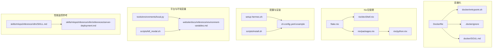
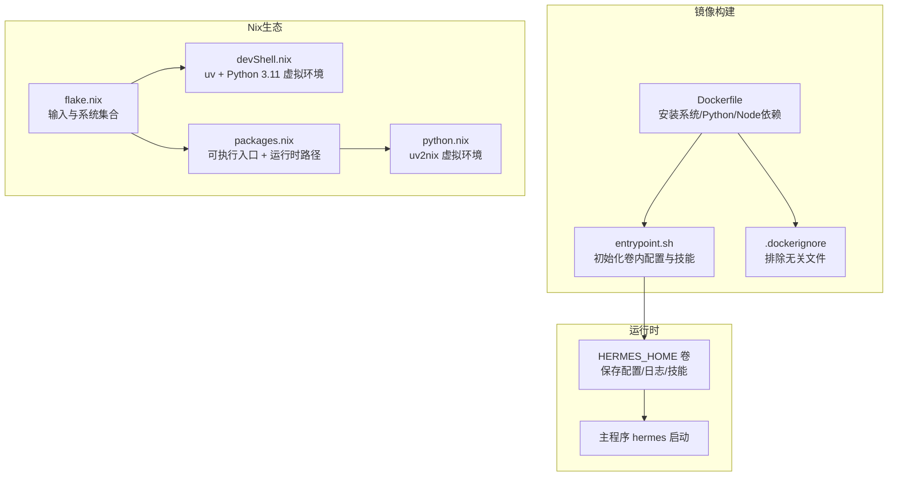
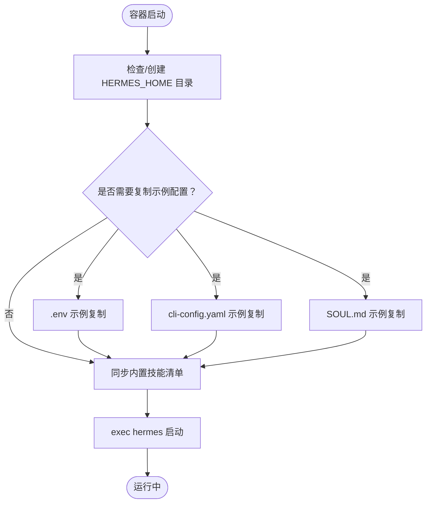
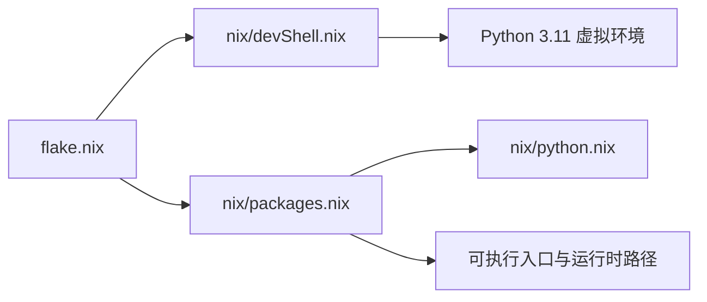
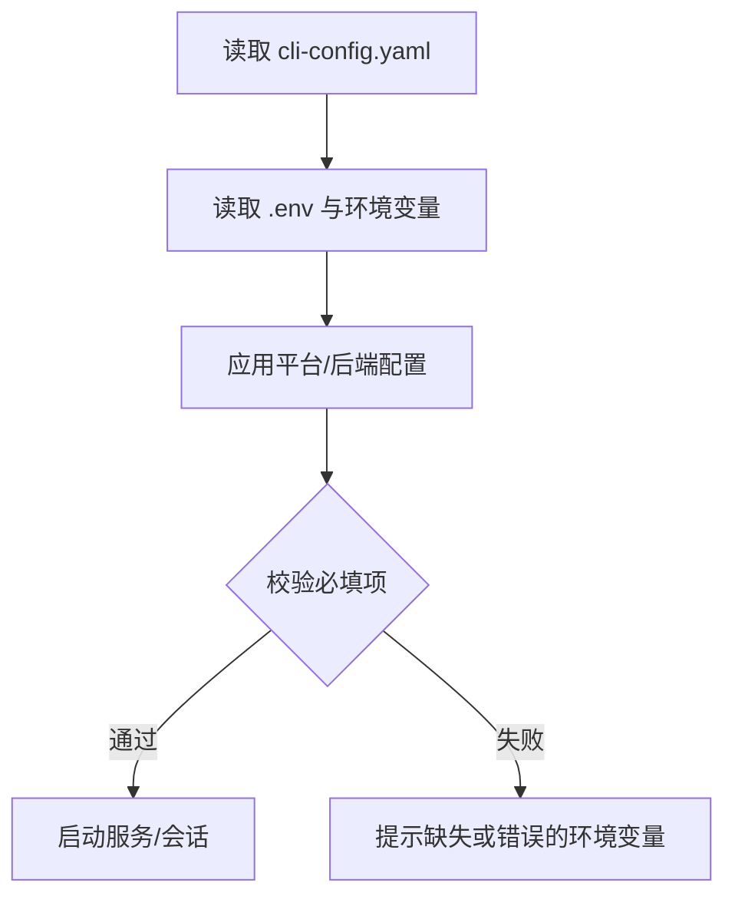
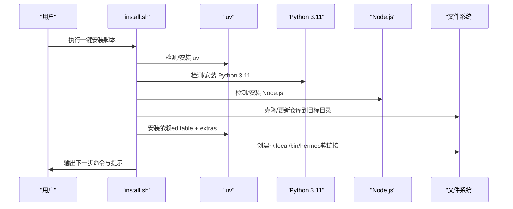
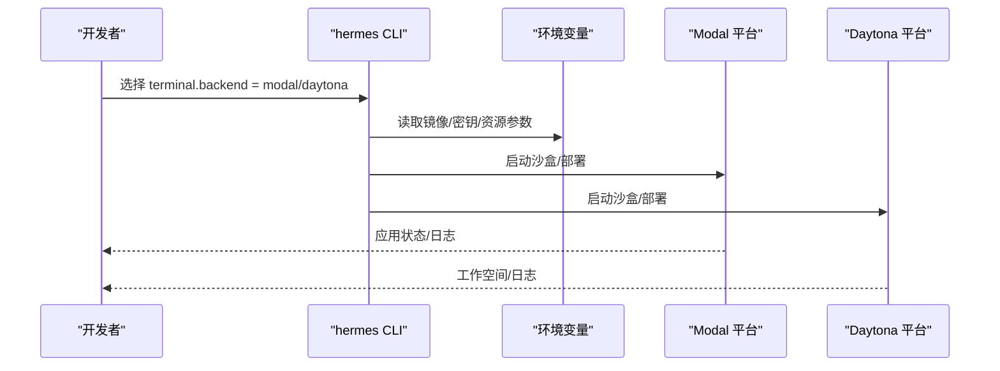
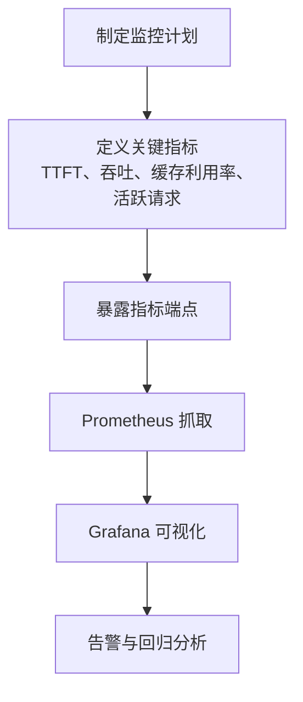
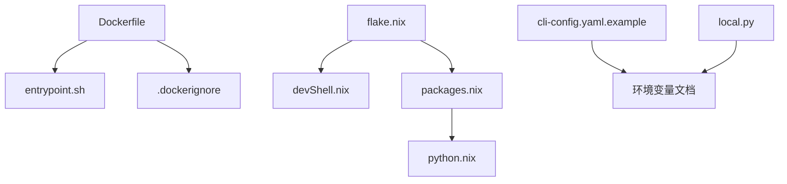

# 部署指南

<cite>
**本文引用的文件**
- [Dockerfile](file://Dockerfile)
- [.dockerignore](file://.dockerignore)
- [docker/entrypoint.sh](file://docker/entrypoint.sh)
- [docker/SOUL.md](file://docker/SOUL.md)
- [flake.nix](file://flake.nix)
- [flake.lock](file://flake.lock)
- [nix/devShell.nix](file://nix/devShell.nix)
- [nix/packages.nix](file://nix/packages.nix)
- [nix/python.nix](file://nix/python.nix)
- [cli-config.yaml.example](file://cli-config.yaml.example)
- [setup-hermes.sh](file://setup-hermes.sh)
- [scripts/install.sh](file://scripts/install.sh)
- [scripts/kill_modal.sh](file://scripts/kill_modal.sh)
- [tools/environments/local.py](file://tools/environments/local.py)
- [website/docs/reference/environment-variables.md](file://website/docs/reference/environment-variables.md)
- [skills/mlops/inference/vllm/SKILL.md](file://skills/mlops/inference/vllm/SKILL.md)
- [skills/mlops/inference/vllm/references/server-deployment.md](file://skills/mlops/inference/vllm/references/server-deployment.md)
</cite>

## 目录
1. [简介](#简介)
2. [项目结构](#项目结构)
3. [核心组件](#核心组件)
4. [架构总览](#架构总览)
5. [详细组件分析](#详细组件分析)
6. [依赖关系分析](#依赖关系分析)
7. [性能考虑](#性能考虑)
8. [故障排查指南](#故障排查指南)
9. [结论](#结论)
10. [附录](#附录)

## 简介
本指南面向Hermes Agent的多场景部署需求，覆盖容器化（Docker）、Nix包管理、本地与云部署、服务器less（Modal、Daytona）等模式，并提供生产级最佳实践（性能调优、安全配置、备份与恢复）、监控与指标采集、自动化部署流程与脚本模板。读者可据此在不同环境中快速、稳定地部署与运维Hermes Agent。

## 项目结构
Hermes Agent的部署相关能力主要分布在以下区域：
- 容器化：Dockerfile、入口脚本、忽略规则
- 包管理与开发环境：Nix生态（flake.nix、devShell.nix、packages.nix、python.nix）
- 配置与示例：cli-config.yaml.example
- 安装与初始化：setup-hermes.sh、scripts/install.sh
- 服务器less工具链：scripts/kill_modal.sh
- 环境变量与平台适配：tools/environments/local.py、website/docs/reference/environment-variables.md
- 性能监控参考：skills/mlops/inference/vllm/SKILL.md、server-deployment.md

**图表来源**
- [Dockerfile:1-26](file://Dockerfile#L1-L26)
- [docker/entrypoint.sh:1-35](file://docker/entrypoint.sh#L1-L35)
- [.dockerignore:1-16](file://.dockerignore#L1-L16)
- [docker/SOUL.md:1-15](file://docker/SOUL.md#L1-L15)
- [flake.nix:1-36](file://flake.nix#L1-L36)
- [nix/devShell.nix:1-52](file://nix/devShell.nix#L1-L52)
- [nix/packages.nix:1-55](file://nix/packages.nix#L1-L55)
- [nix/python.nix:1-29](file://nix/python.nix#L1-L29)
- [cli-config.yaml.example:1-831](file://cli-config.yaml.example#L1-L831)
- [setup-hermes.sh:1-308](file://setup-hermes.sh#L1-L308)
- [scripts/install.sh:1-1134](file://scripts/install.sh#L1-L1134)
- [tools/environments/local.py:97-138](file://tools/environments/local.py#L97-L138)
- [website/docs/reference/environment-variables.md:156-259](file://website/docs/reference/environment-variables.md#L156-L259)
- [scripts/kill_modal.sh:1-35](file://scripts/kill_modal.sh#L1-L35)
- [skills/mlops/inference/vllm/SKILL.md:51-121](file://skills/mlops/inference/vllm/SKILL.md#L51-L121)
- [skills/mlops/inference/vllm/references/server-deployment.md:239-256](file://skills/mlops/inference/vllm/references/server-deployment.md#L239-L256)

**章节来源**
- [Dockerfile:1-26](file://Dockerfile#L1-L26)
- [docker/entrypoint.sh:1-35](file://docker/entrypoint.sh#L1-L35)
- [.dockerignore:1-16](file://.dockerignore#L1-L16)
- [docker/SOUL.md:1-15](file://docker/SOUL.md#L1-L15)
- [flake.nix:1-36](file://flake.nix#L1-L36)
- [nix/devShell.nix:1-52](file://nix/devShell.nix#L1-L52)
- [nix/packages.nix:1-55](file://nix/packages.nix#L1-L55)
- [nix/python.nix:1-29](file://nix/python.nix#L1-L29)
- [cli-config.yaml.example:1-831](file://cli-config.yaml.example#L1-L831)
- [setup-hermes.sh:1-308](file://setup-hermes.sh#L1-L308)
- [scripts/install.sh:1-1134](file://scripts/install.sh#L1-L1134)
- [tools/environments/local.py:97-138](file://tools/environments/local.py#L97-L138)
- [website/docs/reference/environment-variables.md:156-259](file://website/docs/reference/environment-variables.md#L156-L259)
- [scripts/kill_modal.sh:1-35](file://scripts/kill_modal.sh#L1-L35)
- [skills/mlops/inference/vllm/SKILL.md:51-121](file://skills/mlops/inference/vllm/SKILL.md#L51-L121)
- [skills/mlops/inference/vllm/references/server-deployment.md:239-256](file://skills/mlops/inference/vllm/references/server-deployment.md#L239-L256)

## 核心组件
- 容器镜像与入口
  - 基于Debian的Dockerfile，安装系统依赖、Python与Node.js依赖，预装Playwright浏览器运行时，设置HERMES_HOME卷与入口脚本。
  - 入口脚本负责在挂载卷中初始化必要目录与配置文件，同步技能清单，然后启动主程序。
- Nix包管理与开发环境
  - flake.nix定义输入与系统集合；devShell.nix提供uv驱动的Python 3.11虚拟环境与stamp-file优化；packages.nix打包可执行入口与运行时依赖；python.nix通过uv2nix生成虚拟环境。
- 配置与环境变量
  - cli-config.yaml.example提供模型、终端后端、容器沙箱、会话记忆、工具集等配置项示例；website文档列出各平台消息适配器的环境变量键名。
- 安装与初始化脚本
  - setup-hermes.sh用于手动克隆仓库后的快速初始化；scripts/install.sh支持curl一键安装到~/.hermes并自动处理uv、Python、Node.js、系统依赖与PATH。
- 服务器less与平台集成
  - scripts/kill_modal.sh用于批量停止Modal应用；tools/environments/local.py定义了平台相关的环境变量白名单与阻断列表，确保敏感信息不泄露到子进程。

**章节来源**
- [Dockerfile:1-26](file://Dockerfile#L1-L26)
- [docker/entrypoint.sh:1-35](file://docker/entrypoint.sh#L1-L35)
- [flake.nix:1-36](file://flake.nix#L1-L36)
- [nix/devShell.nix:1-52](file://nix/devShell.nix#L1-L52)
- [nix/packages.nix:1-55](file://nix/packages.nix#L1-L55)
- [nix/python.nix:1-29](file://nix/python.nix#L1-L29)
- [cli-config.yaml.example:1-831](file://cli-config.yaml.example#L1-L831)
- [website/docs/reference/environment-variables.md:156-259](file://website/docs/reference/environment-variables.md#L156-L259)
- [setup-hermes.sh:1-308](file://setup-hermes.sh#L1-L308)
- [scripts/install.sh:1-1134](file://scripts/install.sh#L1-L1134)
- [scripts/kill_modal.sh:1-35](file://scripts/kill_modal.sh#L1-L35)
- [tools/environments/local.py:97-138](file://tools/environments/local.py#L97-L138)

## 架构总览
下图展示从镜像构建到运行时的关键路径，以及Nix在开发与打包中的角色。

**图表来源**
- [Dockerfile:1-26](file://Dockerfile#L1-L26)
- [docker/entrypoint.sh:1-35](file://docker/entrypoint.sh#L1-L35)
- [.dockerignore:1-16](file://.dockerignore#L1-L16)
- [flake.nix:1-36](file://flake.nix#L1-L36)
- [nix/devShell.nix:1-52](file://nix/devShell.nix#L1-L52)
- [nix/packages.nix:1-55](file://nix/packages.nix#L1-L55)
- [nix/python.nix:1-29](file://nix/python.nix#L1-L29)

## 详细组件分析

### 容器化部署（Docker）
- 镜像构建要点
  - 使用Debian基础镜像，一次性RUN层安装系统依赖并清理缓存，减少镜像体积。
  - 安装Python与Node.js依赖，预装Playwright Chromium运行时与WhatsApp桥npm依赖。
  - 设置HERMES_HOME为持久化卷，ENTRYPOINT指向入口脚本。
- 入口脚本行为
  - 在HERMES_HOME中创建必需目录（cron、sessions、logs、hooks、memories、skills）。
  - 若不存在则复制示例配置文件（.env、cli-config.yaml、SOUL.md）。
  - 同步内置技能清单至用户目录。
  - 最终以hermes作为PID 1启动。
- 忽略规则
  - .dockerignore排除.git、node_modules、CI目录与README等，避免污染镜像。

**图表来源**
- [docker/entrypoint.sh:1-35](file://docker/entrypoint.sh#L1-L35)

**章节来源**
- [Dockerfile:1-26](file://Dockerfile#L1-L26)
- [docker/entrypoint.sh:1-35](file://docker/entrypoint.sh#L1-L35)
- [.dockerignore:1-16](file://.dockerignore#L1-L16)
- [docker/SOUL.md:1-15](file://docker/SOUL.md#L1-L15)

### Nix包管理与开发环境
- flake.nix
  - 定义nixpkgs、flake-parts、pyproject-nix、uv2nix等输入，声明支持系统并导入packages、nixosModules、checks、devShell模块。
- devShell.nix
  - 提供Python 3.11、uv、Node.js 20、ripgrep、openssh、ffmpeg等工具，使用stamp-file避免重复安装。
- packages.nix
  - 通过python.nix生成虚拟环境，打包可执行入口（hermes、hermes-agent、hermes-acp），并注入运行时PATH与HERMES_BUNDLED_SKILLS。
- python.nix
  - 使用uv2nix加载工作区，生成带“all”extras的虚拟环境。

**图表来源**
- [flake.nix:1-36](file://flake.nix#L1-L36)
- [nix/devShell.nix:1-52](file://nix/devShell.nix#L1-L52)
- [nix/packages.nix:1-55](file://nix/packages.nix#L1-L55)
- [nix/python.nix:1-29](file://nix/python.nix#L1-L29)

**章节来源**
- [flake.nix:1-36](file://flake.nix#L1-L36)
- [flake.lock:1-182](file://flake.lock#L1-L182)
- [nix/devShell.nix:1-52](file://nix/devShell.nix#L1-L52)
- [nix/packages.nix:1-55](file://nix/packages.nix#L1-L55)
- [nix/python.nix:1-29](file://nix/python.nix#L1-L29)

### 配置与环境变量
- cli-config.yaml.example
  - 模型与推理提供方选择、智能路由、终端后端（local/ssh/docker/singularity/modal/daytona）、容器资源限制、安全扫描、浏览器与上下文压缩、持久化记忆、会话重置策略、流式传输、工具集与MCP服务器、语音转写、显示与皮肤等。
- 环境变量参考
  - 网站文档列举了各消息平台（Telegram、Discord、Slack、WhatsApp、Signal、SMS、Email、DingTalk、Feishu、WeCom、Mattermost、Matrix、Webhook、API Server）所需的环境变量键名与用途。
- 平台环境变量阻断
  - tools/environments/local.py定义了平台相关环境变量白名单与阻断列表，防止敏感凭据泄露到子进程。

**图表来源**
- [cli-config.yaml.example:1-831](file://cli-config.yaml.example#L1-L831)
- [website/docs/reference/environment-variables.md:156-259](file://website/docs/reference/environment-variables.md#L156-L259)
- [tools/environments/local.py:97-138](file://tools/environments/local.py#L97-L138)

**章节来源**
- [cli-config.yaml.example:1-831](file://cli-config.yaml.example#L1-L831)
- [website/docs/reference/environment-variables.md:156-259](file://website/docs/reference/environment-variables.md#L156-L259)
- [tools/environments/local.py:97-138](file://tools/environments/local.py#L97-L138)

### 安装与初始化脚本
- setup-hermes.sh
  - 自动检测/安装uv，创建Python 3.11虚拟环境，安装依赖（含可选子模块），复制.env示例，软链接hermes到~/.local/bin，同步内置技能，可交互运行setup向导。
- scripts/install.sh
  - curl一键安装，支持指定分支、安装目录、禁用虚拟环境、跳过setup向导；自动处理uv、Python、Node.js、系统依赖（ripgrep、ffmpeg），并维护PATH。

**图表来源**
- [scripts/install.sh:1-1134](file://scripts/install.sh#L1-L1134)
- [setup-hermes.sh:1-308](file://setup-hermes.sh#L1-L308)

**章节来源**
- [setup-hermes.sh:1-308](file://setup-hermes.sh#L1-L308)
- [scripts/install.sh:1-1134](file://scripts/install.sh#L1-L1134)

### 服务器less部署（Modal、Daytona）
- Modal
  - 支持在Modal云上以沙盒/部署形式运行命令后端（如docker、singularity、modal、daytona）。可通过scripts/kill_modal.sh批量停止当前账户下的Hermes相关应用。
- Daytona
  - 在cli-config.yaml.example中提供daytona后端配置项（镜像、磁盘大小、持久化等），适合团队协作与可重现的云端开发环境。
- 安全与凭据
  - tools/environments/local.py对平台相关环境变量进行阻断，避免将敏感凭据传递给子进程；同时网站文档列出了各平台所需环境变量键名，便于集中管理。

**图表来源**
- [cli-config.yaml.example:169-192](file://cli-config.yaml.example#L169-L192)
- [scripts/kill_modal.sh:1-35](file://scripts/kill_modal.sh#L1-L35)
- [tools/environments/local.py:97-138](file://tools/environments/local.py#L97-L138)

**章节来源**
- [cli-config.yaml.example:169-192](file://cli-config.yaml.example#L169-L192)
- [scripts/kill_modal.sh:1-35](file://scripts/kill_modal.sh#L1-L35)
- [tools/environments/local.py:97-138](file://tools/environments/local.py#L97-L138)

### 性能监控与基准测试（参考）
- vLLM部署与监控参考
  - 提供生产部署检查清单、服务器端配置示例、负载测试建议、Prometheus抓取配置与关键指标（请求速率、TTFT分位数、GPU缓存利用率、活跃请求数）。
- 实践建议
  - 结合Hermes的容器资源限制（CPU/内存/磁盘/持久化）与上下文压缩策略，评估吞吐与延迟目标；在容器中启用必要的指标端点，配合Prometheus/Grafana进行观测。

**图表来源**
- [skills/mlops/inference/vllm/SKILL.md:51-121](file://skills/mlops/inference/vllm/SKILL.md#L51-L121)
- [skills/mlops/inference/vllm/references/server-deployment.md:239-256](file://skills/mlops/inference/vllm/references/server-deployment.md#L239-L256)

**章节来源**
- [skills/mlops/inference/vllm/SKILL.md:51-121](file://skills/mlops/inference/vllm/SKILL.md#L51-L121)
- [skills/mlops/inference/vllm/references/server-deployment.md:239-256](file://skills/mlops/inference/vllm/references/server-deployment.md#L239-L256)

## 依赖关系分析
- 组件耦合
  - Dockerfile与entrypoint.sh强关联：镜像层安装完成后由入口脚本完成首次运行时准备。
  - Nix模块之间松耦合：flake.nix统一入口，devShell与packages独立构建开发与发布产物。
  - 配置与环境变量：cli-config.yaml.example与website文档共同构成运行时配置契约；tools/environments/local.py在运行期过滤敏感变量。
- 外部依赖
  - Docker镜像依赖Debian基础镜像与系统包；Nix依赖远程输入（nixpkgs、pyproject-nix、uv2nix等）；安装脚本依赖GitHub仓库与包管理器。

**图表来源**
- [Dockerfile:1-26](file://Dockerfile#L1-L26)
- [docker/entrypoint.sh:1-35](file://docker/entrypoint.sh#L1-L35)
- [.dockerignore:1-16](file://.dockerignore#L1-L16)
- [flake.nix:1-36](file://flake.nix#L1-L36)
- [nix/devShell.nix:1-52](file://nix/devShell.nix#L1-L52)
- [nix/packages.nix:1-55](file://nix/packages.nix#L1-L55)
- [nix/python.nix:1-29](file://nix/python.nix#L1-L29)
- [cli-config.yaml.example:1-831](file://cli-config.yaml.example#L1-L831)
- [website/docs/reference/environment-variables.md:156-259](file://website/docs/reference/environment-variables.md#L156-L259)
- [tools/environments/local.py:97-138](file://tools/environments/local.py#L97-L138)

**章节来源**
- [Dockerfile:1-26](file://Dockerfile#L1-L26)
- [docker/entrypoint.sh:1-35](file://docker/entrypoint.sh#L1-L35)
- [.dockerignore:1-16](file://.dockerignore#L1-L16)
- [flake.nix:1-36](file://flake.nix#L1-L36)
- [nix/devShell.nix:1-52](file://nix/devShell.nix#L1-L52)
- [nix/packages.nix:1-55](file://nix/packages.nix#L1-L55)
- [nix/python.nix:1-29](file://nix/python.nix#L1-L29)
- [cli-config.yaml.example:1-831](file://cli-config.yaml.example#L1-L831)
- [website/docs/reference/environment-variables.md:156-259](file://website/docs/reference/environment-variables.md#L156-L259)
- [tools/environments/local.py:97-138](file://tools/environments/local.py#L97-L138)

## 性能考虑
- 容器资源规划
  - 参考cli-config.yaml.example中的container_cpu、container_memory、container_disk与container_persistent，结合实际任务规模设定合理上限与持久化策略。
- 上下文压缩与模型路由
  - 启用compression与smart_model_routing可降低长对话的token压力与成本，提升响应速度。
- 浏览器与多媒体
  - 确保安装ripgrep与ffmpeg，以获得更快的文件搜索与TTS语音生成功能。
- 服务器less与GPU
  - 在Modal/Daytona中按需选择GPU实例类型与镜像，结合vLLM监控参考进行压测与容量规划。

[本节为通用指导，无需特定文件来源]

## 故障排查指南
- 容器启动失败
  - 检查HERMES_HOME卷权限与可用空间；确认入口脚本已复制示例配置；查看容器日志定位依赖安装问题。
- 环境变量未生效
  - 确认.env与环境变量优先级；核对平台适配器所需键名；避免将敏感变量透传到子进程。
- Modal相关问题
  - 使用scripts/kill_modal.sh停止当前账户下的Hermes应用，重新部署；检查Modal令牌与网络连通性。
- 安装脚本异常
  - scripts/install.sh与setup-hermes.sh均提供详细的依赖检测与安装步骤，按提示修复uv、Python、Node.js或系统包。

**章节来源**
- [docker/entrypoint.sh:1-35](file://docker/entrypoint.sh#L1-L35)
- [website/docs/reference/environment-variables.md:156-259](file://website/docs/reference/environment-variables.md#L156-L259)
- [tools/environments/local.py:97-138](file://tools/environments/local.py#L97-L138)
- [scripts/kill_modal.sh:1-35](file://scripts/kill_modal.sh#L1-L35)
- [scripts/install.sh:1-1134](file://scripts/install.sh#L1-L1134)
- [setup-hermes.sh:1-308](file://setup-hermes.sh#L1-L308)

## 结论
通过Docker与Nix双轨部署方案，Hermes Agent可在本地、容器与服务器less环境中实现一致的运行体验。结合完善的配置体系、严格的环境变量治理与可观测性参考，可满足从开发到生产的多样化需求。建议在生产中配套性能基线、安全加固与备份恢复策略，持续迭代监控与告警。

[本节为总结性内容，无需特定文件来源]

## 附录
- 部署模式速览
  - 本地部署：使用scripts/install.sh或setup-hermes.sh，结合cli-config.yaml.example进行配置。
  - 容器部署：基于Dockerfile构建镜像，挂载HERMES_HOME卷，使用entrypoint.sh完成初始化。
  - 服务器less：在Modal/Daytona中配置相应后端，按需启用GPU与持久化存储。
- 自动化部署流程建议
  - 使用scripts/install.sh进行标准化安装；结合Nix在CI中复现构建；在容器编排中设置健康检查与重启策略。
- 配置模板与脚本
  - 参考cli-config.yaml.example与website/docs/reference/environment-variables.md中的键名清单，结合Docker卷与Nix环境变量管理。

[本节为概览性内容，无需特定文件来源]