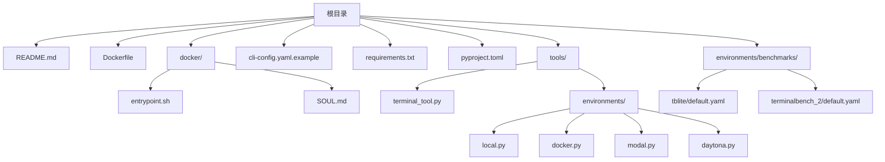
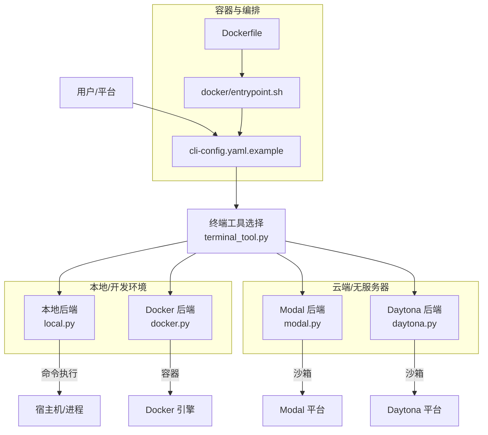
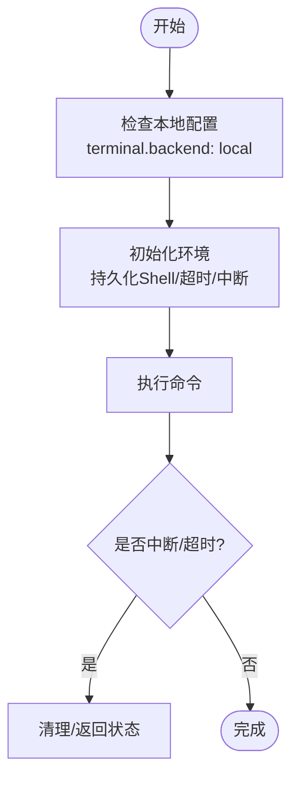
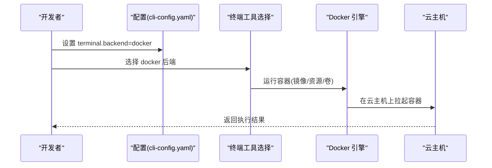
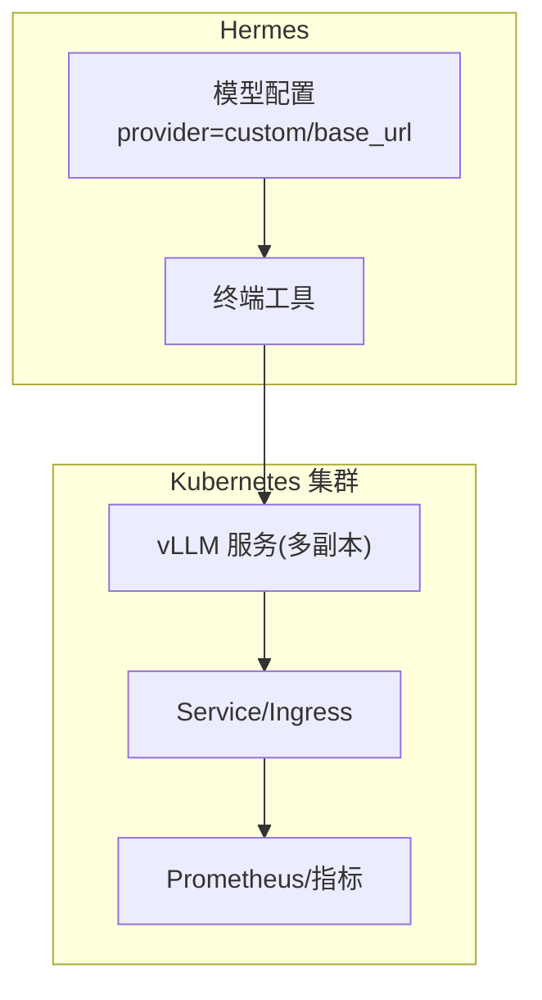
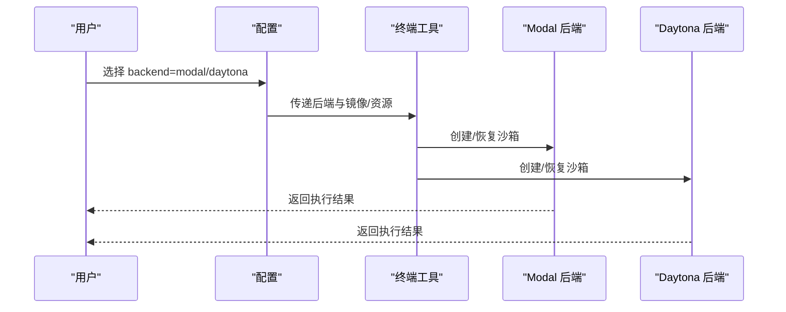
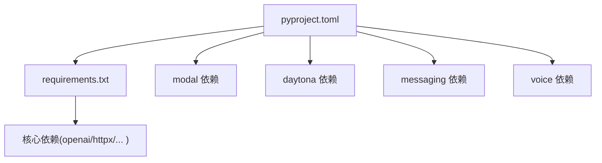

# 部署模式选择

<cite>
**本文引用的文件**
- [README.md](file://README.md)
- [Dockerfile](file://Dockerfile)
- [docker/entrypoint.sh](file://docker/entrypoint.sh)
- [docker/SOUL.md](file://docker/SOUL.md)
- [cli-config.yaml.example](file://cli-config.yaml.example)
- [requirements.txt](file://requirements.txt)
- [pyproject.toml](file://pyproject.toml)
- [tools/terminal_tool.py](file://tools/terminal_tool.py)
- [tools/environments/local.py](file://tools/environments/local.py)
- [tools/environments/docker.py](file://tools/environments/docker.py)
- [tools/environments/modal.py](file://tools/environments/modal.py)
- [tools/environments/daytona.py](file://tools/environments/daytona.py)
- [environments/benchmarks/tblite/default.yaml](file://environments/benchmarks/tblite/default.yaml)
- [environments/benchmarks/terminalbench_2/default.yaml](file://environments/benchmarks/terminalbench_2/default.yaml)
- [skills/mlops/inference/vllm/references/server-deployment.md](file://skills/mlops/inference/vllm/references/server-deployment.md)
- [optional-skills/mlops/pinecone/references/deployment.md](file://optional-skills/mlops/pinecone/references/deployment.md)
</cite>

## 目录
1. [简介](#简介)
2. [项目结构](#项目结构)
3. [核心组件](#核心组件)
4. [架构总览](#架构总览)
5. [详细组件分析](#详细组件分析)
6. [依赖关系分析](#依赖关系分析)
7. [性能考量](#性能考量)
8. [故障排查指南](#故障排查指南)
9. [结论](#结论)
10. [附录](#附录)

## 简介
本指南面向需要在不同环境中部署 Hermes Agent 的用户，系统性对比本地部署、云部署、GPU 集群、无服务器（Serverless）以及混合部署模式，帮助您基于成本、性能、可扩展性与维护复杂度做出合理选择。

Hermes Agent 支持多种执行后端：本地、Docker、Singularity、Modal、Daytona、SSH；同时提供容器化镜像与 Docker 入口脚本，便于在各类基础设施上快速启动。

## 项目结构
下图展示与部署相关的项目结构与关键文件：

图表来源
- [Dockerfile:1-26](file://Dockerfile#L1-L26)
- [docker/entrypoint.sh:1-35](file://docker/entrypoint.sh#L1-L35)
- [cli-config.yaml.example:1-831](file://cli-config.yaml.example#L1-L831)
- [pyproject.toml:1-116](file://pyproject.toml#L1-L116)
- [tools/terminal_tool.py:578-1500](file://tools/terminal_tool.py#L578-L1500)
- [tools/environments/local.py:1-487](file://tools/environments/local.py#L1-L487)
- [tools/environments/docker.py:1-605](file://tools/environments/docker.py#L1-L605)
- [tools/environments/modal.py:1-446](file://tools/environments/modal.py#L1-L446)
- [tools/environments/daytona.py:1-301](file://tools/environments/daytona.py#L1-L301)
- [environments/benchmarks/tblite/default.yaml:1-40](file://environments/benchmarks/tblite/default.yaml#L1-L40)
- [environments/benchmarks/terminalbench_2/default.yaml:1-43](file://environments/benchmarks/terminalbench_2/default.yaml#L1-L43)

章节来源
- [README.md:1-176](file://README.md#L1-L176)
- [Dockerfile:1-26](file://Dockerfile#L1-L26)
- [docker/entrypoint.sh:1-35](file://docker/entrypoint.sh#L1-L35)
- [cli-config.yaml.example:1-831](file://cli-config.yaml.example#L1-L831)
- [pyproject.toml:1-116](file://pyproject.toml#L1-L116)

## 核心组件
- 容器化入口与持久化
  - Dockerfile 指定基础镜像、安装依赖与 Playwright 二进制，并设置 HERMES_HOME 与卷挂载，便于数据持久化。
  - docker/entrypoint.sh 在首次运行时将 .env、config.yaml、SOUL.md 同步到宿主机挂载目录，确保配置与个性文件可用。
- 终端后端抽象与选择
  - tools/terminal_tool.py 提供统一接口，支持 local、docker、singularity、modal、daytona、ssh 等后端；通过配置项选择默认后端与资源限制。
- 执行环境实现
  - local.py：直接在宿主机执行命令，支持持久化 Shell、中断与超时处理。
  - docker.py：基于 Docker 的安全沙箱，支持资源限制、持久化卷、凭据与技能文件挂载。
  - modal.py：使用 Modal SDK 的原生沙箱，支持快照恢复与文件同步。
  - daytona.py：使用 Daytona SDK 的云沙箱，支持持久化停止/启动生命周期。
- 配置参考
  - cli-config.yaml.example 提供终端后端、容器资源、工具集、模型路由等配置示例，覆盖本地、Docker、Singularity、Modal、Daytona 等场景。

章节来源
- [Dockerfile:1-26](file://Dockerfile#L1-L26)
- [docker/entrypoint.sh:1-35](file://docker/entrypoint.sh#L1-L35)
- [cli-config.yaml.example:107-225](file://cli-config.yaml.example#L107-L225)
- [tools/terminal_tool.py:578-1500](file://tools/terminal_tool.py#L578-L1500)
- [tools/environments/local.py:317-487](file://tools/environments/local.py#L317-L487)
- [tools/environments/docker.py:221-605](file://tools/environments/docker.py#L221-L605)
- [tools/environments/modal.py:147-446](file://tools/environments/modal.py#L147-L446)
- [tools/environments/daytona.py:24-301](file://tools/environments/daytona.py#L24-L301)

## 架构总览
下图展示 Hermes Agent 在不同部署模式下的执行路径与关键组件交互：

图表来源
- [tools/terminal_tool.py:578-1500](file://tools/terminal_tool.py#L578-L1500)
- [tools/environments/local.py:317-487](file://tools/environments/local.py#L317-L487)
- [tools/environments/docker.py:221-605](file://tools/environments/docker.py#L221-L605)
- [tools/environments/modal.py:147-446](file://tools/environments/modal.py#L147-L446)
- [tools/environments/daytona.py:24-301](file://tools/environments/daytona.py#L24-L301)
- [Dockerfile:1-26](file://Dockerfile#L1-L26)
- [docker/entrypoint.sh:1-35](file://docker/entrypoint.sh#L1-L35)
- [cli-config.yaml.example:107-225](file://cli-config.yaml.example#L107-L225)

## 详细组件分析

### 本地部署模式
- 单机部署
  - 使用 local 后端在宿主机直接执行命令，适合开发调试、小规模任务与低延迟交互。
  - 特性：支持持久化 Shell、中断与超时控制、sudo 密码透传、安全环境变量过滤。
- 开发环境配置
  - 通过 cli-config.yaml.example 的 terminal.backend: local 配置工作目录、超时、生命周期等参数。
  - 可结合 docker/entrypoint.sh 在容器内进行首次配置初始化（如复制 .env、config.yaml、SOUL.md）。
- 快速启动方案
  - 使用 Dockerfile 构建镜像，设置 HERMES_HOME 与卷，配合 entrypoint 脚本完成初始配置与启动。

图表来源
- [tools/environments/local.py:317-487](file://tools/environments/local.py#L317-L487)
- [cli-config.yaml.example:107-121](file://cli-config.yaml.example#L107-L121)
- [docker/entrypoint.sh:1-35](file://docker/entrypoint.sh#L1-L35)

章节来源
- [tools/environments/local.py:317-487](file://tools/environments/local.py#L317-L487)
- [cli-config.yaml.example:107-121](file://cli-config.yaml.example#L107-L121)
- [docker/entrypoint.sh:1-35](file://docker/entrypoint.sh#L1-L35)

### 云部署模式（AWS/GCP/Azure）
- 通用云平台
  - 通过 Docker 后端在任意具备 Docker 的云主机上运行，实现与本地一致的体验。
  - 可结合云厂商提供的容器服务（如 ECS、EKS、Cloud Run）进行编排与弹性伸缩。
- 配置要点
  - 在 cli-config.yaml.example 中选择 docker 后端，设置镜像、资源限制与持久化选项。
  - 使用 Dockerfile 构建镜像，确保依赖完整（Playwright、Node、Python 等）。
- 与 Benchmark 配置联动
  - tblite/terminalbench_2 等评测环境默认使用 Modal 后端，可在相同云平台上以容器方式复用。

图表来源
- [cli-config.yaml.example:137-155](file://cli-config.yaml.example#L137-L155)
- [tools/environments/docker.py:221-605](file://tools/environments/docker.py#L221-L605)
- [Dockerfile:1-26](file://Dockerfile#L1-L26)

章节来源
- [cli-config.yaml.example:137-155](file://cli-config.yaml.example#L137-L155)
- [tools/environments/docker.py:221-605](file://tools/environments/docker.py#L221-L605)
- [Dockerfile:1-26](file://Dockerfile#L1-L26)
- [environments/benchmarks/tblite/default.yaml:22-22](file://environments/benchmarks/tblite/default.yaml#L22-L22)
- [environments/benchmarks/terminalbench_2/default.yaml:21-21](file://environments/benchmarks/terminalbench_2/default.yaml#L21-L21)

### GPU 集群部署
- 分布式计算与资源调度
  - 可在具备 GPU 的 Kubernetes 集群中部署推理服务（如 vLLM），并通过 OpenRouter 或自建 API 提供服务。
  - 参考：skills/mlops/inference/vllm/references/server-deployment.md 展示了 Docker/Kubernetes/负载均衡/健康检查等生产实践。
- 性能优化建议
  - 前缀缓存、GPU 内存利用率、多节点扩展与指标监控。
- 与 Hermes 集成
  - 在 cli-config.yaml.example 中将 model.provider 设为 custom，并配置 base_url 指向集群内的推理服务地址。

图表来源
- [skills/mlops/inference/vllm/references/server-deployment.md:1-119](file://skills/mlops/inference/vllm/references/server-deployment.md#L1-L119)
- [cli-config.yaml.example:30-44](file://cli-config.yaml.example#L30-L44)

章节来源
- [skills/mlops/inference/vllm/references/server-deployment.md:1-119](file://skills/mlops/inference/vllm/references/server-deployment.md#L1-L119)
- [cli-config.yaml.example:30-44](file://cli-config.yaml.example#L30-L44)

### 无服务器（Serverless）部署
- Modal
  - 使用 tools/environments/modal.py 的原生沙箱，支持快照恢复与文件同步，适合按需计算与高并发任务。
  - 在 cli-config.yaml.example 中选择 terminal.backend: modal，并设置镜像与资源。
- Daytona
  - 使用 tools/environments/daytona.py 的云沙箱，支持持久化停止/启动生命周期，适合团队协作与可重复环境。
  - 需要 DAYTONA_API_KEY，且平台最大磁盘为 10GB。
- 与 Benchmark 的关系
  - tblite/terminalbench_2 等评测默认使用 Modal 后端，体现其在评测与大规模并行中的适用性。

图表来源
- [cli-config.yaml.example:169-193](file://cli-config.yaml.example#L169-L193)
- [tools/environments/modal.py:147-446](file://tools/environments/modal.py#L147-L446)
- [tools/environments/daytona.py:24-301](file://tools/environments/daytona.py#L24-L301)
- [environments/benchmarks/tblite/default.yaml:22-22](file://environments/benchmarks/tblite/default.yaml#L22-L22)
- [environments/benchmarks/terminalbench_2/default.yaml:21-21](file://environments/benchmarks/terminalbench_2/default.yaml#L21-L21)

章节来源
- [cli-config.yaml.example:169-193](file://cli-config.yaml.example#L169-L193)
- [tools/environments/modal.py:147-446](file://tools/environments/modal.py#L147-L446)
- [tools/environments/daytona.py:24-301](file://tools/environments/daytona.py#L24-L301)
- [environments/benchmarks/tblite/default.yaml:22-22](file://environments/benchmarks/tblite/default.yaml#L22-L22)
- [environments/benchmarks/terminalbench_2/default.yaml:21-21](file://environments/benchmarks/terminalbench_2/default.yaml#L21-L21)

### 混合部署模式
- 多云策略
  - 将不同后端组合使用：本地用于开发与调试，Modal/Daytona 用于突发任务，云主机用于长期稳定运行。
- 边缘计算与本地回退
  - 在边缘设备使用 local 后端，当云端不可用时自动切换至本地；或在云端失败时回退到本地执行。
- 一致性与可观测性
  - 通过统一的配置文件与日志记录，保证跨环境行为一致；结合 Prometheus/指标监控与日志聚合。

（本节为概念性说明，不直接分析具体文件）

## 依赖关系分析
- 安装与依赖
  - requirements.txt 与 pyproject.toml 定义了核心依赖与可选依赖（如 modal、daytona、messaging、voice 等）。
  - 推荐使用 pip install -e ".[all]" 获取完整功能集合。
- 后端依赖
  - Modal/Daytona 后端分别依赖 modal 与 daytona SDK；Docker 后端依赖 Docker 引擎；SSH 后端依赖远端主机配置。

图表来源
- [pyproject.toml:1-116](file://pyproject.toml#L1-L116)
- [requirements.txt:1-37](file://requirements.txt#L1-L37)

章节来源
- [pyproject.toml:1-116](file://pyproject.toml#L1-L116)
- [requirements.txt:1-37](file://requirements.txt#L1-L37)

## 性能考量
- 本地后端
  - 优点：低延迟、易调试、资源可控；缺点：无法利用云 GPU 与弹性资源。
- Docker 后端
  - 优点：隔离性强、可复现、资源限制明确；缺点：额外容器开销、网络与 I/O 受限。
- Modal/Daytona
  - 优点：按需计费、自动扩缩容、快照/持久化；缺点：冷启动、平台限制（如 Daytona 磁盘上限）。
- GPU 集群
  - 优点：高吞吐、低延迟；缺点：运维复杂、成本较高。
- 模型路由与压缩
  - cli-config.yaml.example 提供智能模型路由与上下文压缩配置，有助于在不同后端间平衡性能与成本。

（本节提供通用指导，不直接分析具体文件）

## 故障排查指南
- Docker 后端
  - 症状：找不到 docker 可执行文件或 Docker 服务未响应。
  - 处理：确认 Docker 已安装并运行，必要时指定非 PATH 安装路径；检查存储驱动对磁盘配额的支持。
- Modal 后端
  - 症状：缺少直接凭证或托管网关不可用。
  - 处理：配置 Modal 凭证或启用托管网关；检查快照恢复失败后的回退逻辑。
- Daytona 后端
  - 症状：SDK 超时或命令未被可靠终止。
  - 处理：使用 shell timeout 包裹命令；在中断或超时时主动停止沙箱。
- 本地后端
  - 症状：Windows 下 Git Bash 未找到。
  - 处理：安装 Git for Windows 或设置 HERMES_GIT_BASH_PATH。

章节来源
- [tools/environments/docker.py:155-219](file://tools/environments/docker.py#L155-L219)
- [tools/environments/modal.py:65-88](file://tools/environments/modal.py#L65-L88)
- [tools/environments/daytona.py:173-234](file://tools/environments/daytona.py#L173-L234)
- [tools/environments/local.py:199-205](file://tools/environments/local.py#L199-L205)

## 结论
- 本地部署适合开发与小规模任务，强调低延迟与可控性。
- 云部署提供弹性与可扩展性，适合长期稳定运行与团队协作。
- GPU 集群适合高吞吐推理与研究场景，需关注运维与成本。
- 无服务器（Modal/Daytona）适合突发任务与按需计算，兼顾成本与弹性。
- 混合部署可实现多云策略与本地回退，提升韧性与灵活性。

最终选择应综合考虑业务目标、预算、技术栈与运维能力。

## 附录
- 容器化与持久化
  - 使用 Dockerfile 构建镜像，设置 HERMES_HOME 与卷；entrypoint 脚本负责首次配置同步。
- 配置参考
  - 参考 cli-config.yaml.example 的 terminal、container、model、tools 等段落，按需调整后端与资源。
- 评测与基准
  - tblite/terminalbench_2 等评测默认使用 Modal 后端，可作为性能与稳定性参考。

章节来源
- [Dockerfile:1-26](file://Dockerfile#L1-L26)
- [docker/entrypoint.sh:1-35](file://docker/entrypoint.sh#L1-L35)
- [cli-config.yaml.example:107-225](file://cli-config.yaml.example#L107-L225)
- [environments/benchmarks/tblite/default.yaml:22-22](file://environments/benchmarks/tblite/default.yaml#L22-L22)
- [environments/benchmarks/terminalbench_2/default.yaml:21-21](file://environments/benchmarks/terminalbench_2/default.yaml#L21-L21)