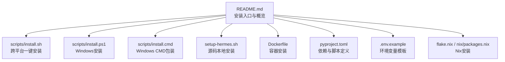
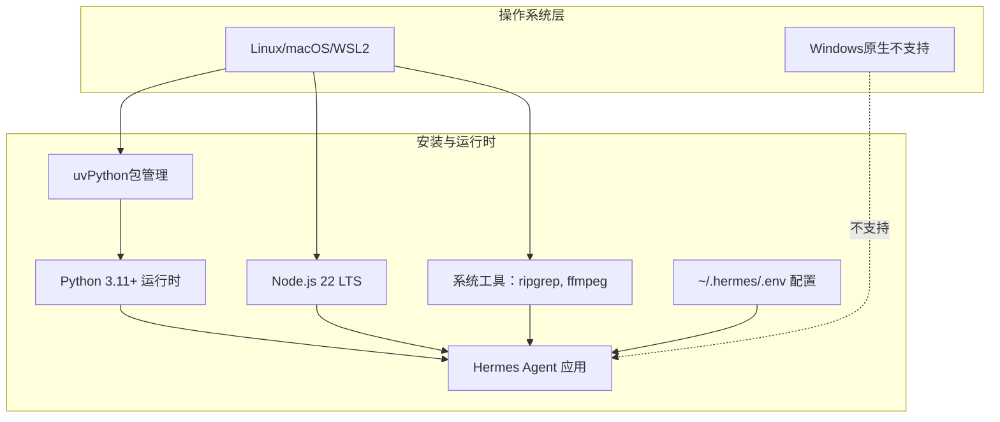
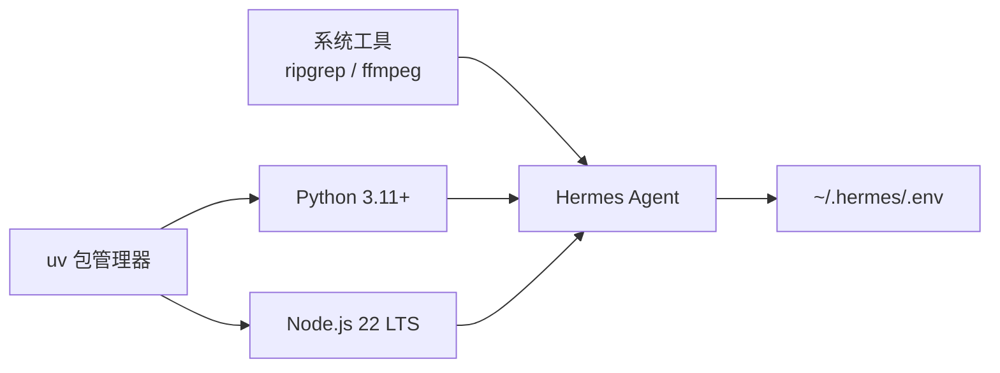

# 安装要求

<cite>
**本文引用的文件**
- [README.md](file://README.md)
- [scripts/install.sh](file://scripts/install.sh)
- [scripts/install.ps1](file://scripts/install.ps1)
- [scripts/install.cmd](file://scripts/install.cmd)
- [setup-hermes.sh](file://setup-hermes.sh)
- [Dockerfile](file://Dockerfile)
- [pyproject.toml](file://pyproject.toml)
- [requirements.txt](file://requirements.txt)
- [.env.example](file://.env.example)
- [flake.nix](file://flake.nix)
- [nix/packages.nix](file://nix/packages.nix)
</cite>

## 目录
1. [简介](#简介)
2. [项目结构](#项目结构)
3. [核心组件](#核心组件)
4. [架构总览](#架构总览)
5. [详细组件分析](#详细组件分析)
6. [依赖关系分析](#依赖关系分析)
7. [性能考虑](#性能考虑)
8. [故障排除指南](#故障排除指南)
9. [结论](#结论)
10. [附录](#附录)

## 简介
本文件面向不同技术背景的用户，提供Hermes Agent的完整安装要求与系统兼容性说明。内容涵盖支持与不支持的操作系统、硬件要求、软件依赖（Python版本、Node.js、系统工具）、多种安装方式（curl一键安装脚本、源码安装、Docker、Nix、包管理器）、环境变量配置、初始设置流程、常见问题与解决方案，以及安装验证方法。

## 项目结构
Hermes Agent提供多平台安装路径与自动化脚本，核心安装相关文件如下：
- 跨平台一键安装脚本：scripts/install.sh（Linux/macOS/WSL2）
- Windows安装脚本：scripts/install.ps1（PowerShell），scripts/install.cmd（CMD包装）
- 源码本地快速安装脚本：setup-hermes.sh（开发者手动克隆仓库后使用）
- 容器化安装：Dockerfile（基于Debian）
- 包管理与构建元数据：pyproject.toml、requirements.txt
- 环境变量模板：.env.example
- Nix生态：flake.nix、nix/packages.nix

**图表来源**
- [README.md:30-46](file://README.md#L30-L46)
- [scripts/install.sh:1-1134](file://scripts/install.sh#L1-L1134)
- [scripts/install.ps1:1-920](file://scripts/install.ps1#L1-L920)
- [scripts/install.cmd:1-29](file://scripts/install.cmd#L1-L29)
- [setup-hermes.sh:1-308](file://setup-hermes.sh#L1-L308)
- [Dockerfile:1-26](file://Dockerfile#L1-L26)
- [pyproject.toml:1-116](file://pyproject.toml#L1-L116)
- [.env.example:1-362](file://.env.example#L1-L362)
- [flake.nix:1-36](file://flake.nix#L1-L36)
- [nix/packages.nix:1-55](file://nix/packages.nix#L1-L55)

**章节来源**
- [README.md:30-46](file://README.md#L30-L46)
- [scripts/install.sh:124-154](file://scripts/install.sh#L124-L154)
- [scripts/install.ps1:15-21](file://scripts/install.ps1#L15-L21)
- [Dockerfile:1-26](file://Dockerfile#L1-L26)
- [pyproject.toml:10-116](file://pyproject.toml#L10-L116)
- [.env.example:1-362](file://.env.example#L1-L362)
- [flake.nix:24-36](file://flake.nix#L24-L36)
- [nix/packages.nix:1-55](file://nix/packages.nix#L1-L55)

## 核心组件
- Python运行时与包管理：Python 3.11及以上；优先使用uv进行虚拟环境与依赖安装。
- Node.js运行时：用于浏览器工具链（Playwright、WhatsApp桥等），默认安装Node.js 22 LTS。
- 系统工具：ripgrep（文件搜索加速）、ffmpeg（语音消息处理）。
- 可选组件：Docker（容器化部署）、Nix（包管理与开发环境）。
- 环境变量：通过~/.hermes/.env统一管理，覆盖API密钥、平台令牌、终端后端配置等。

**章节来源**
- [scripts/install.sh:33-34](file://scripts/install.sh#L33-L34)
- [scripts/install.ps1:29-32](file://scripts/install.ps1#L29-L32)
- [pyproject.toml:10](file://pyproject.toml#L10)
- [Dockerfile:4-7](file://Dockerfile#L4-L7)
- [.env.example:1-362](file://.env.example#L1-L362)

## 架构总览
下图展示从操作系统到应用运行的整体安装与运行时关系：

**图表来源**
- [scripts/install.sh:124-154](file://scripts/install.sh#L124-L154)
- [scripts/install.ps1:15-21](file://scripts/install.ps1#L15-L21)
- [pyproject.toml:10](file://pyproject.toml#L10)
- [Dockerfile:4-7](file://Dockerfile#L4-L7)
- [.env.example:1-362](file://.env.example#L1-L362)

## 详细组件分析

### 系统兼容性与硬件要求
- 支持的操作系统
  - Linux、macOS、WSL2：官方支持，使用scripts/install.sh一键安装。
  - Windows原生：不支持。请使用WSL2并在WSL环境中运行安装脚本。
- 硬件要求
  - 最低配置：单核CPU、2GB内存、磁盘空间满足Python/Node依赖与模型缓存。
  - 推荐配置：4核以上CPU、8GB+内存、SSD存储，以获得更流畅的工具调用与语音处理体验。
  - 注意：具体资源消耗取决于所选模型大小、并发任务数量与启用的工具集。

**章节来源**
- [README.md:36-39](file://README.md#L36-L39)
- [scripts/install.sh:139-145](file://scripts/install.sh#L139-L145)

### 软件依赖项
- Python版本：>=3.11（项目元数据与安装脚本均要求此版本）。
- Node.js版本：22 LTS（用于浏览器工具与WhatsApp桥等）。
- 系统工具：ripgrep（可选，提升文件搜索性能）、ffmpeg（可选，语音消息处理）。
- 其他：Git（用于仓库克隆与更新）、uv（包管理与虚拟环境）。

**章节来源**
- [pyproject.toml:10](file://pyproject.toml#L10)
- [scripts/install.sh:33-34](file://scripts/install.sh#L33-L34)
- [scripts/install.ps1:29-32](file://scripts/install.ps1#L29-L32)
- [Dockerfile:4-7](file://Dockerfile#L4-L7)

### 安装方式与步骤

#### 方式一：跨平台一键安装（推荐）
- Linux/macOS/WSL2
  - 使用curl一键脚本自动检测系统、安装uv、Python 3.11、Node.js 22、系统依赖，并创建hermes命令。
  - 命令示例：curl -fsSL https://raw.githubusercontent.com/NousResearch/hermes-agent/main/scripts/install.sh | bash
  - 可选参数：--no-venv（禁用虚拟环境）、--skip-setup（跳过交互式设置）、--branch 分支名、--dir 安装目录
- Windows
  - 不支持原生Windows，请在WSL2中执行上述Linux命令。
  - 若需直接在Windows上运行，可使用PowerShell安装脚本或CMD包装脚本。

**章节来源**
- [README.md:30-46](file://README.md#L30-L46)
- [scripts/install.sh:50-87](file://scripts/install.sh#L50-L87)
- [scripts/install.ps1:15-21](file://scripts/install.ps1#L15-L21)
- [scripts/install.cmd:1-29](file://scripts/install.cmd#L1-L29)

#### 方式二：源码本地安装
- 适用于已克隆仓库的开发者，使用setup-hermes.sh完成uv安装、虚拟环境创建、依赖安装、.env生成与hermes命令软链接。
- 步骤要点：检查uv与Python 3.11；创建并使用虚拟环境；安装主包与可选子模块；可选安装ripgrep；生成~/.hermes/skills/技能目录；创建~/.local/bin/hermes软链接。

**章节来源**
- [setup-hermes.sh:1-308](file://setup-hermes.sh#L1-L308)

#### 方式三：Docker安装
- 使用Dockerfile构建镜像，预装Python、Node.js、系统依赖与Playwright浏览器运行时，挂载卷至/opt/data作为HERMES_HOME。
- 适合需要隔离环境或在无Python/Node环境的服务器上快速部署。

**章节来源**
- [Dockerfile:1-26](file://Dockerfile#L1-L26)

#### 方式四：Nix安装
- flake.nix定义系统范围与开发环境，nix/packages.nix将uv生成的Python虚拟环境与系统工具打包为可执行程序hermes。
- 适合偏好Nix生态的用户。

**章节来源**
- [flake.nix:24-36](file://flake.nix#L24-L36)
- [nix/packages.nix:1-55](file://nix/packages.nix#L1-L55)

### 环境变量与初始设置
- 环境变量模板：复制.env.example为~/.hermes/.env，按需填写各提供商API密钥与平台令牌。
- 初始设置：安装完成后运行hermes setup或hermes doctor进行诊断与配置。
- 平台集成：Telegram、Discord、Slack、WhatsApp、Email等可通过.env配置相应令牌。

**章节来源**
- [.env.example:1-362](file://.env.example#L1-L362)
- [README.md:40-61](file://README.md#L40-L61)

### 验证安装成功
- 命令可用：hermes命令可在终端直接调用。
- 启动对话：hermes进入交互式CLI界面。
- 状态检查：hermes status查看配置状态；hermes doctor诊断常见问题。
- 平台测试：如配置了网关平台，发送消息测试连通性。

**章节来源**
- [README.md:40-61](file://README.md#L40-L61)

## 依赖关系分析

**图表来源**
- [scripts/install.sh:160-209](file://scripts/install.sh#L160-L209)
- [scripts/install.ps1:72-130](file://scripts/install.ps1#L72-L130)
- [Dockerfile:4-7](file://Dockerfile#L4-L7)
- [.env.example:1-362](file://.env.example#L1-L362)

**章节来源**
- [scripts/install.sh:160-209](file://scripts/install.sh#L160-L209)
- [scripts/install.ps1:72-130](file://scripts/install.ps1#L72-L130)
- [Dockerfile:4-7](file://Dockerfile#L4-L7)
- [.env.example:1-362](file://.env.example#L1-L362)

## 性能考虑
- 选择更高配置的CPU与内存可显著提升工具调用、语音转写与大模型推理速度。
- 在Linux/macOS/WSL2上优先安装ripgrep与ffmpeg以减少I/O与转码瓶颈。
- Docker/Nix安装可避免宿主机环境差异带来的性能波动。

[本节为通用建议，无需特定文件引用]

## 故障排除指南
- Windows原生不支持
  - 症状：脚本检测到Windows并提示使用WSL2。
  - 解决：在WSL2中执行Linux安装脚本。
- uv未找到或未在PATH
  - 症状：安装脚本报错找不到uv或uv安装后未生效。
  - 解决：确保~/.local/bin加入PATH；重新加载shell配置后重试。
- Python版本不符
  - 症状：系统自带Python版本过低导致安装失败。
  - 解决：使用uv自动安装Python 3.11；或手动升级系统Python。
- Node.js缺失或版本不匹配
  - 症状：浏览器工具无法使用或WhatsApp桥报错。
  - 解决：安装Node.js 22 LTS；或使用脚本自动安装。
- 权限问题（Linux/macOS）
  - 症状：sudo安装系统包失败或PATH未更新。
  - 解决：确认sudo权限；脚本会尝试通过brew/dnf/apt等安装ripgrep/ffmpeg；若失败，按提示手动安装。
- Windows Git克隆失败
  - 症状：SSH/HTTPS克隆失败或ZIP下载失败。
  - 解决：脚本会尝试修复Windows Git配置并回退到ZIP下载；必要时手动下载ZIP并初始化git仓库。
- Docker安装失败
  - 症状：系统缺少build-essential、gcc、python3-dev等编译工具。
  - 解决：安装对应系统编译工具后再执行pip安装。

**章节来源**
- [scripts/install.sh:139-145](file://scripts/install.sh#L139-L145)
- [scripts/install.sh:160-209](file://scripts/install.sh#L160-L209)
- [scripts/install.ps1:194-207](file://scripts/install.ps1#L194-L207)
- [scripts/install.ps1:412-518](file://scripts/install.ps1#L412-L518)
- [Dockerfile:4-7](file://Dockerfile#L4-L7)

## 结论
Hermes Agent提供多平台、多方式的安装路径，推荐优先使用跨平台一键安装脚本；对于开发者或高级用户，可选择源码安装、Docker或Nix方式。安装过程中，确保满足Python 3.11+、Node.js 22 LTS与必要的系统工具要求，并正确配置~/.hermes/.env中的API密钥与平台令牌。遇到问题时，可借助hermes doctor进行诊断，或参考本指南的故障排除部分。

[本节为总结性内容，无需特定文件引用]

## 附录

### A. 安装方式对比表
- 跨平台一键安装（Linux/macOS/WSL2）：最简路径，自动处理uv、Python、Node.js与系统依赖。
- Windows：不支持原生，推荐WSL2；也可使用PowerShell/CMD安装脚本。
- 源码本地安装：适合开发者，手动控制虚拟环境与依赖。
- Docker：容器化部署，便于迁移与隔离。
- Nix：包管理与开发环境一体化，适合Nix生态用户。

**章节来源**
- [README.md:30-46](file://README.md#L30-L46)
- [scripts/install.sh:1-1134](file://scripts/install.sh#L1-L1134)
- [scripts/install.ps1:1-920](file://scripts/install.ps1#L1-L920)
- [setup-hermes.sh:1-308](file://setup-hermes.sh#L1-L308)
- [Dockerfile:1-26](file://Dockerfile#L1-L26)
- [flake.nix:1-36](file://flake.nix#L1-L36)
- [nix/packages.nix:1-55](file://nix/packages.nix#L1-L55)

### B. 关键环境变量清单（摘录）
- LLM提供商：OPENROUTER_API_KEY、GOOGLE_API_KEY、GLM_API_KEY、KIMI_API_KEY、MINIMAX_API_KEY等。
- 工具API：EXA_API_KEY、PARALLEL_API_KEY、FIRECRAWL_API_KEY、FAL_KEY、HONCHO_API_KEY等。
- 平台集成：TELEGRAM_BOT_TOKEN、SLACK_BOT_TOKEN、SLACK_APP_TOKEN、WHATSAPP_ENABLED、EMAIL_*等。
- 终端后端：TERMINAL_ENV、TERMINAL_DOCKER_IMAGE、TERMINAL_MODAL_IMAGE、TERMINAL_CWD、TERMINAL_TIMEOUT等。
- 浏览器工具：BROWSERBASE_API_KEY、BROWSERBASE_PROJECT_ID、BROWSERBASE_PROXIES、BROWSERBASE_ADVANCED_STEALTH等。
- 语音与STT：VOICE_TOOLS_OPENAI_KEY、GROQ_API_KEY、STT_PROVIDER与模型覆盖等。

**章节来源**
- [.env.example:1-362](file://.env.example#L1-L362)