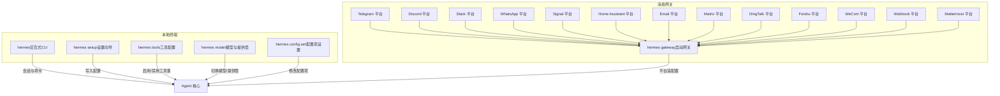
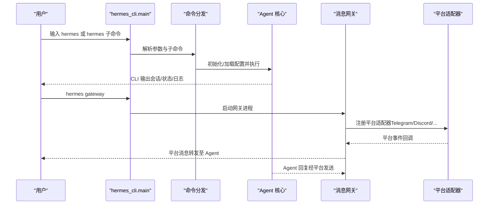
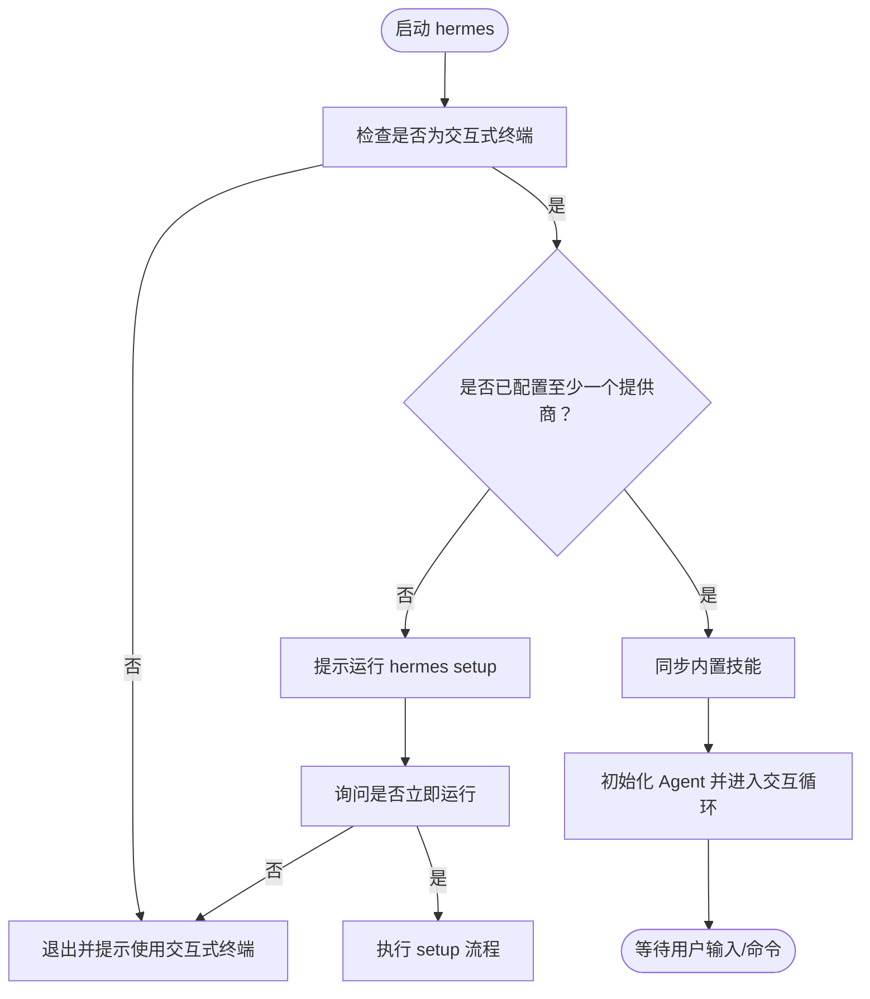
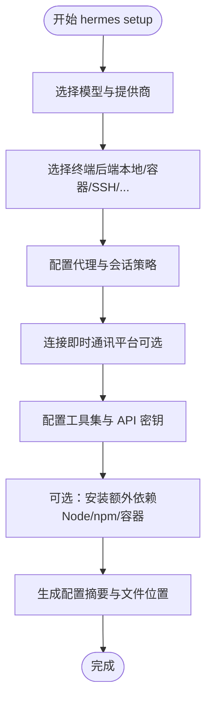
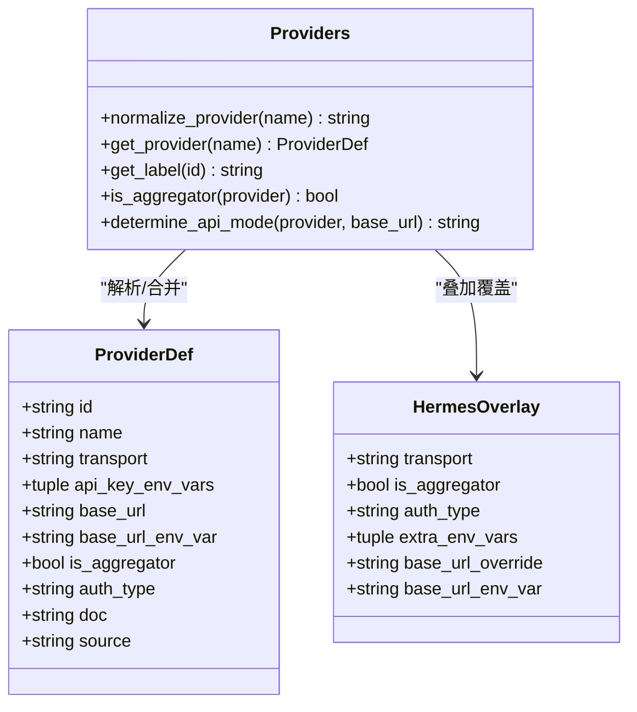
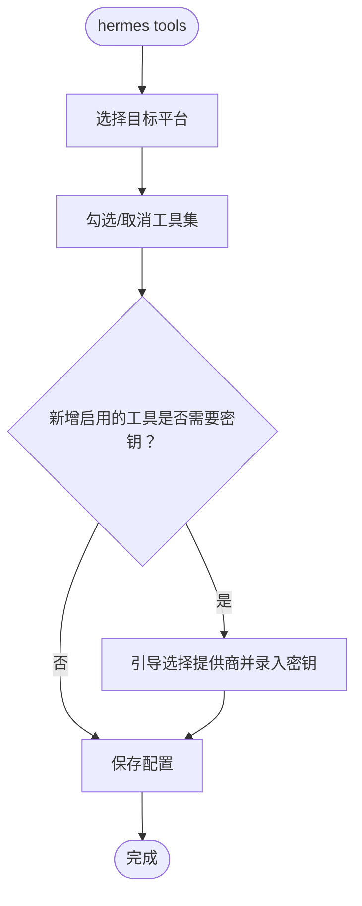
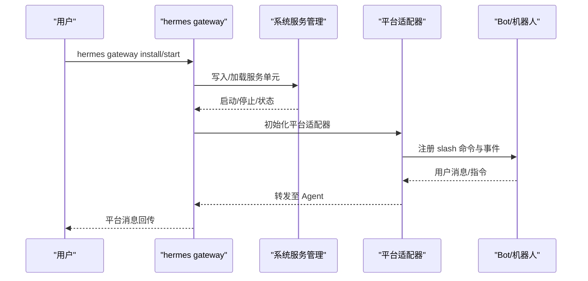
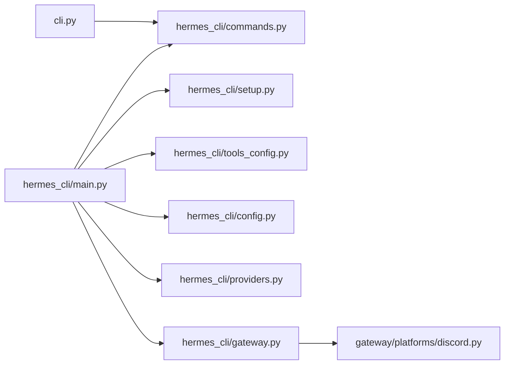

# 快速开始

<cite>
**本文引用的文件**
- [README.md](file://README.md)
- [hermes_cli/main.py](file://hermes_cli/main.py)
- [hermes_cli/commands.py](file://hermes_cli/commands.py)
- [hermes_cli/setup.py](file://hermes_cli/setup.py)
- [hermes_cli/gateway.py](file://hermes_cli/gateway.py)
- [hermes_cli/config.py](file://hermes_cli/config.py)
- [hermes_cli/tools_config.py](file://hermes_cli/tools_config.py)
- [hermes_cli/providers.py](file://hermes_cli/providers.py)
- [cli.py](file://cli.py)
- [gateway/platforms/discord.py](file://gateway/platforms/discord.py)
</cite>

## 目录
1. [简介](#简介)
2. [项目结构](#项目结构)
3. [核心组件](#核心组件)
4. [架构总览](#架构总览)
5. [详细组件分析](#详细组件分析)
6. [依赖关系分析](#依赖关系分析)
7. [性能考虑](#性能考虑)
8. [故障排除指南](#故障排除指南)
9. [结论](#结论)
10. [附录](#附录)

## 简介
本指南面向首次使用 Hermes Agent 的用户，提供从安装到完成首次对话的完整路径。你将学会：
- 安装与初始化
- 使用 hermes 命令行进行交互式聊天
- 通过 hermes setup 运行完整设置向导
- 配置模型提供商与模型（hermes model）
- 启用/管理工具（hermes tools）
- 设置单个配置项（hermes config set）
- 启动消息网关（hermes gateway），并通过 Telegram、Discord 等平台与 Agent 对话
- 掌握 slash 命令的常用操作
- 处理常见问题与排障

## 项目结构
Hermes Agent 提供两类入口：
- 交互式 CLI：直接在终端内开启对话，适合本地开发与调试
- 消息网关：启动后可接入多个即时通讯平台，实现跨平台持续对话

下图展示了两类入口与关键子系统的交互关系。

图表来源
- [hermes_cli/main.py](file://hermes_cli/main.py)
- [hermes_cli/gateway.py](file://hermes_cli/gateway.py)
- [hermes_cli/tools_config.py](file://hermes_cli/tools_config.py)
- [hermes_cli/config.py](file://hermes_cli/config.py)

章节来源
- [README.md](file://README.md)
- [hermes_cli/main.py](file://hermes_cli/main.py)
- [hermes_cli/gateway.py](file://hermes_cli/gateway.py)

## 核心组件
- 交互式 CLI（hermes）：提供多行编辑、slash 命令、历史记录、流式工具输出、中断与重定向等能力，适合日常开发与测试。
- 设置向导（hermes setup）：模块化引导，帮助你完成模型/提供商选择、终端后端、代理设置、平台连接与工具配置。
- 模型与提供商（hermes model）：支持多家提供商与自定义端点，一键切换并持久化配置。
- 工具配置（hermes tools）：统一管理各平台可用的工具集，按需启用/禁用，并为需要密钥的工具自动引导配置。
- 配置项设置（hermes config set）：对单个配置项进行原子级更新，无需手动编辑 YAML。
- 消息网关（hermes gateway）：统一接入 Telegram、Discord、Slack、WhatsApp、Signal、Email、Matrix、DingTalk、Feishu、WeCom、Webhook、Mattermost 等平台，支持状态查询、平台特定命令等。

章节来源
- [README.md](file://README.md)
- [hermes_cli/main.py](file://hermes_cli/main.py)
- [hermes_cli/setup.py](file://hermes_cli/setup.py)
- [hermes_cli/tools_config.py](file://hermes_cli/tools_config.py)
- [hermes_cli/config.py](file://hermes_cli/config.py)

## 架构总览
下图展示从命令入口到 Agent 执行与平台适配的整体流程。

图表来源
- [hermes_cli/main.py](file://hermes_cli/main.py)
- [hermes_cli/gateway.py](file://hermes_cli/gateway.py)
- [cli.py](file://cli.py)

章节来源
- [hermes_cli/main.py](file://hermes_cli/main.py)
- [hermes_cli/gateway.py](file://hermes_cli/gateway.py)
- [cli.py](file://cli.py)

## 详细组件分析

### 组件一：交互式 CLI（hermes）
- 入口行为：默认启动交互式聊天；支持 --continue/--resume 从上次会话继续；支持 --yolo 跳过危险命令审批；支持 --source 标记会话来源。
- 首次运行保护：若未检测到任何提供商配置，会提示先运行 hermes setup。
- 同步技能：每次启动同步内置技能，保证功能最新。
- 会话解析：支持通过名称或 ID 解析最近会话或指定会话。

图表来源
- [hermes_cli/main.py](file://hermes_cli/main.py)

章节来源
- [hermes_cli/main.py](file://hermes_cli/main.py)

### 组件二：设置向导（hermes setup）
- 分步引导：模型与提供商选择、终端后端、代理设置、平台连接、工具配置。
- 可选安装：根据订阅与环境，自动提示安装 Node.js 依赖（浏览器工具）、Camoufox、tinker-atropos 等。
- 总结页：列出当前可用工具类别与缺失的密钥，指引下一步。

图表来源
- [hermes_cli/setup.py](file://hermes_cli/setup.py)

章节来源
- [hermes_cli/setup.py](file://hermes_cli/setup.py)

### 组件三：模型与提供商（hermes model）
- 支持多家提供商与聚合路由（如 OpenRouter），并支持自定义端点。
- 提供商别名与标签映射，便于记忆与迁移。
- 与配置系统集成，持久化模型与提供商信息。

图表来源
- [hermes_cli/providers.py](file://hermes_cli/providers.py)

章节来源
- [hermes_cli/providers.py](file://hermes_cli/providers.py)

### 组件四：工具配置（hermes tools）
- 工具集分类：网络搜索、浏览器自动化、终端与进程、文件操作、代码执行、视觉分析、图像生成、混合代理、TTS、技能、任务规划、记忆、会话检索、澄清问题、任务委派、定时任务、RL 训练、智能家居等。
- 平台维度：CLI、Telegram、Discord、Slack、WhatsApp、Signal、Home Assistant、Email、Matrix、DingTalk、Feishu、WeCom、API Server、Mattermost 等。
- 提示与引导：针对需要密钥的工具，自动弹出提供商选择与密钥录入流程。

图表来源
- [hermes_cli/tools_config.py](file://hermes_cli/tools_config.py)

章节来源
- [hermes_cli/tools_config.py](file://hermes_cli/tools_config.py)

### 组件五：配置项设置（hermes config set）
- 单项配置更新：对 config.yaml 中的任意键进行安全写入，避免破坏其他字段。
- 环境变量补充：部分配置项会同时更新 ~/.hermes/.env 中的对应密钥。
- 管理模式提示：在 NixOS/Homebrew 等受包管理器托管的环境中，提供升级与修改建议。

章节来源
- [hermes_cli/config.py](file://hermes_cli/config.py)

### 组件六：消息网关（hermes gateway）
- 进程管理：支持 start/stop/restart/status/install/uninstall 等子命令；支持 systemd/launchd 服务安装与守护。
- 平台适配：内置 Telegram、Discord、Slack、WhatsApp、Signal、Email、Matrix、DingTalk、Feishu、WeCom、Webhook、Mattermost 等适配器。
- 平台特定命令：例如 Discord 的 /voice、/update、/approve、/deny、/thread 等，均由平台侧注册并转发到 Agent。

图表来源
- [hermes_cli/gateway.py](file://hermes_cli/gateway.py)
- [gateway/platforms/discord.py](file://gateway/platforms/discord.py)

章节来源
- [hermes_cli/gateway.py](file://hermes_cli/gateway.py)
- [gateway/platforms/discord.py](file://gateway/platforms/discord.py)

## 依赖关系分析
- hermes_cli/main.py 是所有 CLI 子命令的入口，负责参数解析、首次运行保护、配置加载与子命令分发。
- hermes_cli/commands.py 定义了所有 slash 命令及其分类、别名、子命令与可用性门控，CLI 与网关共享同一套命令定义。
- hermes_cli/setup.py、hermes_cli/tools_config.py、hermes_cli/providers.py、hermes_cli/config.py 分别处理设置向导、工具配置、提供商解析与配置持久化。
- gateway/platforms/* 提供各平台适配器，将平台消息转换为 Agent 可理解的指令。
- cli.py 是交互式 CLI 的核心执行逻辑，负责渲染、补全、历史与命令处理。

图表来源
- [hermes_cli/main.py](file://hermes_cli/main.py)
- [hermes_cli/commands.py](file://hermes_cli/commands.py)
- [hermes_cli/setup.py](file://hermes_cli/setup.py)
- [hermes_cli/tools_config.py](file://hermes_cli/tools_config.py)
- [hermes_cli/config.py](file://hermes_cli/config.py)
- [hermes_cli/providers.py](file://hermes_cli/providers.py)
- [hermes_cli/gateway.py](file://hermes_cli/gateway.py)
- [cli.py](file://cli.py)
- [gateway/platforms/discord.py](file://gateway/platforms/discord.py)

章节来源
- [hermes_cli/main.py](file://hermes_cli/main.py)
- [hermes_cli/commands.py](file://hermes_cli/commands.py)
- [hermes_cli/setup.py](file://hermes_cli/setup.py)
- [hermes_cli/tools_config.py](file://hermes_cli/tools_config.py)
- [hermes_cli/config.py](file://hermes_cli/config.py)
- [hermes_cli/providers.py](file://hermes_cli/providers.py)
- [hermes_cli/gateway.py](file://hermes_cli/gateway.py)
- [cli.py](file://cli.py)
- [gateway/platforms/discord.py](file://gateway/platforms/discord.py)

## 性能考虑
- 会话压缩：当上下文占用超过阈值时自动压缩，减少 token 使用并提升响应速度。
- 工具调用预估：对工具 schema 进行 token 预估，帮助控制上下文开销。
- 流式输出：CLI 与网关均支持流式工具输出，改善交互体验。
- 代理路由：智能模型路由在简单请求时使用低成本模型，复杂任务再切换高成本模型。

章节来源
- [hermes_cli/tools_config.py](file://hermes_cli/tools_config.py)
- [hermes_cli/config.py](file://hermes_cli/config.py)

## 故障排除指南
- 无法启动 CLI：确保在交互式终端中运行 hermes，非交互管道会触发保护退出。
- 未配置提供商：首次运行会提示先运行 hermes setup；也可通过 hermes config set 手动设置模型与提供商。
- 网关无法启动：检查系统服务权限与 linger 设置（Linux），确认端口与防火墙；必要时使用 hermes gateway install/start。
- 平台无响应：确认平台令牌与允许列表配置正确；查看网关日志与平台事件回调。
- 工具不可用：检查对应 API 密钥是否已录入；根据 hermes setup 的摘要页面定位缺失项。
- 更新与卸载：在受包管理器托管的环境中，请使用其推荐的升级/卸载方式；否则使用 hermes update 或 hermes uninstall。

章节来源
- [hermes_cli/main.py](file://hermes_cli/main.py)
- [hermes_cli/gateway.py](file://hermes_cli/gateway.py)
- [hermes_cli/config.py](file://hermes_cli/config.py)
- [hermes_cli/setup.py](file://hermes_cli/setup.py)

## 结论
通过本快速开始指南，你已经完成了：
- 安装与初始化
- 运行设置向导完成基础配置
- 在 CLI 中进行首次对话
- 切换模型与提供商
- 启用所需工具
- 启动消息网关并在多平台与 Agent 互动
- 掌握常用 slash 命令与排障方法

现在你可以根据实际需求扩展工具集、定制个性化人格、配置定时任务与跨平台持续对话。

## 附录

### CLI 与消息网关使用方式对比
- CLI 适合本地开发、快速验证与调试，具备完整的 TUI 体验与命令补全。
- 网关适合长期在线、多平台接入与团队协作，支持状态查询、平台特定命令与后台守护。

章节来源
- [README.md](file://README.md)
- [hermes_cli/main.py](file://hermes_cli/main.py)
- [hermes_cli/gateway.py](file://hermes_cli/gateway.py)

### 常用 slash 命令速查
以下命令在 CLI 与消息网关中通用（部分平台有特定命令）：

- 会话管理
  - /new 或 /reset：开始全新会话
  - /retry：重试上一轮对话
  - /undo：移除最后一条用户/助手对话
  - /branch 或 /fork：基于当前会话分支探索
  - /resume [名称]：恢复指定会话
  - /title [名称]：为当前会话设置标题
  - /clear：清屏并开始新会话（仅 CLI）

- 模型与配置
  - /model [provider:model]：切换当前会话使用的模型
  - /provider：显示当前可用提供商与当前提供商
  - /personality [名称]：应用预设个性
  - /prompt [文本|clear]：查看或设置自定义系统提示（仅 CLI）
  - /reasoning [级别|show|hide]：管理推理努力与显示
  - /skin [名称]：切换显示皮肤（仅 CLI）
  - /voice [on|off|tts|status]：语音模式开关（含 TTS）
  - /yolo：切换跳过危险命令审批模式
  - /verbose：切换工具进度显示级别（受配置门控）

- 工具与技能
  - /tools [list|disable|enable] [名称...]：管理工具集（仅 CLI）
  - /toolsets：列出可用工具集（仅 CLI）
  - /skills [search|browse|inspect|install]：搜索/浏览/查看/安装技能（仅 CLI）
  - /reload-mcp：从配置重新加载 MCP 服务器
  - /browser [connect|disconnect|status]：连接浏览器工具（仅 CLI）
  - /plugins：列出已安装插件及状态（仅 CLI）
  - /cron [list|add|create|edit|pause|resume|run|remove]：管理定时任务（仅 CLI）

- 信息与状态
  - /help：显示可用命令
  - /commands：显示命令与技能（网关）
  - /usage：显示当前会话 token 使用情况
  - /insights [天数]：显示使用洞察与分析
  - /status：显示会话信息（网关）
  - /platforms：显示网关平台状态（仅 CLI）
  - /profile：显示当前配置文件夹与个人资料
  - /paste：检查剪贴板中的图片并附加（仅 CLI）
  - /update：在网关中触发更新（网关）

- 平台特定命令（示例）
  - Discord：/voice、/update、/approve、/deny、/thread 等

章节来源
- [hermes_cli/commands.py](file://hermes_cli/commands.py)
- [gateway/platforms/discord.py](file://gateway/platforms/discord.py)