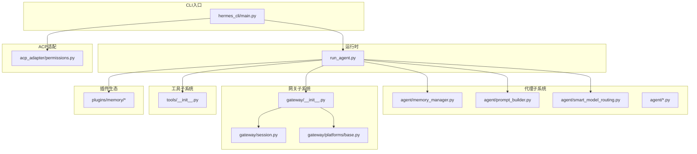
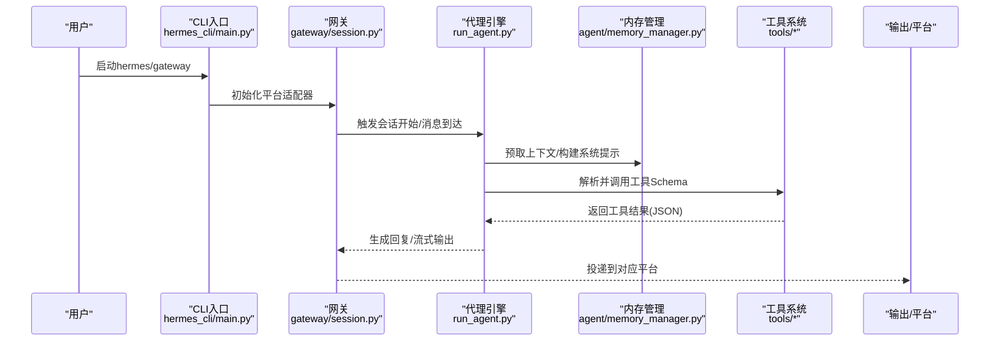
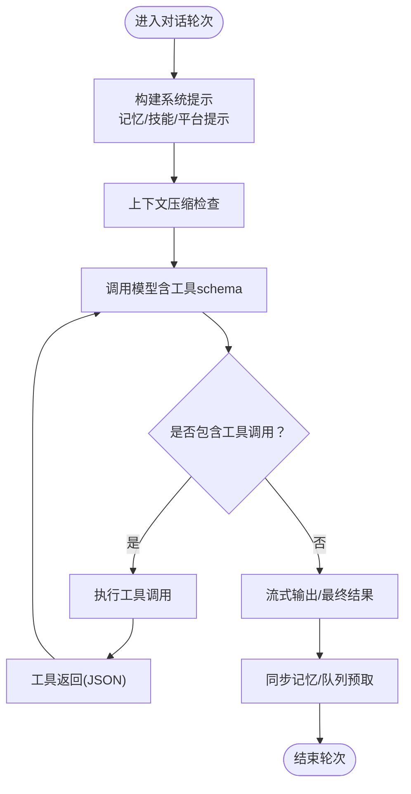
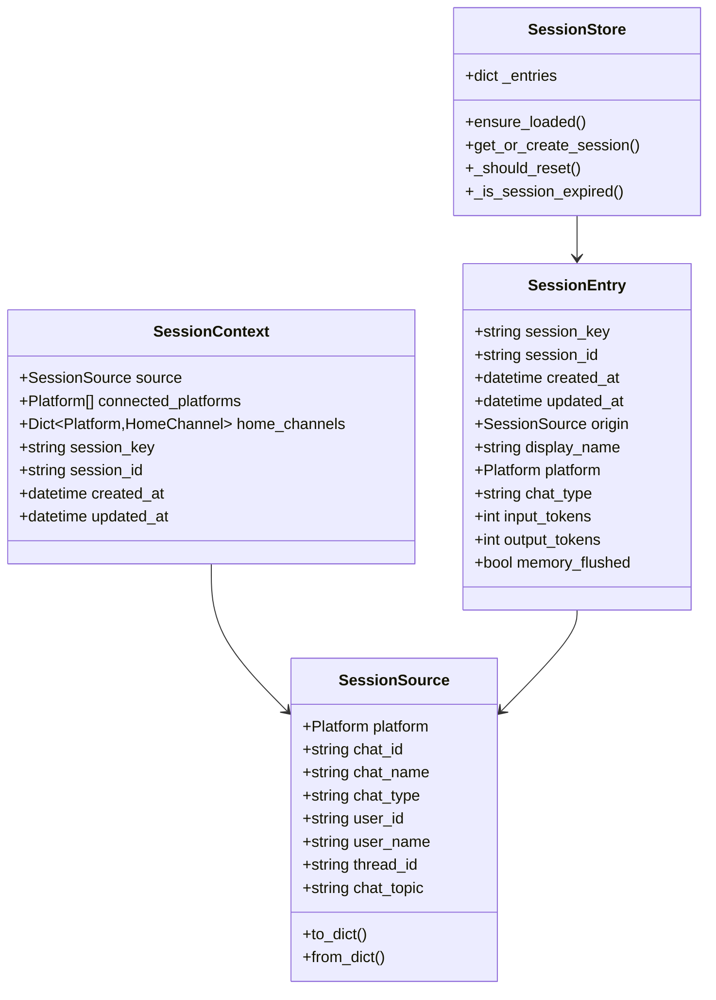
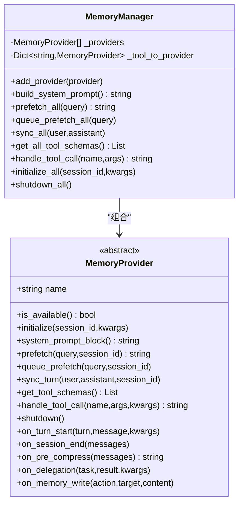
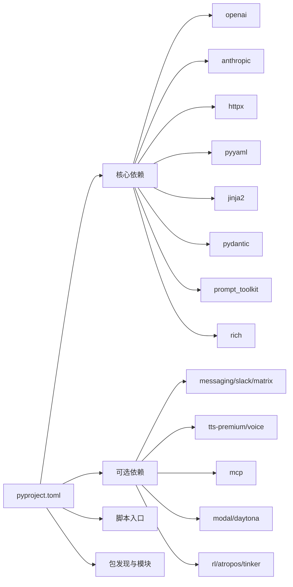

# 技术架构

<cite>
**本文引用的文件**
- [README.md](file://README.md)
- [pyproject.toml](file://pyproject.toml)
- [requirements.txt](file://requirements.txt)
- [run_agent.py](file://run_agent.py)
- [agent/__init__.py](file://agent/__init__.py)
- [agent/memory_manager.py](file://agent/memory_manager.py)
- [agent/memory_provider.py](file://agent/memory_provider.py)
- [agent/smart_model_routing.py](file://agent/smart_model_routing.py)
- [agent/prompt_builder.py](file://agent/prompt_builder.py)
- [gateway/__init__.py](file://gateway/__init__.py)
- [gateway/session.py](file://gateway/session.py)
- [gateway/platforms/base.py](file://gateway/platforms/base.py)
- [hermes_cli/main.py](file://hermes_cli/main.py)
- [tools/__init__.py](file://tools/__init__.py)
- [acp_adapter/permissions.py](file://acp_adapter/permissions.py)
- [.plans/openai-api-server.md](file://.plans/openai-api-server.md)
- [.plans/streaming-support.md](file://.plans/streaming-support.md)
- [docs/plans/2026-03-16-pricing-accuracy-architecture-design.md](file://docs/plans/2026-03-16-pricing-accuracy-architecture-design.md)
</cite>

## 目录
1. [引言](#引言)
2. [项目结构](#项目结构)
3. [核心组件](#核心组件)
4. [架构总览](#架构总览)
5. [详细组件分析](#详细组件分析)
6. [依赖分析](#依赖分析)
7. [性能考量](#性能考量)
8. [故障排查指南](#故障排查指南)
9. [结论](#结论)
10. [附录](#附录)

## 引言
本文件面向Hermes Agent的系统架构与实现，聚焦于代理引擎、消息网关、工具系统、技能学习机制与内存管理的整体设计。文档解释核心组件间的交互关系、数据流向与集成模式，阐述技术决策、权衡与约束，并给出基础设施需求、可扩展性与部署拓扑建议。同时覆盖横切关注点（安全、监控、灾难恢复），记录技术栈、第三方依赖与版本兼容性，强调模块化设计、插件架构与事件驱动架构等关键设计模式。

## 项目结构
Hermes Agent采用分层与功能域结合的组织方式：
- 核心运行时：run_agent.py 提供独立的代理执行器，负责对话循环、工具调用与响应管理。
- 代理子系统：agent/ 包含记忆管理、提示构建、模型路由、上下文压缩、轨迹与定价等能力。
- 网关子系统：gateway/ 提供多平台消息接入、会话管理、投递路由与平台适配。
- 工具子系统：tools/ 提供终端、浏览器、文件、代码执行、语音、网页检索等工具集。
- CLI入口：hermes_cli/ 提供命令行界面与配置管理。
- ACP适配：acp_adapter/ 将Hermes与编辑器的ACP协议桥接。
- 插件生态：plugins/ 为记忆提供外部插件扩展点。
- 文档与规划：docs/ 与 .plans/ 存放架构设计与路线图。

图表来源
- [run_agent.py:1-200](file://run_agent.py#L1-L200)
- [agent/memory_manager.py:1-120](file://agent/memory_manager.py#L1-L120)
- [agent/prompt_builder.py:1-120](file://agent/prompt_builder.py#L1-L120)
- [agent/smart_model_routing.py:1-120](file://agent/smart_model_routing.py#L1-L120)
- [gateway/__init__.py:1-36](file://gateway/__init__.py#L1-L36)
- [gateway/session.py:1-120](file://gateway/session.py#L1-L120)
- [gateway/platforms/base.py:1-120](file://gateway/platforms/base.py#L1-L120)
- [hermes_cli/main.py:1-120](file://hermes_cli/main.py#L1-L120)
- [tools/__init__.py:1-26](file://tools/__init__.py#L1-L26)
- [acp_adapter/permissions.py:1-45](file://acp_adapter/permissions.py#L1-L45)

章节来源
- [README.md:1-176](file://README.md#L1-L176)
- [pyproject.toml:1-116](file://pyproject.toml#L1-L116)

## 核心组件
- 代理引擎（AIAgent）
  - 职责：统一的对话循环、工具调用、错误处理与恢复、消息历史管理、多模型提供商支持。
  - 关键点：从 run_agent.py 拆分出的模块化子系统，通过 agent/ 包提供记忆、提示、模型路由、上下文压缩等能力。
- 消息网关（Gateway）
  - 职责：多平台接入（Telegram、Discord、Slack等）、会话管理、动态上下文注入、投递路由、平台特定工具集。
  - 关键点：会话键生成、过期策略、SQLite/JSONL持久化、PII脱敏与安全传输。
- 工具系统（Tools）
  - 职责：终端后端、浏览器、文件操作、代码执行、语音、网页检索、MCP/ACCP工具桥接。
  - 关键点：按需导入、最小副作用、环境后端隔离与沙箱。
- 技能学习机制（Skills）
  - 职责：基于经验的程序性记忆、技能创建与改进、跨会话检索与复用。
  - 关键点：技能索引、禁用列表、平台匹配与前端展示。
- 内存管理（Memory）
  - 职责：内置持久记忆与外部插件记忆的统一编排，提供系统提示块、预取、同步与工具Schema。
  - 关键点：内置提供者优先、仅允许一个外部提供者、失败不阻断、生命周期钩子。

章节来源
- [run_agent.py:1-200](file://run_agent.py#L1-L200)
- [agent/memory_manager.py:1-120](file://agent/memory_manager.py#L1-L120)
- [agent/memory_provider.py:1-120](file://agent/memory_provider.py#L1-L120)
- [gateway/session.py:1-120](file://gateway/session.py#L1-L120)
- [tools/__init__.py:1-26](file://tools/__init__.py#L1-L26)

## 架构总览
Hermes采用“事件驱动 + 插件化”的混合架构：
- 事件驱动：网关接收平台事件，触发会话状态变更与消息流转；代理引擎在工具调用与模型推理中以异步/线程池协作。
- 插件化：内存提供者、平台适配器、工具后端均通过注册与接口抽象实现解耦。
- 分层清晰：CLI入口负责启动与配置；网关负责接入与会话；代理引擎负责推理与工具编排；工具与插件提供能力扩展。

图表来源
- [hermes_cli/main.py:1-120](file://hermes_cli/main.py#L1-L120)
- [gateway/session.py:1-120](file://gateway/session.py#L1-L120)
- [run_agent.py:1-200](file://run_agent.py#L1-L200)
- [agent/memory_manager.py:1-120](file://agent/memory_manager.py#L1-L120)
- [tools/__init__.py:1-26](file://tools/__init__.py#L1-L26)

## 详细组件分析

### 代理引擎（AIAgent）与核心流程
- 运行循环：自动工具调用直至完成，可配置模型参数，具备错误处理与恢复。
- 数据流：构建系统提示（含记忆、技能、平台提示），压缩上下文，估算token与费用，执行工具调用，流式输出。
- 关键模块：
  - 记忆管理：build_memory_context_block、prefetch_all、sync_all。
  - 提示构建：build_nous_subscription_prompt、build_skills_system_prompt、build_context_files_prompt。
  - 模型路由：choose_cheap_model_route、resolve_turn_route。
  - 上下文压缩：ContextCompressor。
  - 显示与轨迹：KawaiiSpinner、convert_scratchpad_to_think、save_trajectory。

图表来源
- [run_agent.py:1-200](file://run_agent.py#L1-L200)
- [agent/prompt_builder.py:1-120](file://agent/prompt_builder.py#L1-L120)
- [agent/memory_manager.py:170-220](file://agent/memory_manager.py#L170-L220)
- [agent/smart_model_routing.py:60-120](file://agent/smart_model_routing.py#L60-L120)

章节来源
- [run_agent.py:1-200](file://run_agent.py#L1-L200)
- [agent/prompt_builder.py:1-120](file://agent/prompt_builder.py#L1-L120)
- [agent/smart_model_routing.py:1-120](file://agent/smart_model_routing.py#L1-L120)

### 消息网关与会话管理
- 会话键规则：基于平台、聊天类型、参与者ID、线程ID等确定唯一会话键，支持DM隔离、线程共享或隔离。
- 会话存储：SQLite（SessionDB）为主，回退至JSONL；持久化会话元数据与令牌统计。
- 重置策略：空闲超时与每日重置，支持后台进程检测避免误判。
- 动态上下文：构建系统提示段落，注入来源平台、连接平台、默认投递通道等信息；支持PII脱敏。

图表来源
- [gateway/session.py:70-180](file://gateway/session.py#L70-L180)
- [gateway/session.py:180-360](file://gateway/session.py#L180-L360)
- [gateway/session.py:500-760](file://gateway/session.py#L500-L760)

章节来源
- [gateway/session.py:1-200](file://gateway/session.py#L1-L200)
- [gateway/__init__.py:1-36](file://gateway/__init__.py#L1-L36)

### 工具系统与平台适配
- 工具包命名空间：tools/__init__.py 控制最小导入副作用，具体工具按需导入。
- 平台适配器：gateway/platforms/base.py 定义统一接口，各平台（Telegram、Discord、Slack等）继承实现。
- 媒体缓存：图片/音频缓存目录与清理策略，避免平台URL过期带来的问题。
- URL安全：SSRF保护与URL白名单校验，日志中安全地截断敏感URL。

章节来源
- [tools/__init__.py:1-26](file://tools/__init__.py#L1-L26)
- [gateway/platforms/base.py:1-120](file://gateway/platforms/base.py#L1-L120)

### 内存管理与插件架构
- MemoryManager：内置提供者始终注册，最多再注册一个外部提供者；失败不阻断其他提供者；提供系统提示块、预取、同步、工具Schema聚合与生命周期钩子。
- MemoryProvider：抽象基类定义可用性、初始化、系统提示块、预取、同步、工具Schema与调用、关闭等接口；可选钩子包括回合开始、会话结束、压缩前提取、委托观察、镜像写入等。
- 插件扩展：plugins/memory/* 下的外部记忆提供者通过配置启用，遵循单外部提供者限制。

图表来源
- [agent/memory_manager.py:70-140](file://agent/memory_manager.py#L70-L140)
- [agent/memory_provider.py:40-140](file://agent/memory_provider.py#L40-L140)

章节来源
- [agent/memory_manager.py:1-120](file://agent/memory_manager.py#L1-L120)
- [agent/memory_provider.py:1-120](file://agent/memory_provider.py#L1-L120)

### 技能学习机制与提示构建
- 技能索引与禁用：从技能目录扫描、解析frontmatter、过滤平台匹配与禁用列表。
- 提示构建：默认身份、记忆指导、会话搜索指导、技能指导、工具使用强制与执行纪律等。
- 上下文文件扫描：对AGENTS.md、.cursorrules、SOUL.md等进行威胁模式检测与隐藏字符清洗，防止提示注入。

章节来源
- [agent/prompt_builder.py:1-120](file://agent/prompt_builder.py#L1-L120)

### ACP权限桥接
- 权限映射：将ACP的许可选项映射为Hermes的“一次性/总是/拒绝”策略，默认超时与桥接失败时拒绝。
- 生命周期：新会话创建、任务执行、取消与分支会话，工作目录绑定与认证复用。

章节来源
- [acp_adapter/permissions.py:1-45](file://acp_adapter/permissions.py#L1-L45)
- [website/docs/developer-guide/acp-internals.md:89-154](file://website/docs/developer-guide/acp-internals.md#L89-L154)

## 依赖分析
- 核心依赖：OpenAI、Anthropic、HTTPX、PyYAML、Jinja2、Pydantic、Prompt Toolkit、Rich等。
- 可选依赖：消息平台（Telegram、Discord、Slack等）、语音（ElevenLabs、Edge TTS）、MCP、Modal、Daytona、RL训练（Atropos、Tinker）等。
- CLI脚本：hermes、hermes-agent、hermes-acp分别指向不同入口模块。
- 包发现：通过pyproject.toml的packages.find.include与setuptools模块声明，确保安装后可导入agent、tools、gateway等包。

图表来源
- [pyproject.toml:13-97](file://pyproject.toml#L13-L97)

章节来源
- [pyproject.toml:1-116](file://pyproject.toml#L1-L116)
- [requirements.txt:1-37](file://requirements.txt#L1-L37)

## 性能考量
- 模型路由优化：针对简单对话选择低成本模型，减少token与费用开销；复杂任务回退主模型。
- 上下文压缩：在压缩前抽取关键洞察，降低信息丢失风险；结合令牌估算与费用归集。
- I/O与并发：会话存储与工具调用采用异步/线程池模式；媒体缓存避免重复下载；安全URL校验与指数退避重试。
- 成本控制：迭代预算、令牌统计与费用估算，支持按天/按次重置策略。

章节来源
- [agent/smart_model_routing.py:60-120](file://agent/smart_model_routing.py#L60-L120)
- [agent/prompt_builder.py:1-120](file://agent/prompt_builder.py#L1-L120)
- [gateway/platforms/base.py:110-170](file://gateway/platforms/base.py#L110-L170)

## 故障排查指南
- 环境变量加载：优先加载~/.hermes/.env，再回退项目根目录.env，确保用户配置覆盖系统环境。
- 安全与日志：集中式CLI日志初始化；URL安全校验与PII脱敏；媒体缓存清理与过期策略。
- 网关异常：SQLite不可用时回退JSONL；会话计数与历史记录统计；空闲/每日重置策略生效验证。
- ACP桥接：权限请求超时默认拒绝；工具渲染与大结果截断；取消与分支会话状态一致性。

章节来源
- [hermes_cli/main.py:139-160](file://hermes_cli/main.py#L139-L160)
- [gateway/platforms/base.py:110-170](file://gateway/platforms/base.py#L110-L170)
- [gateway/session.py:500-760](file://gateway/session.py#L500-L760)
- [acp_adapter/permissions.py:25-45](file://acp_adapter/permissions.py#L25-L45)

## 结论
Hermes Agent通过模块化与插件化设计，实现了跨平台、可扩展且安全的智能体系统。代理引擎以事件驱动与工具编排为核心，消息网关提供统一接入与会话治理，内存与技能系统支撑长期记忆与自适应学习。技术栈与可选依赖覆盖主流平台与能力，满足从个人到企业级部署的需求。未来规划包括OpenAI API服务器与流式支持等方向，持续提升性能与可观测性。

## 附录
- 基础设施需求
  - 操作系统：Linux、macOS、WSL2（Windows原生不支持）。
  - 运行时：Python 3.11+，推荐虚拟环境。
  - 可选：Modal、Daytona用于无服务器与持久化；语音/视频工具需要额外依赖。
- 可扩展性
  - 平台适配器与工具后端均可独立扩展；内存提供者限制为一个外部提供者，避免冲突。
  - 会话存储支持SQLite与JSONL双路径，便于迁移与灾备。
- 部署拓扑
  - 单机CLI：本地终端交互。
  - 网关模式：启动网关服务，多平台接入；支持容器与无服务后端。
  - ACP模式：编辑器集成，工作目录绑定与权限桥接。
- 横切关注点
  - 安全：PII脱敏、URL安全、SSRF防护、权限桥接与超时拒绝。
  - 监控：令牌统计、费用估算、会话计数、日志集中化。
  - 灾难恢复：SQLite/JSONL双存储、会话历史保留、重置策略与内存刷新。

章节来源
- [README.md:30-61](file://README.md#L30-L61)
- [pyproject.toml:39-97](file://pyproject.toml#L39-L97)
- [gateway/session.py:500-760](file://gateway/session.py#L500-L760)
- [website/docs/developer-guide/acp-internals.md:89-154](file://website/docs/developer-guide/acp-internals.md#L89-L154)