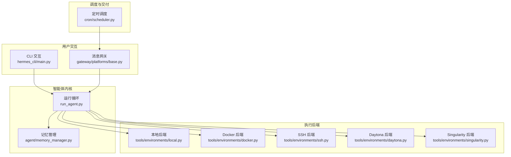
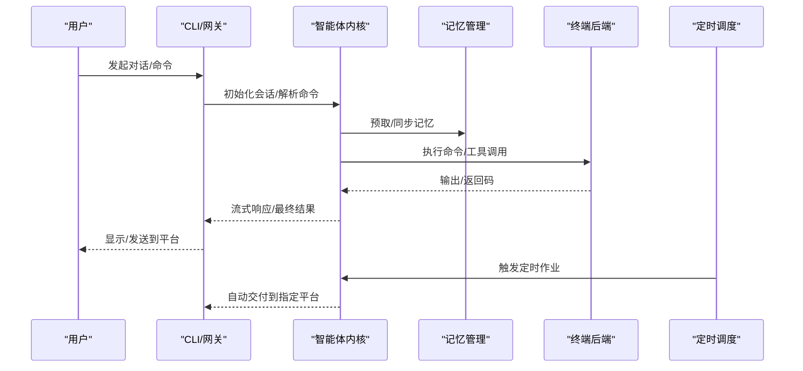
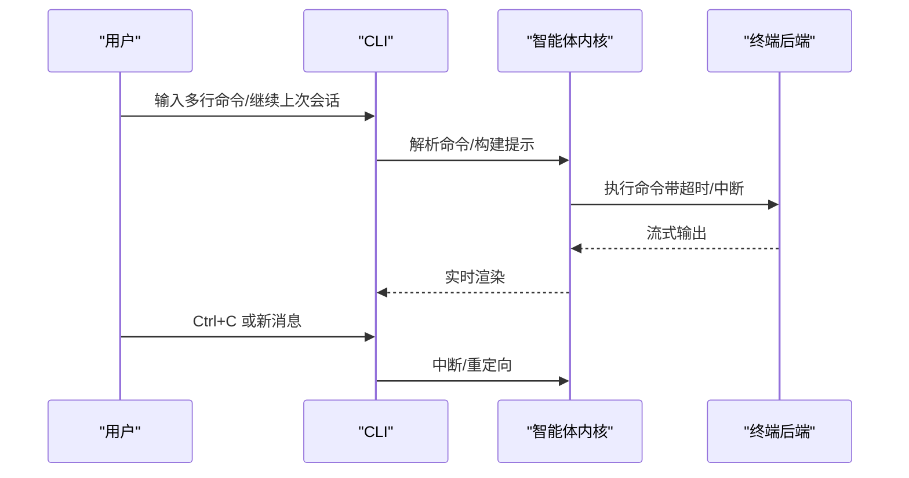
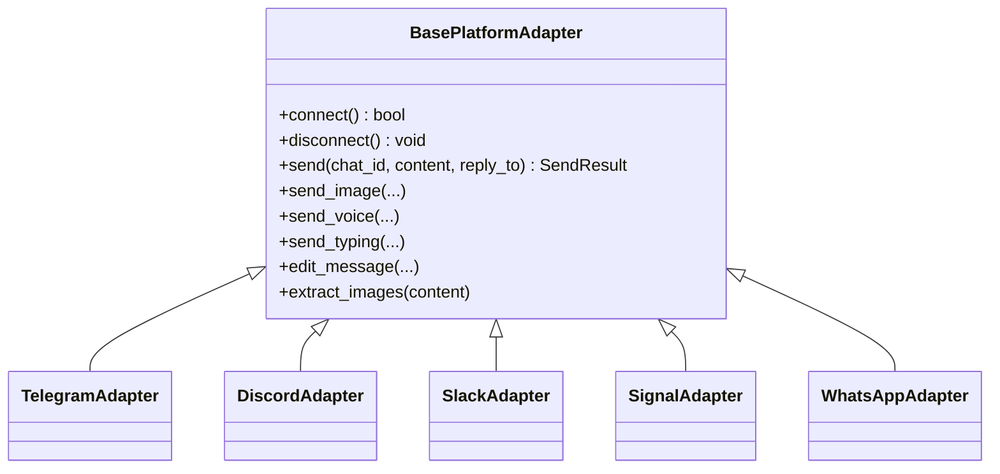
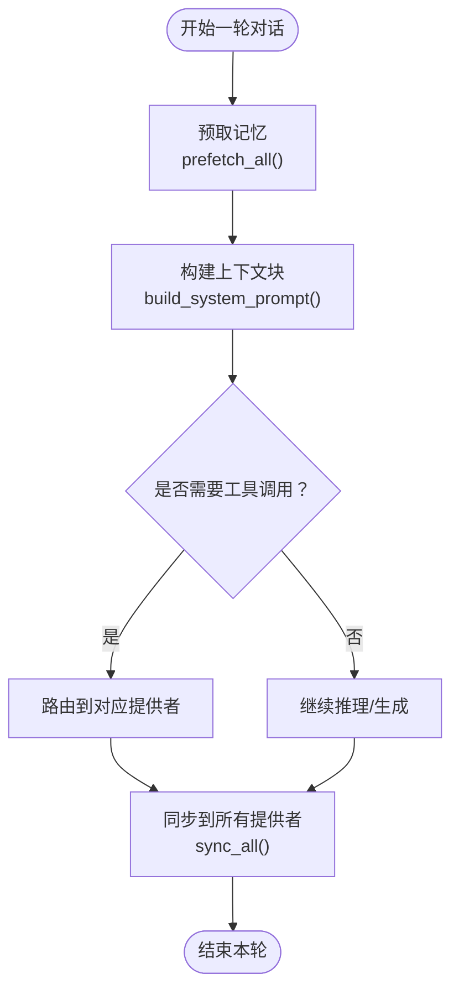
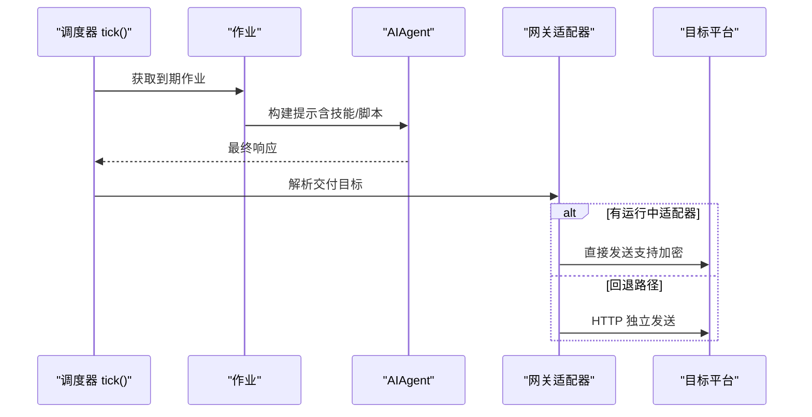
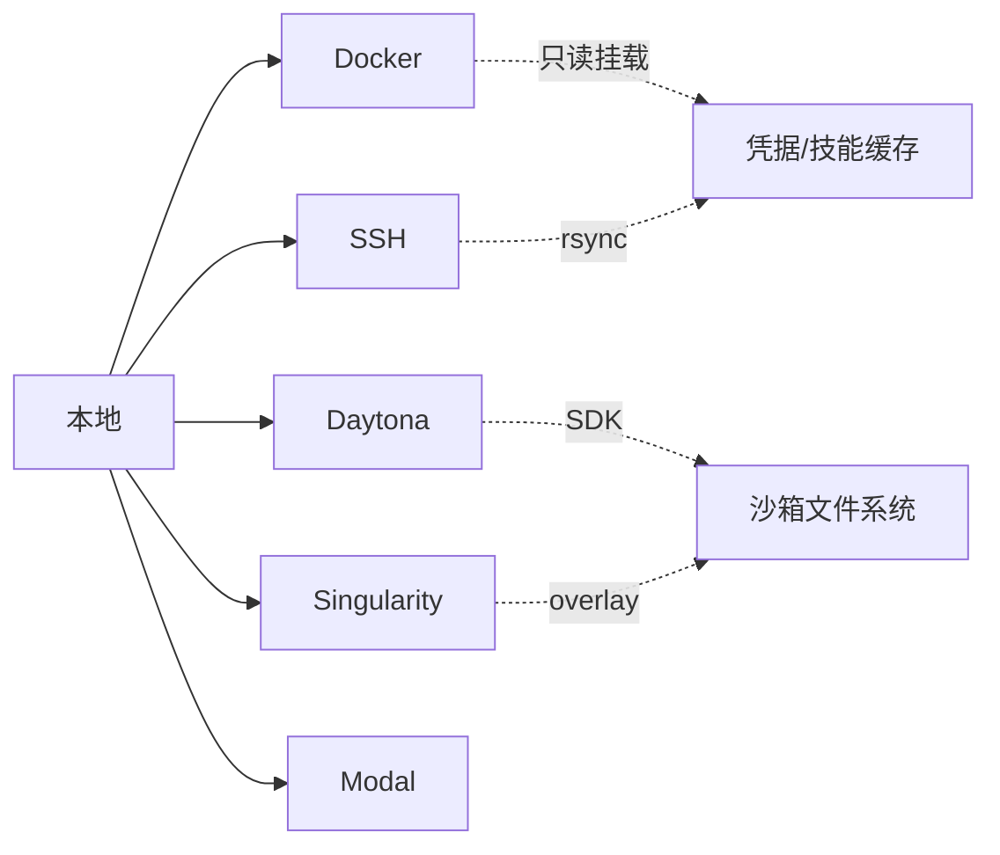
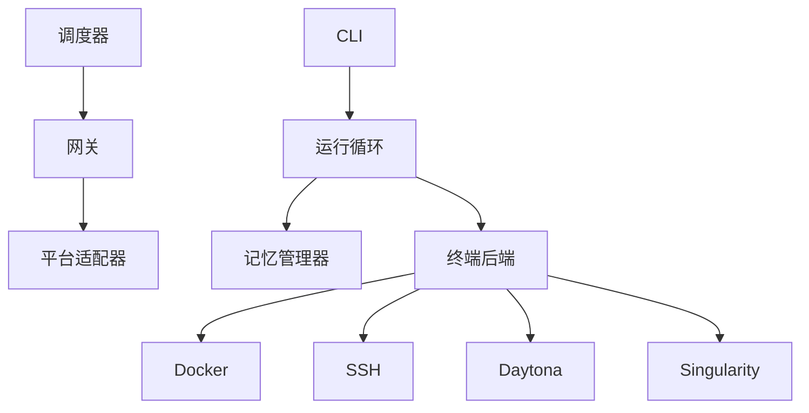

# 核心特性

<cite>
**本文引用的文件**
- [README.md](file://README.md)
- [hermes_cli/main.py](file://hermes_cli/main.py)
- [gateway/platforms/base.py](file://gateway/platforms/base.py)
- [agent/memory_manager.py](file://agent/memory_manager.py)
- [cron/scheduler.py](file://cron/scheduler.py)
- [tools/environments/local.py](file://tools/environments/local.py)
- [tools/environments/docker.py](file://tools/environments/docker.py)
- [tools/environments/ssh.py](file://tools/environments/ssh.py)
- [tools/environments/daytona.py](file://tools/environments/daytona.py)
- [tools/environments/singularity.py](file://tools/environments/singularity.py)
</cite>

## 目录
1. [引言](#引言)
2. [项目结构](#项目结构)
3. [核心组件](#核心组件)
4. [架构总览](#架构总览)
5. [详细组件分析](#详细组件分析)
6. [依赖分析](#依赖分析)
7. [性能考虑](#性能考虑)
8. [故障排查指南](#故障排查指南)
9. [结论](#结论)

## 引言
本文件系统性阐述 Hermes Agent 的六大核心特性，并结合代码级实现与运行机制，帮助用户理解其“实时终端界面”“跨平台存在”“闭环学习回路”“计划自动化”“委托并行化”“跨环境运行能力”的技术实现与实际价值。文中所有技术细节均来自仓库源码与官方文档，确保可追溯与可验证。

## 项目结构
Hermes Agent 采用模块化分层设计：
- CLI 层：hermes 命令入口，负责会话启动、配置加载、TUI 初始化等
- 网关层：消息网关，统一接入 Telegram、Discord、Slack、WhatsApp、Signal 等平台
- 代理内核：智能体循环、工具调用、记忆与上下文管理
- 终端后端：本地、Docker、SSH、Daytona、Singularity、Modal 多种执行环境
- 定时调度：内置 cron 调度器，支持自动交付到任意平台

图表来源
- [hermes_cli/main.py](file://hermes_cli/main.py)
- [gateway/platforms/base.py](file://gateway/platforms/base.py)
- [agent/memory_manager.py](file://agent/memory_manager.py)
- [tools/environments/local.py](file://tools/environments/local.py)
- [tools/environments/docker.py](file://tools/environments/docker.py)
- [tools/environments/ssh.py](file://tools/environments/ssh.py)
- [tools/environments/daytona.py](file://tools/environments/daytona.py)
- [tools/environments/singularity.py](file://tools/environments/singularity.py)
- [cron/scheduler.py](file://cron/scheduler.py)

章节来源
- [README.md](file://README.md)
- [hermes_cli/main.py](file://hermes_cli/main.py)

## 核心组件
- 实时终端界面（Full TUI with multiline editing, slash-command autocomplete, conversation history, interrupt-and-redirect, and streaming tool output）
  - 支持多行编辑、命令补全、历史浏览、中断重定向、流式工具输出
- 跨平台存在（Telegram, Discord, Slack, WhatsApp, Signal, and CLI）
  - 平台适配器统一抽象，支持消息收发、媒体缓存、打字指示、致命错误处理
- 闭环学习回路（Agent-curated memory with periodic nudges, autonomous skill creation, skills self-improve during use）
  - 内置与外部记忆提供者组合，Turn 前/后处理，工具路由，持久化与检索
- 计划自动化（Built-in cron scheduler with delivery to any platform）
  - 作业调度、脚本执行、技能注入、自动交付、静默抑制
- 委托并行化（Spawn isolated subagents for parallel workstreams）
  - 子代理/子任务隔离执行，会话状态与资源隔离
- 跨环境运行能力（Six terminal backends - local, Docker, SSH, Daytona, Singularity, and Modal）
  - 本地、容器、远程、云沙箱、持久化覆盖层等多样化执行后端

章节来源
- [README.md](file://README.md)
- [gateway/platforms/base.py](file://gateway/platforms/base.py)
- [agent/memory_manager.py](file://agent/memory_manager.py)
- [cron/scheduler.py](file://cron/scheduler.py)
- [tools/environments/local.py](file://tools/environments/local.py)
- [tools/environments/docker.py](file://tools/environments/docker.py)
- [tools/environments/ssh.py](file://tools/environments/ssh.py)
- [tools/environments/daytona.py](file://tools/environments/daytona.py)
- [tools/environments/singularity.py](file://tools/environments/singularity.py)

## 架构总览
Hermes Agent 的核心是“智能体内核 + 多后端执行 + 统一网关”。CLI 与网关分别作为入口，进入统一的运行循环；运行循环通过记忆管理器组织上下文，选择工具与模型，驱动终端后端执行命令；定时调度器在后台按计划触发作业，自动将结果投递到任一平台。

图表来源
- [hermes_cli/main.py](file://hermes_cli/main.py)
- [agent/memory_manager.py](file://agent/memory_manager.py)
- [tools/environments/local.py](file://tools/environments/local.py)
- [cron/scheduler.py](file://cron/scheduler.py)

## 详细组件分析

### 特性一：实时终端界面（Full TUI 与交互能力）
- 多行编辑与命令补全：CLI 入口提供交互式 TUI，支持继续上一次会话、命令补全、历史浏览与快捷键
- 会话历史与恢复：通过会话数据库记录与检索，支持按名称或 ID 恢复
- 中断与重定向：在执行长任务时可中断当前工作，切换到新话题或新命令
- 流式工具输出：工具执行过程中的增量输出以流式方式呈现，提升交互体验

图表来源
- [hermes_cli/main.py](file://hermes_cli/main.py)
- [tools/environments/local.py](file://tools/environments/local.py)

章节来源
- [hermes_cli/main.py](file://hermes_cli/main.py)
- [tools/environments/local.py](file://tools/environments/local.py)

### 特性二：跨平台存在（Telegram、Discord、Slack、WhatsApp、Signal、CLI）
- 平台适配器统一接口：所有平台继承自基类，实现连接、发送、媒体处理、致命错误上报等
- 媒体缓存与安全下载：图片/音频/文档缓存，避免平台 URL 过期与 SSRF 风险
- 打字指示与线程上下文：支持线程/频道上下文，保持连续对话体验
- 致命错误处理：平台连接失败时写入运行状态，便于诊断

图表来源
- [gateway/platforms/base.py](file://gateway/platforms/base.py)

章节来源
- [gateway/platforms/base.py](file://gateway/platforms/base.py)

### 特性三：闭环学习回路（Agent-curated memory 与技能自进化）
- 记忆提供者组合：内置提供者优先，最多注册一个外部提供者；失败不阻塞其他提供者
- Turn 生命周期钩子：预取/同步/压缩前回调，支持外部提供者感知
- 工具路由与冲突消解：同名工具去重，按提供者顺序路由
- 与外部记忆插件兼容：支持 Honcho 等外部记忆系统

图表来源
- [agent/memory_manager.py](file://agent/memory_manager.py)

章节来源
- [agent/memory_manager.py](file://agent/memory_manager.py)

### 特性四：计划自动化（内置 cron 调度与平台交付）
- 作业调度：每分钟 tick 检查到期任务，文件锁避免并发冲突
- 技能注入与脚本前置：可加载技能内容与数据采集脚本，注入上下文
- 自动交付：根据 origin 或配置解析目标平台，优先使用运行中适配器直连（支持 E2EE），否则回退到独立发送
- 静默抑制：输出以 [SILENT] 开头时抑制交付，仅保存审计日志

图表来源
- [cron/scheduler.py](file://cron/scheduler.py)
- [gateway/platforms/base.py](file://gateway/platforms/base.py)

章节来源
- [cron/scheduler.py](file://cron/scheduler.py)
- [gateway/platforms/base.py](file://gateway/platforms/base.py)

### 特性五：委托并行化（隔离子代理与并行工作流）
- 子代理隔离：通过独立会话与资源限制，实现并行工作流
- 会话状态隔离：子代理拥有独立会话 ID、数据库与内存状态
- 交付与追踪：子代理完成的任务可被父代理感知，用于后续决策与总结

说明：该特性在代码中体现为“子代理/子任务”概念与会话隔离，具体实现细节由运行循环与调度器协作完成。

章节来源
- [cron/scheduler.py](file://cron/scheduler.py)

### 特性六：跨环境运行能力（本地、Docker、SSH、Daytona、Singularity、Modal）
- 本地后端：交互式登录 shell、持久会话、sudo 密码透传、输出围栏与噪声清洗
- Docker 后端：能力降级、PID 限制、tmpfs、只读挂载凭据与技能目录、可选持久化卷
- SSH 后端：ControlMaster 连接复用、远端临时文件 IPC、增量同步凭据与技能
- Daytona 后端：沙箱生命周期管理、标签化任务、增量上传、可靠超时控制
- Singularity 后端：containall 隔离、overlay 持久化、SIF 缓存与构建
- Modal：作为终端后端之一（在 README 中列出）

图表来源
- [tools/environments/local.py](file://tools/environments/local.py)
- [tools/environments/docker.py](file://tools/environments/docker.py)
- [tools/environments/ssh.py](file://tools/environments/ssh.py)
- [tools/environments/daytona.py](file://tools/environments/daytona.py)
- [tools/environments/singularity.py](file://tools/environments/singularity.py)

章节来源
- [tools/environments/local.py](file://tools/environments/local.py)
- [tools/environments/docker.py](file://tools/environments/docker.py)
- [tools/environments/ssh.py](file://tools/environments/ssh.py)
- [tools/environments/daytona.py](file://tools/environments/daytona.py)
- [tools/environments/singularity.py](file://tools/environments/singularity.py)
- [README.md](file://README.md)

## 依赖分析
- 组件耦合
  - CLI 与运行循环：CLI 负责初始化与会话恢复，运行循环负责工具调用与后端执行
  - 网关与平台适配器：网关统一调度，平台适配器实现差异化行为
  - 记忆管理器：对内聚合多个提供者，对外暴露统一工具与系统提示
  - 调度器与网关：调度器通过网关适配器进行平台交付
- 外部依赖
  - 平台 SDK/客户端：Telegram/Discord/Slack/Signal/WhatsApp 等
  - 容器与云平台：Docker、Apptainer/Singularity、Daytona、Modal
  - 媒体与网络：HTTPX、URL 安全校验、SSRF 防护

图表来源
- [hermes_cli/main.py](file://hermes_cli/main.py)
- [gateway/platforms/base.py](file://gateway/platforms/base.py)
- [agent/memory_manager.py](file://agent/memory_manager.py)
- [cron/scheduler.py](file://cron/scheduler.py)
- [tools/environments/docker.py](file://tools/environments/docker.py)
- [tools/environments/ssh.py](file://tools/environments/ssh.py)
- [tools/environments/daytona.py](file://tools/environments/daytona.py)
- [tools/environments/singularity.py](file://tools/environments/singularity.py)

章节来源
- [hermes_cli/main.py](file://hermes_cli/main.py)
- [gateway/platforms/base.py](file://gateway/platforms/base.py)
- [agent/memory_manager.py](file://agent/memory_manager.py)
- [cron/scheduler.py](file://cron/scheduler.py)

## 性能考虑
- I/O 与背压
  - 终端后端普遍采用异步/线程读取 stdout，避免管道阻塞
  - Docker/SSH/Daytona 使用连接复用与临时文件 IPC，降低开销
- 资源限制
  - Docker 设置 CPU/内存/磁盘限额；Singularity 使用 cgroups；SSH/本地后端通过超时与中断控制
- 缓存与持久化
  - 图片/音频/文档缓存减少重复下载；凭据与技能增量同步；Daytona/Singularity overlay 持久化
- 调度与并发
  - 调度器文件锁避免并发 tick；线程池与活动计时器防止长时间空闲作业占用资源

## 故障排查指南
- 平台连接问题
  - 检查致命错误状态与错误码，确认平台配置与凭据
  - 参考平台适配器的错误处理与重试策略
- Docker/容器相关
  - 确认 docker 可执行文件与守护进程可用；overlay2 + pquota 才支持磁盘配额
  - 检查只读挂载与凭据文件路径
- SSH 连接
  - 确认 openssh 客户端可用与 ControlMaster 可用；检查密钥与主机指纹
- Daytona
  - 检查沙箱生命周期与 SDK 错误；必要时重启沙箱
- 本地后端
  - Windows 需要 Git Bash；注意 shell 噪声清洗与输出围栏

章节来源
- [gateway/platforms/base.py](file://gateway/platforms/base.py)
- [tools/environments/docker.py](file://tools/environments/docker.py)
- [tools/environments/ssh.py](file://tools/environments/ssh.py)
- [tools/environments/daytona.py](file://tools/environments/daytona.py)
- [tools/environments/local.py](file://tools/environments/local.py)

## 结论
Hermes Agent 通过“统一智能体内核 + 多后端执行 + 统一网关 + 内置调度”的架构，实现了从实时交互到跨平台交付、从闭环记忆到自动化调度、从本地到云端的全栈能力。六大核心特性相互协同：实时 TUI 提升交互效率，跨平台存在扩大触达范围，闭环学习回路强化长期价值，计划自动化降低维护成本，委托并行化支撑复杂任务，跨环境运行能力保障弹性与安全。这些特性共同构成 Hermes Agent 的工程化优势与产品竞争力。