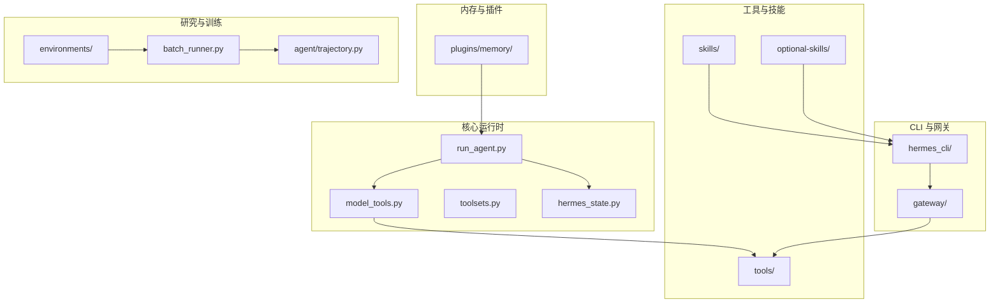
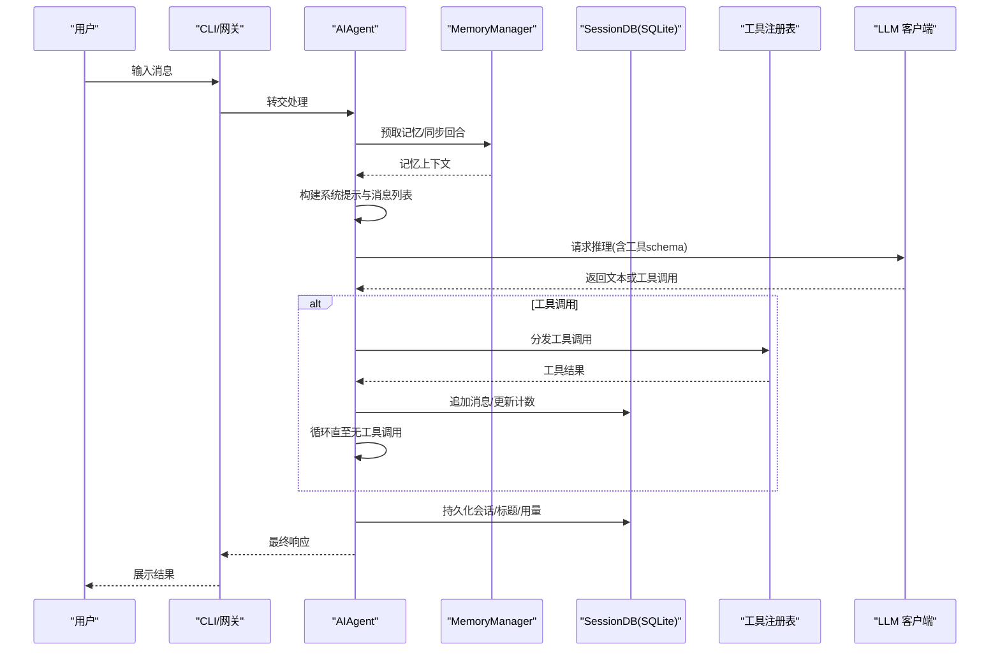
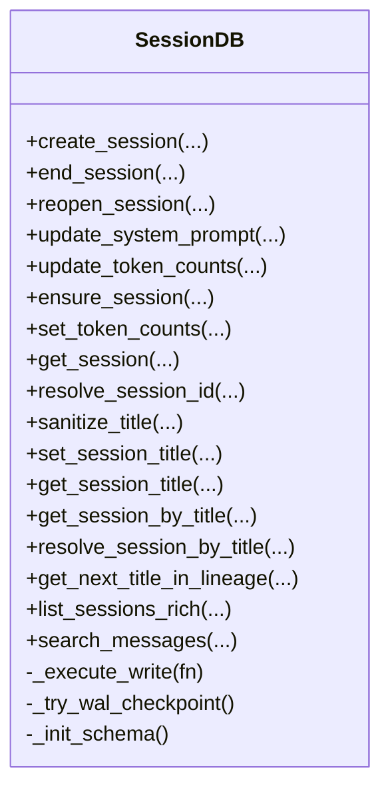
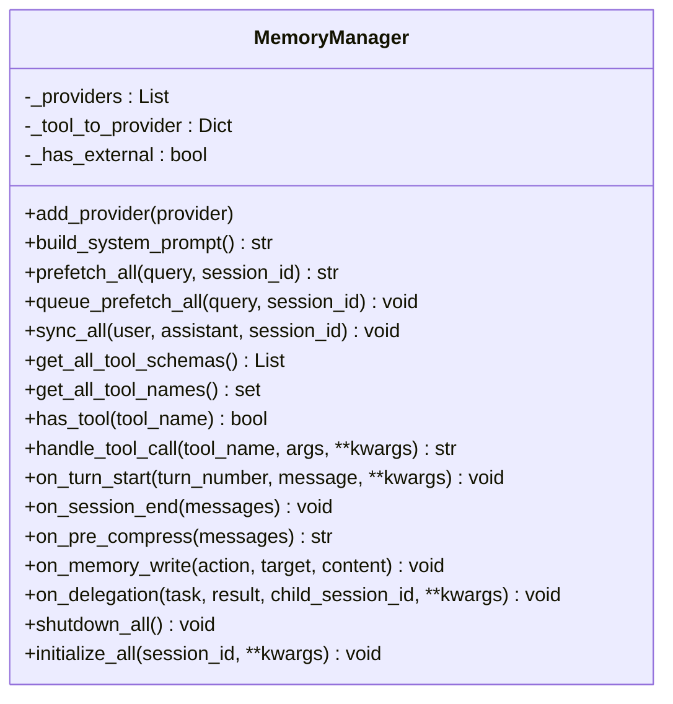
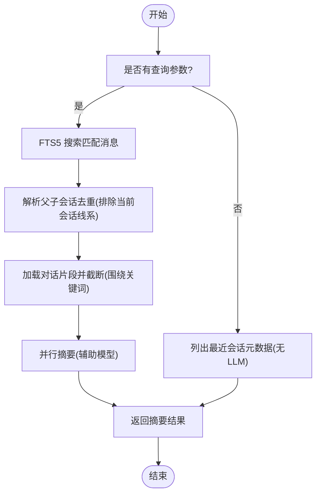
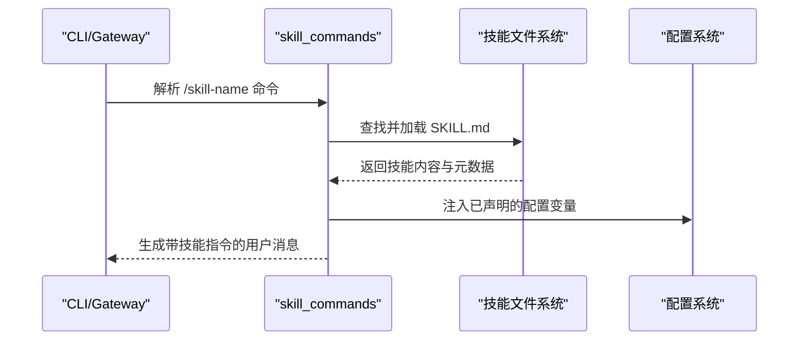
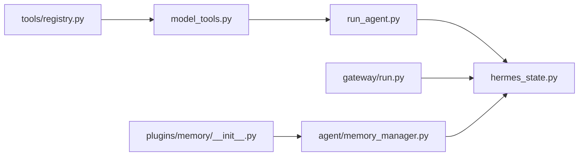

# 项目介绍

<cite>
**本文引用的文件**
- [README.md](file://README.md)
- [AGENTS.md](file://AGENTS.md)
- [hermes_state.py](file://hermes_state.py)
- [hermes_constants.py](file://hermes_constants.py)
- [agent/memory_manager.py](file://agent/memory_manager.py)
- [agent/trajectory.py](file://agent/trajectory.py)
- [agent/skill_commands.py](file://agent/skill_commands.py)
- [tools/session_search_tool.py](file://tools/session_search_tool.py)
- [plugins/memory/__init__.py](file://plugins/memory/__init__.py)
- [plugins/memory/honcho/session.py](file://plugins/memory/honcho/session.py)
- [RELEASE_v0.7.0.md](file://RELEASE_v0.7.0.md)
- [CONTRIBUTING.md](file://CONTRIBUTING.md)
</cite>

## 目录
1. [引言](#引言)
2. [项目结构](#项目结构)
3. [核心组件](#核心组件)
4. [架构总览](#架构总览)
5. [详细组件分析](#详细组件分析)
6. [依赖关系分析](#依赖关系分析)
7. [性能考量](#性能考量)
8. [故障排查指南](#故障排查指南)
9. [结论](#结论)
10. [附录](#附录)

## 引言
Hermes Agent 是由 Nous Research 开发的“自改进 AI 代理”。它最核心的价值主张是：内置“学习循环”，能从经验中创建技能、在使用过程中自我改进、主动持久化知识、搜索过往对话记录，并在多次会话中构建对用户的深层理解模型。与传统代理不同，Hermes 不仅“记住”信息，还能“理解”用户并持续优化交互体验。

- 自改进能力：通过记忆系统、会话搜索与技能注入，代理能在多轮对话中形成稳定的上下文与偏好模型。
- 跨平台与弹性部署：支持 CLI、多消息平台（Telegram、Discord、Slack 等）以及多种终端后端（本地、Docker、Modal、Daytona、Singularity），可在云上按需运行。
- 开源与可扩展：采用模块化设计，工具与技能体系开放，支持插件式内存后端与第三方 MCP/ACP 集成。

本节旨在帮助初学者快速理解 Hermes 的独特价值，同时为有经验的开发者提供技术深度与创新洞察。

## 项目结构
Hermes 采用分层与功能域结合的组织方式：
- 核心运行时：run_agent.py、model_tools.py、toolsets.py、hermes_state.py
- CLI 与网关：hermes_cli/、gateway/
- 工具与技能：tools/、skills/、optional-skills/
- 内存与插件：plugins/memory/
- 研究与训练：environments/、batch_runner.py、trajectory 相关工具

图示来源
- [AGENTS.md:11-64](file://AGENTS.md#L11-L64)
- [CONTRIBUTING.md:114-182](file://CONTRIBUTING.md#L114-L182)

章节来源
- [AGENTS.md:11-64](file://AGENTS.md#L11-L64)
- [CONTRIBUTING.md:114-182](file://CONTRIBUTING.md#L114-L182)

## 核心组件
- 会话数据库与检索：基于 SQLite + FTS5 的会话存储与全文检索，支持跨会话召回与摘要生成。
- 记忆管理器：统一编排内置记忆与外部插件记忆（如 Honcho），实现“系统提示 + 记忆上下文”的组合。
- 技能系统：以“指令 + 工具调用”的方式表达技能，支持跨平台加载与注入，提升任务执行的稳定性与可复用性。
- 会话搜索工具：利用 FTS5 检索历史消息，再以轻量模型生成摘要，降低主模型上下文压力。
- 插件式内存后端：通过统一接口接入不同记忆提供方，支持多实例隔离与配置化选择。

章节来源
- [hermes_state.py:1-120](file://hermes_state.py#L1-L120)
- [agent/memory_manager.py:1-120](file://agent/memory_manager.py#L1-L120)
- [agent/skill_commands.py:1-120](file://agent/skill_commands.py#L1-L120)
- [tools/session_search_tool.py:1-120](file://tools/session_search_tool.py#L1-L120)
- [plugins/memory/__init__.py:1-120](file://plugins/memory/__init__.py#L1-L120)

## 架构总览
Hermes 的核心循环围绕“用户输入 → 构建系统提示与上下文 → LLM 推理 → 工具调用 → 上下文压缩/持久化 → 返回结果”的闭环展开。其中：
- 系统提示由“身份设定 + 技能 + 记忆 + 上下文文件”拼装；
- 记忆通过 MemoryManager 统一调度，支持内置与外部插件；
- 会话数据持久化到 SQLite，支持 FTS5 搜索；
- 工具通过注册表自动发现与分发；
- 会话搜索工具用于跨会话召回与摘要生成。

图示来源
- [AGENTS.md:82-125](file://AGENTS.md#L82-L125)
- [agent/memory_manager.py:150-220](file://agent/memory_manager.py#L150-L220)
- [hermes_state.py:355-420](file://hermes_state.py#L355-L420)

章节来源
- [AGENTS.md:82-125](file://AGENTS.md#L82-L125)

## 详细组件分析

### 会话数据库与检索（SessionDB）
- 设计要点：WAL 模式、FTS5 全文检索、触发器自动维护索引、写入重试与随机抖动避免写锁拥堵、定期被动 checkpoint 控制 WAL 大小。
- 功能覆盖：会话生命周期管理（创建/结束/重开）、系统提示快照、令牌用量与成本统计、标题生成与去重、最近会话列表、会话搜索与摘要。
- 性能特性：短超时 + 应用层重试 + 周期性 checkpoint，适合多进程共享同一 state.db 的场景。

图示来源
- [hermes_state.py:115-220](file://hermes_state.py#L115-L220)
- [hermes_state.py:252-350](file://hermes_state.py#L252-L350)

章节来源
- [hermes_state.py:1-120](file://hermes_state.py#L1-L120)
- [hermes_state.py:115-220](file://hermes_state.py#L115-L220)
- [hermes_state.py:252-350](file://hermes_state.py#L252-L350)

### 记忆管理器（MemoryManager）
- 角色定位：统一编排内置记忆与最多一个外部插件记忆提供方；在系统提示构建、回合前后、工具调用等时机进行记忆的预取、同步与路由。
- 关键流程：注册提供方（内置优先）、构建系统提示块、批量预取与队列预取、回合同步、工具 schema 收集与路由、生命周期钩子（turn 开始/结束、压缩前、委托完成、写入事件、关闭）。
- 可扩展性：通过插件接口限制外部提供方数量，避免 schema 泛滥与冲突。

图示来源
- [agent/memory_manager.py:72-140](file://agent/memory_manager.py#L72-L140)
- [plugins/memory/__init__.py:32-76](file://plugins/memory/__init__.py#L32-L76)

章节来源
- [agent/memory_manager.py:1-120](file://agent/memory_manager.py#L1-L120)
- [plugins/memory/__init__.py:1-120](file://plugins/memory/__init__.py#L1-L120)

### 会话搜索工具（Session Search）
- 机制：FTS5 搜索匹配消息 → 去重父会话 → 截断围绕关键词的对话片段 → 调用辅助模型生成摘要 → 并行汇总返回。
- 适用场景：跨会话召回、近期会话浏览、主题检索、减少重复说明。
- 交互提示：支持空查询浏览近期会话（零 LLM 成本），支持关键词/短语/布尔语法查询。

图示来源
- [tools/session_search_tool.py:247-431](file://tools/session_search_tool.py#L247-L431)

章节来源
- [tools/session_search_tool.py:1-120](file://tools/session_search_tool.py#L1-L120)
- [tools/session_search_tool.py:247-431](file://tools/session_search_tool.py#L247-L431)

### 技能系统（Skill Commands）
- 加载与注入：扫描 ~/.hermes/skills/ 与外部目录，解析 SKILL.md 前言元数据，构建“系统提示风格”的用户消息注入，保留提示缓存有效性。
- 命令注册：统一的命令定义与别名映射，支持 CLI/Gateway 双表面共享。
- 配置注入：根据技能声明的配置变量，动态注入当前配置值，便于代理在不读取配置文件的情况下获得上下文。

图示来源
- [agent/skill_commands.py:200-270](file://agent/skill_commands.py#L200-L270)
- [agent/skill_commands.py:291-327](file://agent/skill_commands.py#L291-L327)

章节来源
- [agent/skill_commands.py:1-120](file://agent/skill_commands.py#L1-L120)
- [agent/skill_commands.py:200-270](file://agent/skill_commands.py#L200-L270)

### Trajectory 保存与研究用途
- 作用：将对话轨迹转换为标准格式并追加到 JSONL 文件，便于后续批处理与强化学习训练。
- 注意：轨迹保存逻辑独立于会话数据库，仅在需要研究/训练时启用。

章节来源
- [agent/trajectory.py:1-57](file://agent/trajectory.py#L1-L57)

### Honcho 记忆插件（多智能体用户建模）
- 特性：在内置记忆之上，提供“辩证推理 + 多智能体用户建模”，对每次对话进行推断，提炼关于用户偏好的“结论”，随时间积累形成更深入的理解。
- 集成方式：作为插件式记忆提供方，通过统一接口接入，支持配置化选择与多实例隔离。

章节来源
- [plugins/memory/honcho/session.py:522-555](file://plugins/memory/honcho/session.py#L522-L555)
- [RELEASE_v0.7.0.md:67-76](file://RELEASE_v0.7.0.md#L67-L76)

## 依赖关系分析
- 工具注册与发现：tools/registry.py 为核心注册中心，各工具在导入时注册自身 schema 与处理器；model_tools.py 通过导入触发工具发现。
- 会话持久化：run_agent.py/gateway/run.py 在每轮结束后将消息与用量写入 SessionDB；CLI 与网关共享同一数据库。
- 记忆提供方：MemoryManager 统一调度内置与外部插件提供方；插件发现通过 plugins/memory/__init__.py 扫描目录并加载。

图示来源
- [AGENTS.md:70-79](file://AGENTS.md#L70-L79)
- [hermes_state.py:32-40](file://hermes_state.py#L32-L40)
- [plugins/memory/__init__.py:32-76](file://plugins/memory/__init__.py#L32-L76)

章节来源
- [AGENTS.md:70-79](file://AGENTS.md#L70-L79)
- [hermes_state.py:32-40](file://hermes_state.py#L32-L40)

## 性能考量
- 写入竞争与锁：SessionDB 使用短超时 + 应用层重试 + 随机抖动打破“ convoy 效应”，并周期性 PASSIVE checkpoint 控制 WAL 增长。
- 会话搜索：FTS5 检索 + 并行摘要 + 截断策略，避免大段上下文进入主模型。
- 提示缓存一致性：禁止在会话中修改系统提示/工具集/上下文，确保缓存命中率与成本控制。
- 令牌用量与成本：SessionDB 支持增量/绝对两种计数模式，网关路径可直接设置累计值，CLI 路径增量累加。

章节来源
- [hermes_state.py:123-137](file://hermes_state.py#L123-L137)
- [hermes_state.py:430-501](file://hermes_state.py#L430-L501)
- [AGENTS.md:339-347](file://AGENTS.md#L339-L347)

## 故障排查指南
- 会话搜索失败：检查 state.db 是否存在、辅助模型是否可用、查询语法是否正确（建议使用 OR/短语/布尔）。
- 记忆提供方冲突：仅允许一个外部记忆提供方，若注册多个会告警并拒绝；检查 memory.provider 配置。
- 写入锁/拥堵：若出现写入阻塞，确认 WAL checkpoint 是否被阻塞；适当降低并发或调整重试参数。
- 凭证与安全：检查 .env 中密钥格式与路径遍历防护；执行代码沙箱输出会被脱敏；浏览器 URL 与 LLM 输出会扫描敏感模式。

章节来源
- [tools/session_search_tool.py:433-440](file://tools/session_search_tool.py#L433-L440)
- [plugins/memory/__init__.py:86-108](file://plugins/memory/__init__.py#L86-L108)
- [hermes_state.py:164-215](file://hermes_state.py#L164-L215)
- [RELEASE_v0.7.0.md:197-221](file://RELEASE_v0.7.0.md#L197-L221)

## 结论
Hermes Agent 的核心创新在于“内置学习循环”：通过记忆系统、会话搜索与技能注入，代理能够在使用中不断沉淀知识、优化交互，并在多会话间建立对用户的深层理解。其开源、模块化与可扩展的设计，使其既能满足初学者的易用需求，也能为高级用户提供深度定制与研究能力。相比其他代理，Hermes 更强调“长期记忆 + 主动改进 + 跨平台弹性”，在成本控制、安全性与可维护性方面也提供了系统性的工程实践。

## 附录
- 快速安装与入门：参见 README 的安装与入门指引。
- 开发者指南：参见 AGENTS.md 与 CONTRIBUTING.md 的开发环境、项目结构与贡献流程。
- 版本演进：参考 RELEASE_v0.7.0.md 的亮点与变更，了解近期在记忆插件、凭证池、浏览器后端等方面的增强。

章节来源
- [README.md:30-62](file://README.md#L30-L62)
- [AGENTS.md:1-64](file://AGENTS.md#L1-L64)
- [CONTRIBUTING.md:52-111](file://CONTRIBUTING.md#L52-L111)
- [RELEASE_v0.7.0.md:1-291](file://RELEASE_v0.7.0.md#L1-L291)