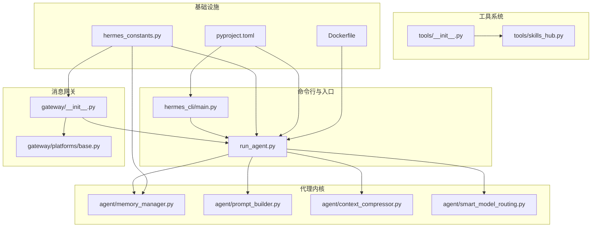
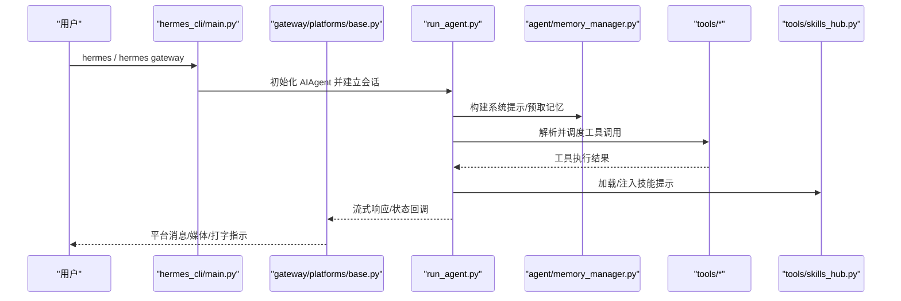
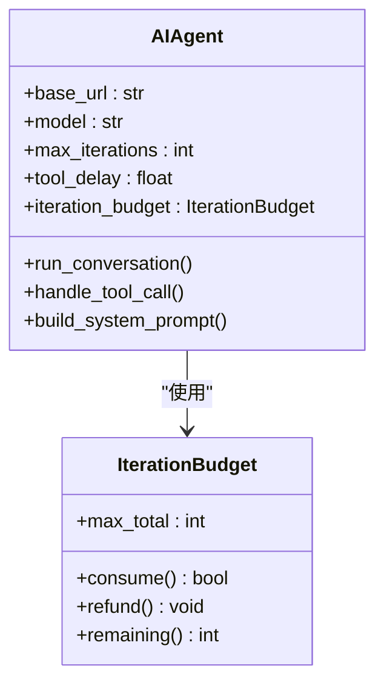
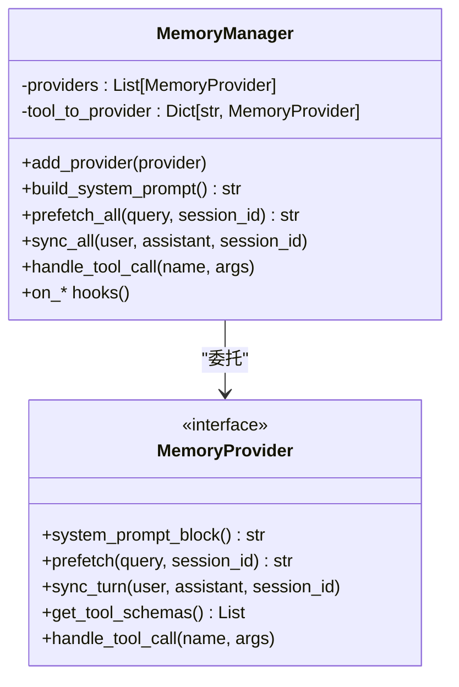
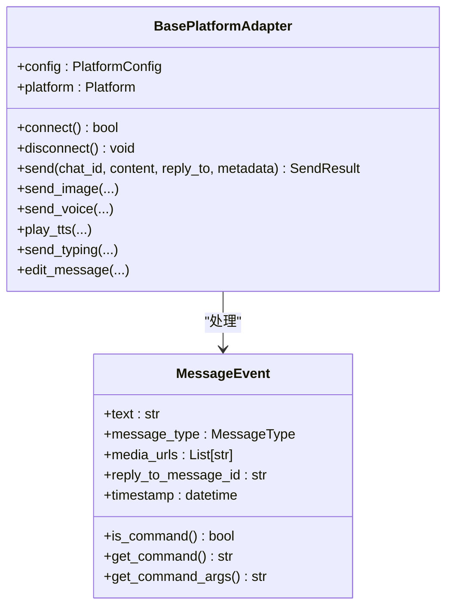
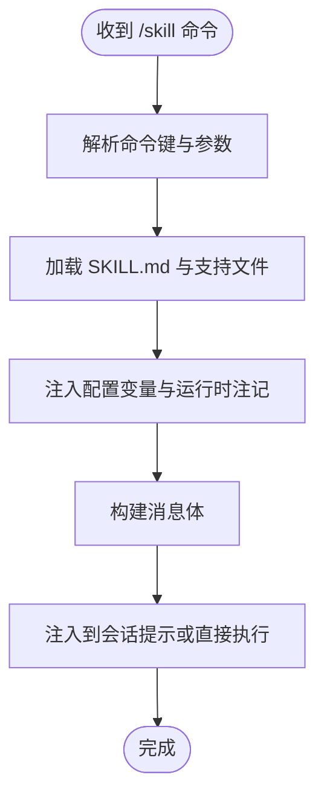
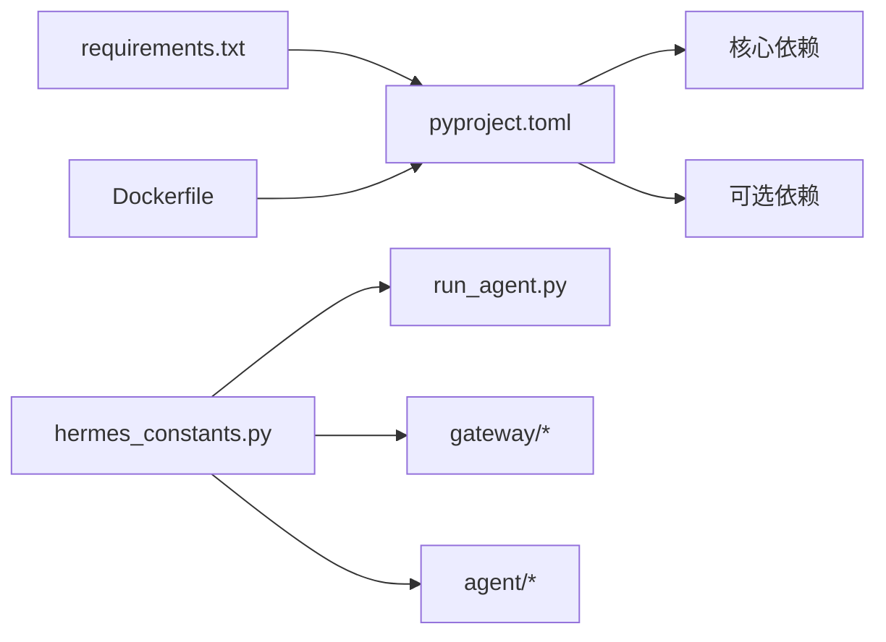

# 项目概述

<cite>
**本文档引用的文件**
- [README.md](file://README.md)
- [pyproject.toml](file://pyproject.toml)
- [requirements.txt](file://requirements.txt)
- [Dockerfile](file://Dockerfile)
- [hermes_constants.py](file://hermes_constants.py)
- [agent/__init__.py](file://agent/__init__.py)
- [gateway/__init__.py](file://gateway/__init__.py)
- [tools/__init__.py](file://tools/__init__.py)
- [hermes_cli/main.py](file://hermes_cli/main.py)
- [run_agent.py](file://run_agent.py)
- [agent/memory_manager.py](file://agent/memory_manager.py)
- [agent/skill_commands.py](file://agent/skill_commands.py)
- [tools/skills_hub.py](file://tools/skills_hub.py)
- [gateway/platforms/base.py](file://gateway/platforms/base.py)
</cite>

## 目录
1. [简介](#简介)
2. [项目结构](#项目结构)
3. [核心组件](#核心组件)
4. [架构总览](#架构总览)
5. [详细组件分析](#详细组件分析)
6. [依赖关系分析](#依赖关系分析)
7. [性能考量](#性能考量)
8. [故障排查指南](#故障排查指南)
9. [结论](#结论)
10. [附录](#附录)

## 简介
Hermes Agent 是由 Nous Research 开发的“自改进型 AI 代理”，其核心愿景是构建一个具备内置学习回路的智能体：它能从经验中创建技能、在使用过程中持续改进、主动持久化知识、检索过往对话、并在多次会话之间加深对用户的理解模型。Hermes 的价值主张体现在以下方面：
- 自主学习循环：通过记忆与技能系统实现闭环学习，支持技能的自动创建与迭代。
- 跨平台存在：统一的消息网关连接 Telegram、Discord、Slack、WhatsApp、Signal 等平台，实现跨平台一致性体验。
- 工具调用能力：内置丰富的工具集（文件、终端、浏览器、语音、图像、MCP 等），支持并行化执行与上下文压缩。
- 记忆系统：结合内置记忆与外部插件记忆提供者，支持会话检索、用户建模与长期记忆。
- 多入口交互：既可直接在本地 TUI 中交互，也可作为网关服务在多平台消息中被调用。

此外，Hermes 支持多种推理模式配置、计划自动化、子代理并行化、以及在不同终端后端（本地、Docker、SSH、Daytona、Singularity、Modal）上运行，满足从个人工作站到云端集群的多样化部署需求。

**章节来源**
- [README.md:14-26](file://README.md#L14-L26)
- [README.md:65-81](file://README.md#L65-L81)

## 项目结构
Hermes 采用模块化分层设计，主要目录与职责如下：
- agent：代理内核与记忆、提示工程、上下文压缩、模型路由等核心逻辑。
- gateway：多平台消息网关，负责会话管理、动态上下文注入、投递路由与平台特定工具集。
- tools：工具系统与工具集，覆盖文件操作、终端、浏览器、语音、MCP、技能同步等。
- hermes_cli：命令行入口与交互式 TUI，提供 setup、gateway 管理、状态查看、迁移等功能。
- plugins：可选的记忆插件生态（如 Honcho、Mem0 等）。
- skills：内置技能与技能生态（Skills Hub），支持搜索、下载、安装与信任等级管理。
- cron：内置定时任务调度器，支持自然语言任务与平台投递。
- docker：容器化打包与入口脚本，便于在容器环境中一键运行。
- docs/website：官方文档与网站资源。

**图表来源**
- [hermes_cli/main.py:1-120](file://hermes_cli/main.py#L1-L120)
- [run_agent.py:1-120](file://run_agent.py#L1-L120)
- [agent/memory_manager.py:1-120](file://agent/memory_manager.py#L1-L120)
- [gateway/__init__.py:1-36](file://gateway/__init__.py#L1-L36)
- [gateway/platforms/base.py:1-120](file://gateway/platforms/base.py#L1-L120)
- [tools/__init__.py:1-26](file://tools/__init__.py#L1-L26)
- [tools/skills_hub.py:1-120](file://tools/skills_hub.py#L1-L120)
- [hermes_constants.py:1-106](file://hermes_constants.py#L1-L106)
- [Dockerfile:1-26](file://Dockerfile#L1-L26)
- [pyproject.toml:1-116](file://pyproject.toml#L1-L116)

**章节来源**
- [pyproject.toml:104-109](file://pyproject.toml#L104-L109)
- [pyproject.toml:107-108](file://pyproject.toml#L107-L108)

## 核心组件
- 代理引擎（AIAgent）
  - 负责对话循环、工具调用、错误处理与恢复、消息历史管理、多模型提供商适配。
  - 支持迭代预算、并行工具执行、超大工具结果落盘、预算压力提示注入、流式输出回调等。
- 消息网关（Gateway）
  - 统一接入多平台（Telegram、Discord、Slack、WhatsApp、Signal 等），提供会话管理、动态上下文注入、投递路由与平台特定工具集。
  - 提供图片/音频/文档缓存、媒体安全校验、打字指示、重试策略等。
- 工具系统（Tools）
  - 提供文件操作、终端、浏览器、语音、MCP、技能同步等工具；支持工具集过滤、路径作用域并行、破坏性命令检测等。
- 技能系统（Skills）
  - 内置技能与 Skills Hub 生态，支持搜索、信任等级、下载、安装、扫描与隔离；提供技能命令解析、预加载提示注入、运行时配置注入等。
- 记忆系统（Memory）
  - 内置记忆提供者与外部插件提供者协同，支持系统提示块构建、预取/召回、回合同步、工具路由与生命周期钩子。
- 命令行与入口（CLI）
  - 提供 setup、gateway 管理、状态查看、更新诊断、ACP/MCP 集成、会话浏览等能力；支持 TUI 与非交互保护。

**章节来源**
- [run_agent.py:470-760](file://run_agent.py#L470-L760)
- [gateway/__init__.py:11-35](file://gateway/__init__.py#L11-L35)
- [tools/__init__.py:18-25](file://tools/__init__.py#L18-L25)
- [agent/skill_commands.py:1-120](file://agent/skill_commands.py#L1-L120)
- [agent/memory_manager.py:72-140](file://agent/memory_manager.py#L72-L140)
- [hermes_cli/main.py:556-663](file://hermes_cli/main.py#L556-L663)

## 架构总览
Hermes 的整体架构围绕“代理引擎 + 网关 + 工具系统 + 记忆系统”的组合展开。CLI 与网关分别作为入口，统一调度代理引擎；代理引擎通过工具系统执行具体动作，并与记忆系统交互以增强上下文与长期记忆；消息网关负责跨平台消息的接收、解析与投递。

**图表来源**
- [hermes_cli/main.py:556-663](file://hermes_cli/main.py#L556-L663)
- [run_agent.py:470-760](file://run_agent.py#L470-L760)
- [agent/memory_manager.py:150-210](file://agent/memory_manager.py#L150-L210)
- [tools/skills_hub.py:1-120](file://tools/skills_hub.py#L1-L120)
- [gateway/platforms/base.py:470-632](file://gateway/platforms/base.py#L470-L632)

## 详细组件分析

### 代理引擎（AIAgent）分析
- 关键职责
  - 对话循环与工具调用：自动推进直到完成；支持最大迭代次数、工具延迟、流式回调。
  - 上下文管理：上下文压缩、令牌估算、长上下文探测与降级、预算压力注入。
  - 并行化与安全性：工具批处理并行判定、路径作用域去冲突、破坏性命令启发式检测。
  - 输出优化：超大工具结果落盘与预览、代理日志安全写入、ANSI 控制符清理。
- 设计要点
  - 迭代预算（IterationBudget）：父子代理共享预算，子代理独立预算上限，避免无限循环。
  - 工具批处理并行：基于工具集合、参数路径与只读工具集判定是否并行，限制并发线程数。
  - 安全性：对代理输出进行代理字符替换、预算警告清理、工具结果截断回退。
- 性能与可靠性
  - 使用流式回调与后台线程预热模型元数据，减少首次调用延迟。
  - 文件缓存与落盘策略降低内存峰值与上下文爆炸风险。

**图表来源**
- [run_agent.py:470-760](file://run_agent.py#L470-L760)
- [run_agent.py:165-207](file://run_agent.py#L165-L207)

**章节来源**
- [run_agent.py:262-332](file://run_agent.py#L262-L332)
- [run_agent.py:412-468](file://run_agent.py#L412-L468)
- [run_agent.py:108-163](file://run_agent.py#L108-L163)

### 记忆系统（MemoryManager）分析
- 角色与职责
  - 协调内置记忆提供者与最多一个外部插件提供者，统一系统提示构建、预取/召回、回合同步与工具路由。
  - 提供生命周期钩子：回合开始、会话结束、上下文压缩前、委托完成、写入事件等。
- 设计要点
  - 注册顺序：内置提供者优先，仅允许一个外部提供者，冲突时告警。
  - 工具路由：按工具名映射到提供者，失败不影响其他提供者。
  - 上下文围栏：对召回内容进行围栏包装，防止模型误判为用户输入。
- 可扩展性
  - 通过接口抽象，支持 Honcho、Mem0 等第三方记忆插件接入。

**图表来源**
- [agent/memory_manager.py:72-140](file://agent/memory_manager.py#L72-L140)
- [agent/memory_manager.py:217-262](file://agent/memory_manager.py#L217-L262)

**章节来源**
- [agent/memory_manager.py:172-201](file://agent/memory_manager.py#L172-L201)
- [agent/memory_manager.py:290-308](file://agent/memory_manager.py#L290-L308)

### 消息网关（Gateway）分析
- 平台适配器基类
  - 定义统一的消息事件、发送结果、媒体缓存（图片/音频/文档）、打字指示、编辑消息等抽象。
  - 提供连接状态管理、致命错误上报与处理回调、会话活跃事件与后台任务取消等。
- 能力与特性
  - 图片/音频/文档缓存：避免平台 URL 过期导致的媒体失效，支持异步重试与 SSRF 保护。
  - 命令解析：标准化命令消息（如 /new、/reset、/retry 等）提取与参数解析。
  - 平台特定能力：子类可覆盖原生图片/动画/语音发送、打字指示与线程上下文等。
- 扩展点
  - 新增平台只需继承基类并实现连接、发送、接收等方法，即可无缝接入统一网关。

**图表来源**
- [gateway/platforms/base.py:470-632](file://gateway/platforms/base.py#L470-L632)
- [gateway/platforms/base.py:380-434](file://gateway/platforms/base.py#L380-L434)

**章节来源**
- [gateway/platforms/base.py:113-171](file://gateway/platforms/base.py#L113-L171)
- [gateway/platforms/base.py:228-286](file://gateway/platforms/base.py#L228-L286)
- [gateway/platforms/base.py:367-434](file://gateway/platforms/base.py#L367-L434)

### 技能系统（Skills）分析
- 技能命令解析
  - 将 /skill-name 命令解析为技能标识，加载 SKILL.md 内容与支持文件，注入配置变量与运行时注记。
- Skills Hub
  - 支持 GitHub、Well-Known Endpoint 等源，提供搜索、元数据检查、信任等级、索引缓存与批量下载。
  - 包含安全路径校验、内容哈希与隔离安装流程，保障技能来源可信与安装安全。
- 预加载与会话注入
  - 支持 CLI 会话预加载技能，构建系统提示并注入到对话中，提升任务一致性。

**图表来源**
- [agent/skill_commands.py:291-327](file://agent/skill_commands.py#L291-L327)
- [agent/skill_commands.py:121-198](file://agent/skill_commands.py#L121-L198)

**章节来源**
- [agent/skill_commands.py:200-269](file://agent/skill_commands.py#L200-L269)
- [tools/skills_hub.py:1-120](file://tools/skills_hub.py#L1-L120)
- [tools/skills_hub.py:284-405](file://tools/skills_hub.py#L284-L405)

### 工具系统（Tools）分析
- 工具组织
  - 保持包导入副作用最小化，避免在初始化阶段加载完整工具栈；通过显式子模块导入控制工具加载时机。
- 工具集与并行化
  - 工具集过滤、路径作用域并行、只读工具集安全并行、破坏性命令启发式检测。
- 大结果处理
  - 超大工具结果自动落盘并提供预览，避免上下文膨胀与内存压力。

**章节来源**
- [tools/__init__.py:18-25](file://tools/__init__.py#L18-L25)
- [run_agent.py:262-332](file://run_agent.py#L262-L332)
- [run_agent.py:412-468](file://run_agent.py#L412-L468)

## 依赖关系分析
- 语言与运行时
  - Python 3.11+，核心依赖包括 openai、anthropic、httpx、rich、pyyaml、jinja2、pydantic、prompt_toolkit 等。
- 可选依赖
  - 消息平台（Telegram、Discord、Slack）、语音（ElevenLabs）、Matrix、Voice（faster-whisper）、MCP、ACPI、HomeAssistant、SMS、RL 等。
- 安装与打包
  - 推荐使用 pip 安装可选功能集（如 [all]），Dockerfile 提供容器化一键安装与 Playwright 依赖准备。
- 环境变量与常量
  - HERMES_HOME 统一配置与数据目录，兼容旧路径与显示友好路径；提供推理努力级别解析与多家模型网关基础 URL。

**图表来源**
- [pyproject.toml:13-37](file://pyproject.toml#L13-L37)
- [pyproject.toml:39-97](file://pyproject.toml#L39-L97)
- [requirements.txt:5-37](file://requirements.txt#L5-L37)
- [Dockerfile:12-18](file://Dockerfile#L12-L18)
- [hermes_constants.py:11-73](file://hermes_constants.py#L11-L73)

**章节来源**
- [pyproject.toml:10-12](file://pyproject.toml#L10-L12)
- [pyproject.toml:39-64](file://pyproject.toml#L39-L64)
- [requirements.txt:1-4](file://requirements.txt#L1-L4)
- [Dockerfile:1-26](file://Dockerfile#L1-L26)
- [hermes_constants.py:75-106](file://hermes_constants.py#L75-L106)

## 性能考量
- 上下文与令牌管理
  - 通过上下文压缩、令牌估算与预算压力注入，避免长上下文导致的性能与成本问题。
- 并行工具执行
  - 基于工具类型与路径作用域的安全并行，限制并发线程数，平衡吞吐与资源占用。
- 大结果落盘
  - 超大工具结果自动落盘并提供预览，显著降低内存峰值与上下文膨胀风险。
- 首次调用优化
  - 后台线程预热模型元数据，减少首次 API 调用等待时间。
- 容器化部署
  - Dockerfile 预装 Playwright 依赖与 Node.js，减少容器启动后的额外准备时间。

[本节为通用指导，无需特定文件引用]

## 故障排查指南
- CLI 交互保护
  - 非交互 stdin 调用会触发保护退出，确保 TUI 与输入提示在管道场景下的稳定性。
- 环境与依赖检查
  - hermes doctor 提供配置与依赖健康检查；支持查看各组件状态与更新诊断。
- 日志与错误记录
  - 统一集中日志（agent.log、errors.log）位于 ~/.hermes/logs/，便于定位问题。
- 网关连接与致命错误
  - 平台适配器维护连接状态与致命错误码，支持错误上报与自动重试策略。
- 更新与迁移
  - 支持从 OpenClaw 迁移设置、记忆、技能与密钥；提供 dry-run 预览与覆盖选项。

**章节来源**
- [hermes_cli/main.py:53-68](file://hermes_cli/main.py#L53-L68)
- [hermes_cli/main.py:615-621](file://hermes_cli/main.py#L615-L621)
- [gateway/platforms/base.py:545-568](file://gateway/platforms/base.py#L545-L568)
- [README.md:109-135](file://README.md#L109-L135)

## 结论
Hermes Agent 通过“代理引擎 + 网关 + 工具系统 + 记忆系统”的模块化架构，实现了跨平台、可扩展、可自改进的智能体系统。其闭环学习回路、多平台消息集成、工具并行化与记忆增强，使其既能满足个人用户的日常助理需求，也能支撑企业级的自动化与研究场景。借助 Skills Hub 与插件生态，Hermes 在保持核心稳定的同时，持续扩展能力边界。

[本节为总结性内容，无需特定文件引用]

## 附录
- 安装与兼容性
  - 支持 Linux、macOS 与 WSL2；Windows 原生不支持，需通过 WSL2 运行。
  - 安装脚本自动处理 Python、Node.js、Playwright 与依赖；推荐使用 pip 安装 [all] 可选功能集。
- 许可证
  - 项目采用 MIT 许可证，见 LICENSE 文件。
- 文档与社区
  - 官方文档站点与 Discord 社区提供使用指南、贡献指南与问题反馈渠道。

**章节来源**
- [README.md:30-46](file://README.md#L30-L46)
- [README.md:171-176](file://README.md#L171-L176)
- [Dockerfile:12-18](file://Dockerfile#L12-L18)
- [pyproject.toml:10-12](file://pyproject.toml#L10-L12)